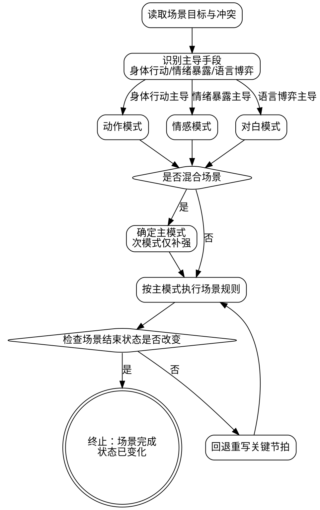
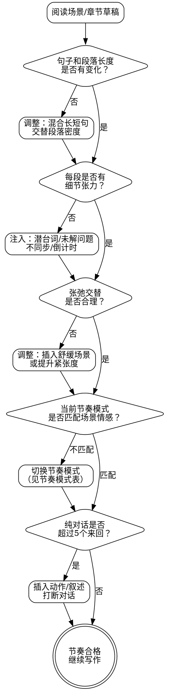
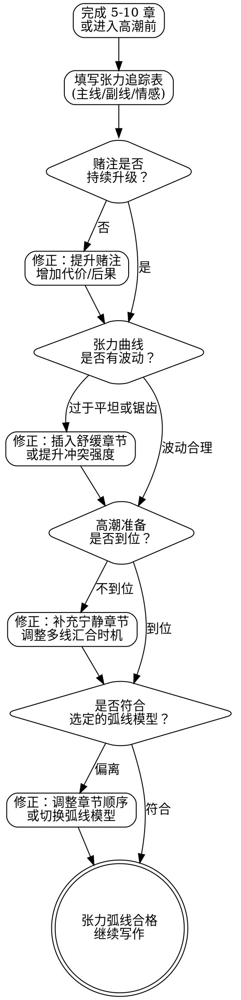

<SUBAGENT-STOP>
如果你是被派遣执行特定任务的子代理，跳过此技能。
</SUBAGENT-STOP>

# 场景导演与叙事节奏控制

本技能是**弹性技能**。

原则固定，细节可调。
你必须遵守场景构建原则、子模式约束和节奏法则，
但可根据题材、人物关系、章节位置微调句长与密度。

本技能覆盖两个层面：

- **场景导演**：场景级分镜控制，三子模式（动作/情感/对白），描写方法论（镜头语言）
- **节奏控制**：微观节奏（句子、段落、对话密度、细节张力）和宏观张力弧线（卷级/全篇张力走势、赌注升级、高潮铺垫）

---

# 第一部分：场景导演

## 核心定位

这是一个场景级分镜导演模块，
不是章节总控模块。

它的职责是：

- 在具体场景写作时提供戏型专用规则
- 保证动作戏、情感戏、对白戏各自成立
- 避免"同一种写法硬套所有场景"

它**不替代**以下技能：

- `dp-chapter-draft`：章节级流程与审查

调用关系：

- 常由 `dp-chapter-draft` 在场景写作阶段调用
- 与 `dp-character-style` 协同

结论：

**一个技能，三个子模式，加节奏控制。**

## 场景类型识别

先判定主导冲突，再选子模式。

### 三类场景判定表

| 子模式 | 激活条件 | 典型任务 | 节奏基调 |
|-------|---------|---------|---------|
| 动作模式 | 存在明显物理冲突、追逐、战斗、逃亡 | 夺取、压制、突围、生还 | 快 |
| 情感模式 | 告白、失去、关系转折、情绪摊牌 | 暴露或压抑真实情绪 | 慢 |
| 对白模式 | 谈判、审问、辩论、信息交换、社交博弈 | 争夺话语权与信息优势 | 中 |

### 混合场景处理

一个场景可以混合多种戏型：

- 打斗中途转为情绪爆发
- 对话破裂后转入追逐
- 情感对峙中夹带策略谈判

混合场景必须先判定**主模式**：

1. 这场戏最核心的输赢是什么？
2. 角色主要靠什么手段争取输赢？
3. 去掉哪一层后场景会立刻失效？那一层就是主模式。

随后把次模式当作补强层，
不得与主模式冲突。



## 动作模式

动作模式是三子模式中约束最密、失误代价最高的一类。
你写的不是"招式展示"，
而是"冲突推进与局势改写"。

### 五层框架

动作场景按五层组织：

| 层 | 你必须交代什么 |
|----|---------------|
| 架 | 环境、站位、赌注 |
| 動 | 位移、换位、距离变化 |
| 招 | 具体动作、技能、战术 |
| 勢 | 优劣转换、战局倾斜 |
| 心 | 恐惧、决心、计算、误判 |

硬规则：

1. 每个动作节拍至少触达 2 层。
2. 禁止只写"招"而无其他层。
3. 每次优势反转都要显式写"勢"。
4. 关键抉择点必须有"心"。

### 动作写作规则

#### 句法密度

- 高峰动作段每句 3-12 字
- 一句只承载一个动作
- 禁止并列复合动作堆在一长句里

#### 动词精度

- 用具体动词：斩 / 刺 / 挡 / 闪 / 压 / 撞
- 避免空泛动词：攻击 / 战斗 / 对抗 ❌

#### 心理节拍插入

- 每 3-5 个动作节拍插入 1 个"心"节拍
- "心"要短，服务当下决策，不写成长段内心独白

#### 地理清晰度

读者必须始终知道：

1. 人在什么位置
2. 谁占地形优势
3. 谁被逼入死角

只要发生位移，立即刷新场景地理关系。

#### 伤势后果追踪

受伤必须持续影响后续动作。

| 伤势 | 立即影响 | 持续影响 |
|------|---------|---------|
| 切伤 | 出血、疼痛 | 握力下降、动作变慢 |
| 钝击 | 眩晕、失衡 | 反应延迟、判断失误 |
| 扭伤 | 位移受阻 | 战术路线受限 |

禁止"上一段重伤，下一段满状态" ❌

#### 状态改变硬要求

动作场景结束时，必须至少改变一项：

- 目标状态（拿到/失去关键物）
- 关系状态（追猎者与被追者逆转）
- 资源状态（体力、武器、地形优势变化）
- 信息状态（暴露身份、发现规则、触发新线索）

没有状态改变，动作场景无效。

### 动作场景节奏

1. 开场要快：直接切入事件中段，不做铺垫。
2. 中段要变速：短暂停顿用于战术选择或认知反转。
3. 收束要决断：明确结果与代价。
4. 禁止无结论收尾：动作场景不可含糊结束 ❌

## 情感模式

情感模式的核心不是"情绪喊得更大"，
而是"情绪有代价、关系会改变"。

### 情感场景原则

1. 用身体化信号呈现情绪，不靠直白内心宣告。
2. 情绪冰山法则：没说出口的部分往往比台词更重。
3. 拒绝狗血堆叠：有来由的情绪 > 夸张情绪。
4. 每场情感戏必须有利害关系。
5. 节奏应慢于动作戏：长句、感官细节、停顿都要可见。

### 情感层次

| 层次 | 定义 | 你要写出的差距 |
|------|------|---------------|
| 表面情绪 | 角色给外界看的反应 | 表面是否掩盖真实 |
| 真实情绪 | 角色此刻真正感受 | 真实是否敢被表达 |
| 根源情绪 | 深层需求或旧伤触发 | 根源如何驱动当前选择 |

高质量情感场景要让读者看见三层之间的断裂。

### 情感禁区

- 角色直接说"我很伤心"作为主要表达 ❌
- 逢情绪就落泪，泪水成为默认按钮 ❌
- 情感场景不推动人物弧线，只在原地抒情 ❌
- 深层冲突一场戏内快速和解 ❌

## 对白模式

对白模式的本质是语言冲突，
不是把设定和信息塞进嘴里。

### 对白场景原则

1. 每轮交换都要有议程：每个说话者都想要某个结果。
2. 对白不是纯信息交换，而是口头博弈。
3. 连续对话最多 5 轮，之后必须插入叙事或动作节拍。
4. 至少 60% 台词承载两层及以上含义（字面 + 潜台词）。
5. 角色不该永远表达完美：卡壳、回避、改口都应出现。

### 潜台词技巧

| 技巧 | 操作方式 | 典型效果 |
|------|---------|---------|
| 答非所问 | 回答另一问题 | 暴露回避点 |
| 转移话题 | 切离痛点议题 | 显示防御 |
| 过度解释 | 解释过长过细 | 暗示掩饰 |
| 沉默 | 关键处不接话 | 拉高张力 |
| 身体语言矛盾 | 话语与动作不一致 | 直接暴露真实意图 |

### 对白节奏控制

| 交换长度 | 节奏效果 | 使用场景 |
|---------|---------|---------|
| 1-3 词短交换 | 紧绷、对抗、压迫 | 质问、威逼、临界冲突 |
| 1-2 句中交换 | 常态推进 | 谈判、试探、澄清 |
| 3 句以上长发言 | 重锤节点 | 告白、揭示、摊牌（稀用） |

补充硬规则：

- 长发言必须稀有，且只给关键节点
- 用动作节拍控速：端杯、移位、避视线、敲桌、停笔

### 群戏对白

1. 同场活跃说话者上限 4 人。
2. 每个说话者应可不靠标签被识别（配合 `dp-character-style`）。
3. 每名角色要有独立议程，不做"陪聊背景板"。
4. 沉默角色也要有可见反应。

## 场景构建通用流程

写任何场景前，你必须先回答五问：

1. 这个场景的目的是什么？（推进情节/角色发展/建立紧张感/揭示信息）
2. 场景开始时的状态是什么？
3. 场景结束时必须出现什么变化？
4. 哪个角色在本场景利害关系最大？
5. 本场景目标节奏是什么？（快/中/慢）

建议先写"场景指令卡"：

| 项目 | 内容 |
|------|------|
| 场景目的 | 一句话写清 |
| 起始状态 | 谁占优、谁受限 |
| 结束变化 | 至少一项状态变化 |
| 高利害角色 | 失去什么最痛 |
| 目标节奏 | 快/中/慢与理由 |

没有指令卡就开写，极易失焦。

## 描写方法论

场景导演选定子模式后，还需要决定**怎么描写这个场景**。

子模式解决的是"这场戏的冲突规则"，
描写方法论解决的是"镜头怎么运动、画面怎么呈现"。

类比电影：子模式是剧本类型（动作片/文艺片/话剧），
描写方法论是摄影指导的镜头语言（推拉摇移、景别切换、焦点选择）。

写小说也有镜头语言，只是工具从摄影机换成了文字的排列顺序与颗粒度。

以下四组技法，是场景级描写的基本镜头语言。

### 技法一：由远及近 / 由近及远（空间距离控制）

控制描写的**空间距离**，决定读者的视角从哪里开始、往哪里移动。

| 技法 | 运镜路径 | 适用场景 |
|------|---------|---------|
| 由远及近 | 大环境 → 具体地点 → 角色/物件 | 开场、场景转换、新地点首次登场 |
| 由近及远 | 角色感官细节 → 拉远到环境 | 角色醒来、从专注中回过神、情绪变化后重新审视环境 |

规则：

1. 一个场景的描写方向选定后保持一致，不在段落中间反复拉伸。
2. 由远及近至少经过三级（全景 → 中景 → 特写），不可一步跳到最近。
3. 由近及远的起点必须是角色能直接感知的东西（触觉、视线内的物件），不可从抽象概念开始。

禁止：段落前半句写天际线，后半句写手指上的伤口，下一句又跳回远山 ❌

### 技法二：先大后小 / 先小后大（信息粒度控制）

控制描写的**信息颗粒度**，决定读者先获得整体印象还是先看到局部细节。

| 技法 | 信息路径 | 适用场景 |
|------|---------|---------|
| 先大后小 | 整体印象/氛围 → 具体细节 | 建立新场景的第一印象 |
| 先小后大 | 一个具体细节 → 拉开揭示全貌 | 制造悬念（先看到一滴血，再看到整个战场） |

与技法一的区别：远/近是空间距离，大/小是信息粒度。两者可以独立组合。

组合示例：

| 组合 | 效果 | 典型用法 |
|------|------|---------|
| 由远及近 + 先大后小 | 常规建场：远景给氛围，推近给细节 | 最安全的开场方式 |
| 由远及近 + 先小后大 | 远处看到一个异常细节，走近后看到全貌 | 悬疑、恐怖场景 |
| 由近及远 + 先大后小 | 角色感知到整体氛围变化，拉远验证 | 氛围转变、危险预感 |
| 由近及远 + 先小后大 | 从一个微小线索出发，逐步揭示整个局面 | 推理、调查场景 |

规则：

1. 先小后大的"小"必须是能勾起好奇心的细节，不可是无关紧要的背景物。
2. 先大后小的"大"用一句话完成，不可用三段写氛围再才给细节。

### 技法三：粗细结合（笔触密度控制）

控制描写的**笔触疏密**，决定哪些地方一笔带过、哪些地方精雕细琢。

| 笔触 | 定义 | 示例 |
|------|------|------|
| 粗笔 | 概括性描写，快速建立整体图景 | "满城飘雪" |
| 细笔 | 精确的感官细节，制造聚焦 | "雪落在他睫毛上，化成一滴冷水" |

规则：

1. 粗笔交代环境基调后，用 1-2 处细笔制造焦点。
2. 不可全粗（空洞，读者无处落眼）。
3. 不可全细（拖沓，读者注意力疲劳）。
4. 细笔的落点必须服务于场景情绪或角色状态，不可随机选择描写对象。

比例参考：

| 场景类型 | 粗笔比例 | 细笔比例 |
|---------|---------|---------|
| 环境描写 | 70% | 30% |
| 关键情感时刻 | 50% | 50% |
| 高速动作段 | 80% | 20%（细笔仅用于决定性瞬间） |

禁止：环境描写全用细笔铺满，把每棵树每块石头都写一遍 ❌

### 技法四：动静结合（画面动态控制）

控制描写中**运动与静止的配比**，制造画面的节奏感和张力。

| 技法 | 操作方式 | 效果 |
|------|---------|------|
| 以动写静 | 环境安静时，用一个微小的动态打破沉默 | 比直接写"很安静"有效十倍 |
| 以静写动 | 激烈动作中突然的静止 | 制造时间膨胀感 |

以动写静示例：不写"夜很安静"，而写"风翻动桌上的纸页，哗哗作响，然后停了"。

以静写动示例：不写"打斗很激烈"，而写"他一拳挥出，拳头停在对方鼻尖前一寸。空气凝住了"。

规则：

1. 纯静态描写不超过 2 段，之后必须引入动态元素。
2. 纯动态场景中每 3-5 个动作节拍插入一个静态瞬间。
3. 以动写静的"动"要小（风吹纸响、远处狗吠、水滴声），不可用大动作破坏安静感。
4. 以静写动的"静"要突然（一拳打出后的瞬间凝固、爆炸后的耳鸣寂静），不可是渐变。

禁止：写三段纯静态环境描写，没有任何动态元素 ❌

### 描写方法论速查表

根据场景需求快速选择技法组合：

| 场景需求 | 推荐技法组合 | 理由 |
|---------|-------------|------|
| 新场景开场 | 由远及近 + 先大后小 + 粗细结合 | 先给全景氛围，再推近聚焦，粗笔定调细笔落点 |
| 情感高潮 | 由近及远 + 粗细结合（细笔为主）+ 以动写静 | 从角色感官出发，精雕细节，用微小动态传递张力 |
| 动作序列 | 由近及远 + 先小后大 + 以静写动 | 紧贴角色视角，动作中插入凝固瞬间制造冲击 |
| 悬疑揭示 | 由远及近 + 先小后大 | 远处看到异常细节，走近揭示全貌，悬念自然释放 |
| 场景转换 | 由远及近 + 先大后小 + 粗笔为主 | 快速建立新环境，不在过渡处消耗过多笔墨 |
| 角色苏醒/回神 | 由近及远 + 先小后大 + 以动写静 | 从身体感知出发，逐步扩展意识范围 |
| 战后/灾后场景 | 由远及近 + 先大后小 + 以动写静 | 先给废墟全景，再聚焦细节，用微小动态衬托死寂 |

### 描写方法论与三子模式的配合

描写方法论不替代三子模式，而是为每个子模式提供镜头运动的默认倾向。

| 子模式 | 默认镜头倾向 | 说明 |
|-------|-------------|------|
| 动作模式 | 由近及远 + 先小后大 + 动静结合（以静写动为重点） | 紧贴角色视角，动作中的凝固瞬间制造冲击力。镜头跟着角色的身体行动走，不做旁观式全景。 |
| 情感模式 | 由远及近 + 粗细结合（细笔比例高）+ 以动写静 | 从环境氛围收束到角色内心，用高密度感官细节呈现情绪。环境中的微小动态替代直白的情绪宣告。 |
| 对白模式 | 描写方法论主要用于对话间的叙事打断和环境烘托 | 对白模式的主体是语言交锋，描写技法服务于两处：对话开始前的场景定调（粗笔为主），以及对话中间的动作节拍插入（细笔 + 以动写静）。 |

规则：

1. 默认倾向不是强制绑定。场景需求优先于默认倾向。
2. 混合场景中，描写方法论跟随当前主模式切换，不可在主模式为动作时使用情感模式的镜头默认值。
3. 对白模式中的描写技法仅用于叙事打断（详见上方对白场景原则第 3 条），不可喧宾夺主。

---

# 第二部分：微观节奏控制

## 核心定位

节奏不是"快"或"慢"的二选一。节奏是让叙事速度匹配每个时刻的情感需求。紧张升级时加速，需要消化时减速，全程变化以避免单调。

好的节奏让读者忘记自己在读字。坏的节奏让读者注意到文字本身：要么觉得拖沓想跳过，要么觉得眩晕跟不上。

## 节奏工具箱

你手里有六把控制节奏的工具。每一把都是独立的调节杆，组合使用产生复合效果。

### 句子长度

短句（3-12 字）= 紧迫、紧张、动作。长句 = 沉思、描写、情感处理。混合使用 = 自然呼吸感。

规则：
- 动作场景中，80% 以上的句子应在 3-12 字
- 反思场景中，允许 20-35 字的长句占主导
- **永远不要连续 5 个以上的等长句子**：节奏单调的最直接信号

### 段落密度

短段落（1-3 句）= 快节奏。长段落（5 句以上）= 慢节奏。单行段落 = 强调、冲击。

规则：
- 追逐/战斗场景：段落不超过 3 句
- 日常推进场景：3-5 句为主
- 情感深潜场景：允许 5 句以上的长段落，但不超过 8 句
- 单行段落是重锤，一章内不超过 3 次，否则效力稀释

### 场景时间比

场景覆盖的故事时间 vs 消耗的字数。动作场景：大量字数写很短的故事时间（一场十秒的搏斗写 500 字）。过渡场景：少量字数跨越长故事时间（"三天后"一句话带过）。

这个比值决定读者感知到的"时间流速"。高时间比（少字多时间）= 快进感。低时间比（多字少时间）= 慢镜头感。

### 对话 vs 叙述比

高对话比 = 快节奏（读者扫描速度快）。高叙述比 = 慢节奏（读者逐字处理）。

硬性规则：**纯对话超过 5 个来回，必须插入动作或叙述打断**（5轮对话规则详见上方'对话 vs 叙述比'）。连续对话让场景失去空间感和身体感，变成两个悬浮的声音。

### 空白与留白

你**不写**的东西。时间跳跃、场景切割、暗示但不展示的事件。留白是最强的加速工具：直接跳过不需要的时间。

同时，留白也是最强的张力工具。不展示某件事的发生，让读者的想象力填补空白，往往比写出来更有冲击。

### 感官密度

更多感官细节 = 更慢的节奏（读者需要处理视觉、听觉、触觉、嗅觉信息）。更少 = 更快。

规则：
- 动作场景：只保留与动作直接相关的 1-2 种感官（视觉 + 触觉/痛觉）
- 情感场景：铺展 3-4 种感官，让读者沉浸
- **在动作场景中堆砌感官描写是最常见的节奏错误之一** ❌

## 节奏模式

| 模式 | 节奏 | 句子特征 | 段落特征 | 适用场景 |
|------|------|---------|---------|---------|
| 紧迫 | 极快 | 3-8字，碎片化 | 1-2句 | 追逐、战斗、逃亡 |
| 加速 | 快 | 8-15字，动作导向 | 2-3句 | 冲突升级、紧张对话 |
| 正常 | 中 | 15-25字，混合 | 3-5句 | 日常情节推进 |
| 舒缓 | 慢 | 20-35字，描写丰富 | 4-6句 | 情感处理、环境描写 |
| 沉浸 | 极慢 | 长句，多感官 | 5+句 | 重大情感时刻、顿悟 |

选择模式后不是死板套用。一个"加速"场景中也会有一两句长句做对比。关键是**主导节奏**由模式决定，偶尔的偏离制造呼吸感。

## 张弛法则

节奏控制的最高原则：张力与舒缓必须交替出现。

硬性规则：
- 不超过 2 个连续高张力场景，之后必须有一个舒缓场景
- 不超过 2 个连续低张力场景，之后必须提升紧张度
- 高潮后的舒缓场景**不是填充物**：那是角色消化事件、读者整理情绪的必要空间
- 正确的节奏波形：张→张→弛→张→张→弛→张→弛（而非 张张张张张弛弛弛弛弛）

舒缓场景的任务清单（至少完成 1 项）：
1. 角色消化刚发生的事件，展示内心变化
2. 深化角色关系（对话、互动、冲突萌芽）
3. 铺展世界观细节（此时读者有余裕吸收新信息）
4. 植入或推进伏笔

## 节奏诊断

当你怀疑节奏出了问题，对照以下症状定位原因：

| 症状 | 可能原因 | 修复方向 |
|------|---------|---------|
| 读者想跳过段落 | 节奏过慢，或内容缺乏 细节张力 | 缩短段落，增加细节张力 |
| 读者感到困惑 | 节奏过快，新信息没有处理时间 | 增加过渡句，减少信息密度 |
| "什么都没发生" | 场景缺乏 细节张力 | 注入小冲突、未解决的问题 |
| 一切感觉雷同 | 节奏无变化（单调） | 交替使用不同节奏模式 |
| 高潮没有冲击力 | 高潮前没有足够的铺垫或对比 | 高潮前增加一个刻意缓慢的场景 |
| 场景拖沓但删不动 | 信息必要但节奏不对 | 用对话替代叙述，或拆分到多个场景 |

## 细节张力

即使在"慢"场景中，每一段都需要细节张力：一个小问题、一点分歧、一丝不确定、一个未满足的渴望。

细节张力不是情节张力。不需要有人追杀主角。细节张力可以是：
- 一句话里的潜台词（说的和想的不一样）
- 一个未说出口的问题
- 两个角色之间微妙的不同步
- 一个正在倒数的期限
- 一个还没确认的猜测

**慢节奏 + 细节张力 = 读者愿意逐字阅读的沉浸感。慢节奏 + 零张力 = 读者翻页跳过。**

## 章节节奏弧线

每一章都应该有自己独立的节奏弧线，而非平铺直叙。模板：

1. **开场节拍**（钩子）：第一段就抛出吸引读者的东西。可以是动作、问题、反常、情绪。不从天气和环境描写开头，除非环境本身就是冲突
2. **上升动作**：冲突逐步升级，节奏逐渐加快，句子逐渐缩短
3. **峰值**：本章的情感或动作高潮。最短的句子、最密集的动作、最强的情绪
4. **消化**（可选）：如果高潮特别强烈，给读者（和角色）几段喘息的空间。不是每章都需要
5. **出口钩子**：驱动读者翻到下一章的理由。悬念、新问题、未完成的决定、即将到来的威胁

不是每章都要完整走完五步。有些章可能以峰值结束（cliffhanger）。有些章可能全程舒缓，峰值只是一个安静的顿悟。弹性运用。

## 节奏诊断与调整流程



---

# 第三部分：宏观张力弧线控制

## 核心定位

本部分控制**宏观张力**：故事级和卷级的张力走势。第二部分处理微观张力（场景内的句子节奏、段落密度、细节张力），本部分关注更高层面：整个故事的张力是否在持续攀升？每一卷的高潮是否比上一卷更猛？读者翻过一百页之后，赌注是否比开头大了十倍？

宏观张力失控的故事，哪怕每个场景都写得精彩，读者仍然会在中段流失。因为他们感受不到"事情正在变得更大"。

## 适用时机

- 构建大纲时（与 `dp-set-outline` 协同）
- 每写完 5-10 章后，回头审视整体张力走势
- 进入高潮章节写作前，确认铺垫是否到位
- 感觉"故事中段塌了"或"高潮没有冲击力"时

## 张力弧线模型

根据故事类型选择合适的宏观张力模型。不是死板套用，而是作为框架参考。

### 经典三段渐升

每一段的高潮比上一段更强烈。张力整体呈阶梯式上升。

适用：结构紧凑的中短篇，电影感强的叙事。每段末尾的高潮是明确的"不可逆转折"。张力整体呈阶梯式上升，第一段高潮 < 第二段高潮 < 终段高潮。

### 波浪式

张力在紧张与舒缓之间反复摆动，但每一轮波峰比前一轮更高，每一轮波谷也比前一轮更高。读者得到喘息，但永远回不到安全地带。

适用：长篇连载，需要在持续更新中维持读者黏性。波谷是角色发展和关系深化的空间。

### 双线交织

两条独立的张力线（例如：外部冲突线 + 内心冲突线，或主线 + 感情线）错开峰值。当一条线进入低谷，另一条线正在攀升。读者始终被至少一条线牵引。

适用：多线叙事、群像小说、有复杂人物关系的故事。两条线在终章汇合，产生叠加冲击。

## 张力追踪表

每 5-10 章回顾一次，填写以下追踪表。数值 1-10（1=完全平静，10=生死攸关）。

| 章节 | 主线张力 | 副线张力 | 情感张力 | 总体趋势 | 备注 |
|------|---------|---------|---------|---------|------|
| 第1章 | 3 | 1 | 2 | 建立 | 世界引入 |
| 第2章 | 4 | 2 | 3 | ↑ | 冲突萌芽 |
| 第3章 | 6 | 3 | 5 | ↑ | 第一段高潮 |
| 第4章 | 4 | 4 | 3 | ↓ | 消化+转场 |
| ... | ... | ... | ... | ... | ... |

**三条线的关系：** **主线张力**是核心冲突的紧迫程度，**副线张力**是次要冲突或子情节的紧迫程度，**情感张力**是角色内心的挣扎、关系的压力、价值观的碰撞。

当三条线同时达到高分，那就是故事的终极高潮。不要轻易让这种情况出现。留给最后。

## 升级法则

赌注必须升级。角色可能失去的东西必须越来越重要。

### 赌注阶梯

```
个人赌注 → 关系赌注 → 群体赌注 → 世界赌注
```

- **个人赌注**：主角自己的安全、目标、秘密
- **关系赌注**：重要的人可能受伤、离开、背叛
- **群体赌注**：一个社群、组织、家族的存亡
- **世界赌注**：更大范围的存亡或不可逆改变

不是每个故事都要走到"世界赌注"。但在你选定的范围内，赌注必须持续攀升。一个纯个人故事可以从"丢工作"升级到"失去自我认同"，这同样是有效的升级。

### 升级硬规则

1. **永远不要无故降低赌注。** 每次赌注回落都需要叙事理由（例如：虚假胜利导致更大的灾难）。
2. **虚假解决是升级的跳板。** 角色解决了一个问题，结果暴露出更大的问题。
3. **代价必须真实。** 角色必须付出真实代价（失去某人、放弃某物、做出不可逆选择）。没有代价的升级是空洞的。

## 高潮准备

高潮章节的冲击力取决于铺垫质量。写高潮之前，检查以下三项准备是否到位。

### 暴风雨前的宁静

终极高潮之前，安排一个刻意低张力的章节。让角色做平凡的、温暖的日常事。作用是对比：让读者感受到"这些是值得保护的东西"，然后风暴来临。这不是"无聊的过渡章"，而是充满情感重量、只是不靠外部冲突推动的章节。

### 多线汇合

最强的高潮是多条张力线在同一时刻收束。外部威胁到顶峰的同时，角色内心矛盾也被逼到极限，关键关系面临断裂。如果你的高潮只有一条线在响，考虑调整前文让其他线也在此刻抵达峰值。

### 伏笔收束

所有指向高潮的伏笔线应在高潮前 1-3 章加速收拢。读者隐约感觉到"一切都在指向同一个方向"，这种预感本身就是张力。与 `dp-set-outline` 的伏笔线索（`docs/dreampowers/tracking/thread-*.md`）交叉核对，确保高潮章节回收了应该回收的伏笔。

## 张力审计流程



---

# 通用章节

## 与其他技能的交互

| 关系 | 技能 | 说明 |
|------|------|------|
| 被引用 | `dp-chapter-draft` | 在场景起草阶段调用本技能进行场景导演和节奏调整，并参考张力追踪表了解当前章节在全篇张力弧线中的位置 |
| 协作 | `dp-character-style` | 确保对白辨识度与角色风格一致；潜台词密度影响对话节奏 |
| 协作 | `dp-set-outline` | 大纲阶段通过 `skill("dp-chapter-direct")` 调用本技能规划全篇张力走势；大纲中已规划的节奏弧线（高潮/低谷标注）作为本技能的输入 |
| 协作 | `dp-review-consistency` | 修订和去AI味不得破坏本技能设定的节奏意图 |

## 反模式

以下行为严格禁止：

**场景导演反模式：**
- 动作戏没有心理维度，只剩招式清单 ❌
- 情感戏变成纯内心独白，不见行动与关系代价 ❌
- 对白戏角色把真实意图全说透 ❌
- 场景结束状态与开场完全一致 ❌
- 混合场景中子模式互相打架，节奏冲突 ❌

**微观节奏反模式：**
- **长段"什么都没发生"** ❌ 没有 细节张力 的慢场景不是"节奏舒缓"，是"节奏停滞"
- **所有段落等长** ❌ 最直接的节奏单调信号，等长段落让阅读变成机械运动
- **动作场景中堆砌感官描写** ❌ 拳头挥过来的时候没人关心空气中的花香
- **情感场景中砍掉所有描写加速** ❌ 角色痛苦的时刻恰恰需要慢下来，让读者感同身受
- **用"与此同时"做场景切换** ❌ 空行分隔，新场景第一句交代视角
- **每章结尾都是 cliffhanger** ❌ 次次悬崖就没有悬崖了，变化才有力量

**宏观张力反模式：**
- **全程高压不给喘息** ❌ 连续 3 章以上高张力（8+分），读者疲劳脱敏，高潮变成噪音
- **中段塌陷** ❌ 第二卷中间大段张力平坦（连续 3 章变化不超过 1 分），读者流失的重灾区
- **赌注通货膨胀** ❌ 一开头就"世界要毁灭"，后面没有升级空间。第一章的赌注应该是个人级的
- **虚假紧迫感** ❌ 反复用"时间不多了"制造紧张，但 deadline 不断推迟。读者学会不信你
- **高潮无铺垫** ❌ 突然跳到最高张力，没有前面的渐进攀升。冲击力 = 落差，没有低点就没有高点
- **多线混乱** ❌ 三条以上张力线同时活跃且互不关联，读者注意力被稀释而非集中

## 注意事项

触发任一条，立即停止并回退：

**场景导演：**

| 信号 | 含义 | 立即处理 |
|------|------|---------|
| 连续多拍只有"招"没有"勢/心" | 只在写动作，不在写冲突 | 立刻补战局变化与心理决策 |
| 情感场景频繁直说情绪 | 情绪层次塌陷 | 改写为身体信号与沉默张力 |
| 对话超过 5 轮无叙事打断（详见对白场景原则第 3 条） | 节奏板结 | 插入动作节拍并重排交换次序 |
| 读者无法判断人物位置 | 空间失真 | 回填"架"层与位移关系 |
| 伤势对后续动作无影响 | 后果失踪 | 追踪伤势并改写战术选择 |
| 场景无状态变化 | 场景无效 | 重写结尾并强制改写现状 |

**微观节奏：**
- 连续 3 段以上段落长度完全一致 → 节奏单调
- 动作场景中出现超过 30 字的句子 → 节奏与场景不匹配
- 纯对话超过 5 个来回无动作/叙述打断（详见对白场景原则第 3 条） → 场景失去空间感
- 连续 3 个高张力场景无舒缓 → 张弛法则违规
- 舒缓场景中找不到任何 细节张力 → 节奏停滞
- 全章句子长度方差极小 → 缺乏节奏呼吸

**宏观张力：**
- 张力追踪表中连续 3 章主线张力评分不变 → 张力停滞
- 当前章节的赌注低于 5 章前的赌注 → 赌注倒退
- 进入高潮章节但前一章不是低张力章 → 缺少"暴风雨前的宁静"
- 全篇只有一条张力线在驱动故事 → 结构单薄，考虑引入副线
- 高潮章节没有回收任何伏笔 → 伏笔与高潮脱节
- 副线张力和主线张力始终同步波动 → 失去错峰优势，无法持续牵引读者

处理流程：

1. 场景问题：重写场景指令卡 → 重新判定主模式 → 用主模式重排节拍 → 再次检查状态变化。
2. 微观问题：运行节奏诊断流程。
3. 宏观问题：运行张力审计流程。

## 终止状态

当以下条件全部满足，本技能执行结束：

**场景导演：**
1. 你已应用正确子模式规则。
2. 混合场景中的次模式没有破坏主模式。
3. 场景节奏与目标一致。
4. 场景结尾出现明确状态变化。

**节奏控制：**
章节/场景的节奏经过诊断与调整，符合张弛法则，细节张力 贯穿全文，句子和段落长度变化自然，节奏模式匹配场景情感需求。全篇张力弧线经过审计，赌注持续升级，张力曲线呈波浪式攀升，高潮章节的三项准备（宁静对比、多线汇合、伏笔收束）全部到位，张力追踪表填写完整且无异常。

终止判定：

**场景已按对应子模式完成且现状已改变，节奏经过诊断达标，张力弧线经过审计合格。**
