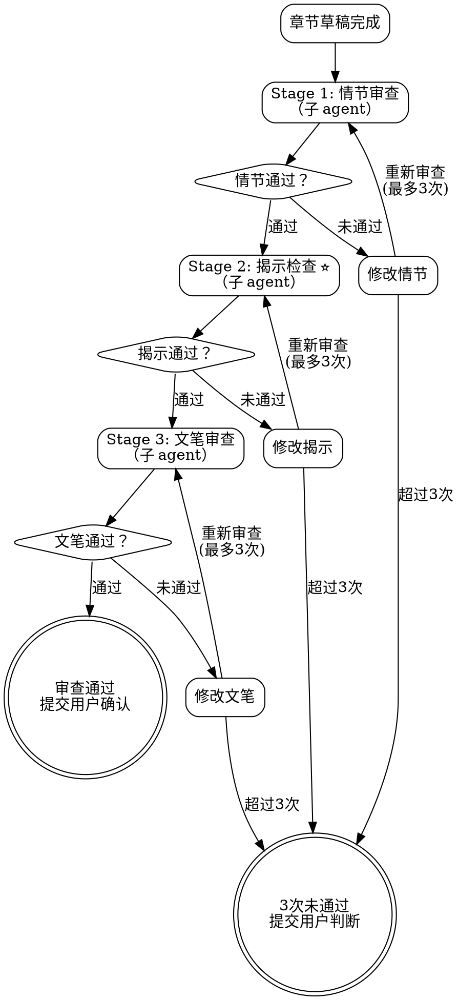
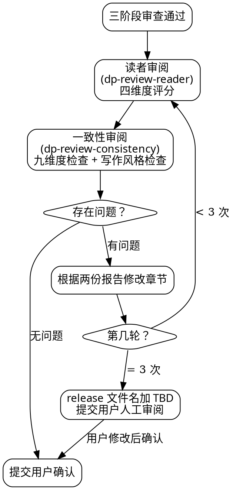
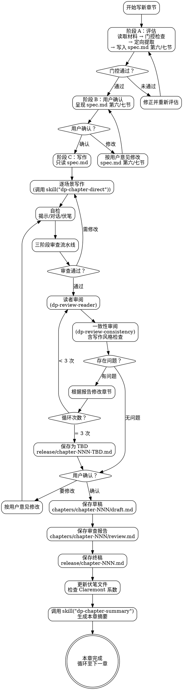

<SUBAGENT-STOP>
如果你是被派遣执行特定任务的子代理，跳过此技能。
</SUBAGENT-STOP>

# 章节起草与三阶段审查

本技能是**弹性技能**。原则不变，细节可因上下文调整。但三阶段审查流水线是刚性的，不可跳过任何阶段。

## 前置条件

必须已完成以下技能的产出物：

1. `dp-tool-research` — `docs/dreampowers/tracking/overview.md` 故事蓝本
2. `dp-set-style` — `docs/dreampowers/tracking/style.md` 写作风格档案
3. `dp-set-concept` — `docs/dreampowers/set/` 下有世界观设定与拆分后的概念/角色文件
4. `dp-set-outline` — `docs/dreampowers/outlines/` 下有大纲文档（含揭示时间表与主题追踪），`docs/dreampowers/chapters/chapter-NNN/` 章节文件夹已创建

缺少任何一项，停下来，先补齐再写。

## 草稿预审（写作前强制检查）

**硬性约束：** 草稿预审分为三个阶段：评估（A）→ 用户确认（B）→ 写作（C）。跳过任何阶段等于盲写。

**硬性约束：** 章节写作必须严格串行：写完第 N 章、三阶段审查通过且用户确认后，才能开始第 N+1 章。禁止并行起草多章。连写模式只是省略用户逐章确认，写作本身仍然是逐章顺序完成。

**硬性约束：** 写作阶段（阶段 C）只读 spec.md。禁止从章节文件夹中的其他文件或章节文件夹之外获取信息。所有写作所需的事实和指令已在阶段 A 提取并写入 spec.md 第六、七节。其他章节文件夹中的任何文件不可访问。

**硬性约束：** 阶段 A 的读取范围限于当前章节文件夹内的文件（含符号链接指向的源文件）。禁止直接读取 `docs/dreampowers/release/` 下的章节正文。前序章节信息只通过章节文件夹内的 `summary-*.md` 摘要符号链接获取；如果链接缺失，执行步骤 5 补建链接，而非绕过链接直接读取原文。

### 阶段 A：评估（读取材料 → 门控检查 → 写入 spec.md）

读取章节文件夹全部材料，执行门控检查和定向提取，将结果写入 spec.md 第六节（门控评估结果）和第七节（本章写作蓝图）。

每章开写前，按顺序执行：

1. **读取大纲**：找到本章在大纲中的详细信息（章节目标、场景安排、关键事件、视角、情绪曲线、章末钩子）。大纲文件通过章节文件夹中的符号链接读取（`outline-*.md → ../../outlines/outline-*.md`）。如果大纲标注本章使用非顺叙手法（倒叙、插叙、补叙），记录时间线执行要求，参照本技能的"叙事时间线执行指引"
2. **读取揭示时间表**（嵌在大纲文件内）：本章安排了哪些世界观揭示？揭示方式是什么？
3. **加载概念白名单**：读取 `docs/dreampowers/chapters/chapter-NNN/` 目录，**仅加载目录内有符号链接的概念文件**。目录中不存在符号链接的概念物理不可见、不可引用
4. **加载角色白名单**：读取同一章节文件夹中的角色符号链接，加载对应的角色文件。复杂角色只加载章节文件夹中链接的特定时间线阶段文件。未链接的角色和时间线阶段物理不可见
5. **检查前序章节摘要符号链接**：检查当前章节文件夹内是否已存在 `summary-*.md` 符号链接（正常情况下由上一章的 `dp-chapter-summary` 在第六步创建）。如果缺失：将 `docs/dreampowers/timeline/` 下所有已存在的 `summary-*.md` 在当前章节文件夹内补建符号链接（`summary-NNN.md → ../../timeline/summary-NNN.md`）。写第一章时无前序章节，跳过本步骤
6. **读取前序章节摘要**：从章节文件夹内的 `summary-*.md` 符号链接读取摘要全文，确认前章结尾状态、角色位置、悬而未决的线索。**重点读取每份摘要末尾的 `[章末状态]` 行**，提取最近一章各角色的物理状态（伤势、健康）、情绪状态、所在位置。本章开头必须延续这些状态——上章受重伤的角色不能无说明地恢复，上章在 A 地的角色不能无交代地出现在 B 地
7. **读取 spec.md 框架**：读取 spec.md 第一～五节（概念预算、门控标准、概念依赖、读者评估要求、改进要求）
8. **读取铁律**：从章节文件夹中的 `iron-rules.md` 符号链接读取六条铁律
9. **读取风格档案**：从章节文件夹中的 `style.md` 符号链接读取写作风格档案，确认七维参数、可执行风格指令和禁区
10. **读取伏笔文件**：读取章节文件夹中链接的伏笔线索文件（`thread-*.md`），确认本章需要植入、推进、回收哪些伏笔
11. **读取作者调优**：检查章节文件夹中是否存在 `tuning.md`。若存在，读取其中的调优指令
12. **加载成人场景技能**：检查章节文件夹中是否存在 `adult.md`。若存在（有链接 = 本章含成人场景），调用 `skill("dp-chapter-adult")` 加载成人场景写作方法论，并读取 `adult.md` 中的尺度、禁区、风格偏好
13. **读取张力追踪状态**：参照 `dp-chapter-direct` 的张弛法则，评估前序章节的张力走势（从前序摘要推断），确认本章的张力定位（高张力/低张力/过渡）是否符合章节粒度的张弛交替要求
14. **执行门控检查**：逐项检查 spec.md 第二节的门控标准清单，执行五问闸门检查：
    - 本章引入几个新概念？是否在 spec.md 的概念预算内？
    - 是否有不服务当前冲突的信息？
    - 揭示方式是否通过角色体验而非旁白？
    - 已有概念是否在深化？
    - 读者此刻的认知负载是否可接受？
15. **大纲驱动的定向提取**：以大纲中本章的场景安排和关键事件为"需求清单"，从概念文件和角色文件中定向提取写作所需的事实要点。只提取需求清单覆盖到的部分，不搬运原文。每个提取项标注"提取依据"（如"依据：大纲场景2'宗门议事'"），供用户对照审核
16. **写入 spec.md 第六节（门控评估结果）**：
    - 第二节门控标准的逐项检查结果（通过/不通过 + 说明）
    - 五问闸门的逐项结果
    - 评估结论（全部通过 / 需要修正）
17. **写入 spec.md 第七节（本章写作蓝图）**：将以上步骤的结果按以下子项组织写入：
    - **大纲要点**：本章目标、场景安排、关键事件、视角、情绪曲线、章末钩子（提取自大纲）
    - **揭示计划**：本章安排的世界观揭示及揭示方式（提取自揭示时间表）
    - **概念要点**：本章需要的概念事实，每项标注提取依据（定向提取自概念文件）
    - **角色要点**：本章需要的角色事实，每项标注提取依据（定向提取自角色文件）
    - **前情衔接**：前序摘要全文引用（每章≤150字）+ 最近一章的角色章末状态快照（从 `[章末状态]` 行提取）+ 需要衔接的具体事项
    - **伏笔指令**：本章需要植入、推进、回收的伏笔清单及具体要求（提取自伏笔文件）
    - **风格指令**：七维参数摘要、可执行指令、禁区（提取自 style.md）
    - **调优指令**：作者调优内容（提取自 tuning.md，若存在）
    - **成人场景指令**：尺度、禁区、风格偏好（提取自 adult.md，若存在）
    - **张力定位**：本章张力级别（高/低/过渡）、与前后章的张弛关系、张弛法则合规性（提取自张力追踪评估）
    - **优先级**：铁律 > tuning.md > adult.md > style.md > 大纲默认设定 > spec.md 中的一般指导
    - **铁律提醒**：六条铁律精简版（提取自 iron-rules.md）
    - **语域转换提醒**：以上要点均为技术参考资料，写作时只提取事实，不复制其语言风格。所有设定信息进入正文时，必须经过风格指令定义的文笔过滤——用角色的感知、动作、对话来承载，不用资料的术语和句式
    - **时间线执行要求**（若大纲标注非顺叙手法）：参照本技能的"叙事时间线执行指引"

### 阶段 B：用户确认

向用户呈现 spec.md 第六节和第七节的内容，等待确认。

- 用户可删除不想让模型看到的信息
- 用户可调整重点、修改指令、补充遗漏
- 用户可否决评估结论，要求返回阶段 A 修正
- 用户确认后，spec.md 第六、七节锁定

### 阶段 C：写作

**硬性约束：** 阶段 C 只读 spec.md。

按 spec.md 第七节写作蓝图逐场景写作。

## 写作流程清单

调用本技能后，将以下清单写入 todowrite，逐项执行：

- [ ] 草稿预审 阶段 A：读取材料、门控检查、定向提取、写入 spec.md 第六/七节
- [ ] 草稿预审 阶段 A 补充：检查前序摘要符号链接是否存在，缺失则补建（阶段 A 步骤 5）
- [ ] 草稿预审 阶段 B：向用户呈现 spec.md 第六/七节，等待确认
- [ ] 草稿预审 阶段 C：只读 spec.md，按第七节写作蓝图确定写作重点
- [ ] 逐场景写作（每个场景独立完成，场景间保持过渡）
- [ ] 保存草稿到章节文件夹 `docs/dreampowers/chapters/chapter-NNN/draft.md`
- [ ] 自检：世界观揭示是否符合铁律
- [ ] 自检：对话是否有角色辨识度
- [ ] 自检：伏笔是否自然植入
- [ ] 自检：张弛法则是否满足（张弛法则详见 `dp-chapter-direct`）
- [ ] 三阶段审查（Stage 1 → Stage 2 → Stage 3）
- [ ] 用户确认或修改
- [ ] 外部审阅闭环（dp-review-reader → dp-review-consistency，最多 3 次循环）
- [ ] 保存终稿到 `docs/dreampowers/release/chapter-NNN.md`
- [ ] 更新伏笔文件（`docs/dreampowers/tracking/thread-*.md`）
- [ ] 记录本章张力级别到章节摘要中，供后续章节的张力追踪评估使用
- [ ] 调用 `skill("dp-chapter-summary")` 生成本章摘要
- [ ] 调用 `skill("dp-tool-version")` 提交版本快照

## 场景写作指引

场景级别的精细控制需调用 `skill("dp-chapter-direct")`。这里只给出章节层面的指引：

**开场**：直接进入动作或对话。不要从天气、环境描写开头，除非天气本身是情节元素（暴风雨阻断退路、浓雾隐藏敌人）。第一句话就应该让读者进入场景。

**过渡**：场景切换用空行分隔，不用"与此同时""另一边""话分两头"。如果视角切换，新场景的第一句就该让读者知道自己在跟谁。

**结尾**：每个场景留一个微型钩子或情绪转折。不一定是悬念，可以是一个未回答的问题、一个令人不安的细节、一个角色做出的选择。章末钩子要更强，驱动读者翻到下一章。

**字数**：不设硬性字数要求。场景写到该停的地方停。但如果大纲规定了本章字数区间，尽量靠近目标。

**时代视角**：故事设定在过去时代时，用角色当时的视角写，不用当代人回忆的视角。对角色而言，身边的一切都是当下的、鲜活的——没有"泛黄"、"陈旧"、"蒙尘"的滤镜。同时注意物品的时代准确性：90年代教室是黑板粉笔不是白板记号笔，方便面是袋装的没有桶面，日用品以搪瓷铝制木质为主而非塑料。写每个场景时核查：这个物件在那个年代存在吗？角色会用什么？

**大纲是框架，不是展开指令**：大纲中的每个条目是情节节点，不是要求你详细描写该事件的过程。大纲写"兴建工厂"，小说里只需要"一座新的工厂拔地而起"一句带过，不需要展开施工细节、建材选择、工人调度。判断标准：这个细节推动了情节、塑造了角色、还是制造了冲突？都不是的话，一句话概括，不展开。

## 叙事时间线执行指引

大纲阶段（`dp-set-outline`）决定本章使用哪种时间线手法。本节指导你在实际写作中如何执行这些手法。大纲说"用什么"，这里说"怎么写"。

### 顺叙

默认模式，无需特殊处理。唯一需要注意的是时间过渡：

- 禁止机械地使用"第二天""三天后""一周之后"作为场景衔接
- 时间跳跃要通过场景内部的细节暗示：光线变化、餐食更替、衣着换季、角色状态变化
- 如果两个场景之间的时间间隔对情节无影响，直接切场景，不需要交代过了多久

### 倒叙

从结果写起，再回溯原因。执行规则：

| 序号 | 规则 | 说明 |
|------|------|------|
| 1 | **开头制造认知缺口** | 第一个场景必须让读者产生"发生了什么？"的强烈疑问。不要在开头解释，只展示结果 |
| 2 | **回溯锚点要清晰** | 从"现在"跳到"过去"时，通过感官、物件、季节等具体细节暗示时间位移。禁止用"时间回到三个月前"这类生硬标注 |
| 3 | **回溯中禁止泄底** | 回溯叙事中严禁提前揭露开头悬念的答案 |
| 4 | **回归信号必须明确** | 从倒叙回到"现在"时，必须有清晰的过渡信号 |

### 插叙

当前时间线中嵌入过去的片段：

1. **触发规则**：插叙必须由当前场景中的具体触发物引发。禁止无触发硬切
2. **长度规则**：单次插叙不超过当前场景篇幅的 1/3
3. **退出规则**：从插叙返回现在时，必须回到触发点
4. **频率规则**：一章内最多 1 次插叙

### 补叙

事件发生后，补充交代此前未披露的信息：

1. **时机规则**：补叙必须在读者已经对某事件产生疑问之后使用
2. **载体规则**：通过角色回忆、对话揭示、物件承载（书信、日记等）
3. **铺垫规则**：禁止在读者毫无铺垫的情况下补叙

### 时间线手法速查表

| 手法 | 核心要求 | 最常见错误 |
|------|---------|-----------|
| 顺叙 | 过渡自然 | 机械标注时间跳跃 |
| 倒叙 | 认知缺口 + 禁止泄底 | 开头悬念太弱，或回溯中提前给答案 |
| 插叙 | 有触发 + 有退出 + 控长度 | 无触发硬切，插叙太长喧宾夺主 |
| 补叙 | 先有疑问再补 | 无铺垫突然补叙，读者一头雾水 |

## 三阶段审查流水线

这是本技能的核心。三阶段顺序执行，不可跳过。



### Stage 1: 情节审查

派遣子 agent，检查以下四点：

1. **核心冲突推进**：本章是否推进了核心冲突？
2. **角色行为一致性**：角色的行为是否符合其已确立的动机和性格？
3. **大纲偏差评估**：与大纲的偏差是否合理？
4. **章末钩子有效性**：章末是否有足够的驱动力让读者继续？

**通过标准**：情节逻辑自洽，角色行为合理，章末有钩子。

### Stage 2: 揭示检查 ⭐

**这是核心创新。零容忍 info-dump。**

派遣子 agent，基于六条铁律逐一检查：

1. **新概念预算**：本章引入了几个全新概念？是否超出预算？
2. **旁白讲解检测**：是否存在角色不可能知道的世界观信息？
3. **揭示载体检查**：所有世界观信息是否通过角色行动、对话、观察传递？
4. **信息相关性**：是否有"此刻没有发生"的信息？
5. **深化 vs 堆砌**：已引入的概念是否在深化理解？

**通过标准**：严格符合六条铁律。零违规。

### Stage 3: 文笔审查

派遣子 agent，检查以下五点：

1. **语言风格一致性**：对照 `style.md` 风格档案的七维参数和可执行风格指令，检查本章文风是否符合风格基准且与已有章节一致？
2. **对话辨识度**：蒙住角色名字，能否从说话方式分辨谁是谁？
3. **感官描写**：是否有充分的感官细节？
4. **节奏与情绪**：段落长短是否服务于情绪目标？
5. **重复检测**：是否有重复用词、重复句式、重复修辞？

**通过标准**：文笔质量达标，风格一致，对话有辨识度。

### 审查规则

- Stage 1 通过后才进入 Stage 2
- Stage 2 通过后才进入 Stage 3
- 任何 Stage 未通过 → 修改 → 重新该 Stage 审查
- 每个 Stage 最多 3 次循环，超过则提交用户判断
- **Stage 2（揭示检查）是最严格的**，零容忍 info-dump

## 外部审阅闭环

三阶段审查通过后，章节进入外部审阅闭环。这个闭环由两个独立技能协作完成，总循环最多 3 次。

### 流程



### 审阅规则

1. **读者审阅先行**：调用 `skill("dp-review-reader")`，获取四维度评分和问题标记
2. **一致性审阅跟进**：调用 `skill("dp-review-consistency")` 第一部分（连续性检查）+ 第二部分（修订建议与AI味检测，含对照 `style.md` 的写作风格检查）
3. **合并修改**：将两份报告的问题汇总，统一修改章节。修改后不需要重新走三阶段审查（三阶段已通过，外部审阅只做体验和一致性层面的调整）
4. **循环上限 3 次**：修改后重新进入读者审阅 → 一致性审阅。总循环最多 3 次
5. **3 次后仍有问题**：终稿保存至 `docs/dreampowers/release/chapter-NNN-TBD.md`，`review_status` 标记为 `tbd`，提交用户人工审阅修改

### 判定"存在问题"的标准

- 读者审阅：翻页欲/共情/节奏任一维度评分 ≤2，认知负荷评分 ≥4（认知负荷越高越差），或两个以上维度评分未达标（翻页欲/共情/节奏 ≤3，认知负荷 ≥3）
- 一致性审阅：任一维度 FAIL，或检出 AI 味

两份报告中任一触发上述标准，即视为"存在问题"，进入修改→复审循环。

## 存储路径与章节格式

草稿保存至章节文件夹：

```
docs/dreampowers/chapters/chapter-NNN/draft.md
```

审查通过并获得用户确认后，终稿保存至：

```
docs/dreampowers/release/chapter-NNN.md
```

外部审阅闭环 3 次后仍有问题的章节，终稿保存至：

```
docs/dreampowers/release/chapter-NNN-TBD.md
```

用户人工审阅修改完成后，将文件重命名为 `docs/dreampowers/release/chapter-NNN.md`，`review_status` 改为 `approved`。

`NNN` 为零填充章节号（001, 002, 003...）。

章节文件头部包含元数据注释：

```markdown
<!-- 
story: [故事名]
chapter: [章节号]
pov: [视角角色]
date: [写作日期]
word_count: [字数]
review_status: [draft/reviewed/approved/tbd/imported]
-->

# 第[N]章：[章节标题]

[正文]
```

`review_status` 状态说明：
- `draft` — 初稿，未经三阶段审查
- `reviewed` — 三阶段审查通过
- `approved` — 用户确认
- `tbd` — 外部审阅闭环 3 次后仍有问题，待用户人工审阅
- `imported` — 外部导入，未经审查流程

## 章节审查报告

三阶段审查完成后，将审查结果保存至章节文件夹：

```
docs/dreampowers/chapters/chapter-NNN/review.md
```

## 伏笔文件更新

每章写完并通过审查后，必须更新 `docs/dreampowers/tracking/` 目录下的对应伏笔文件：

**新植入的伏笔**：创建新的伏笔文件（`thread-NNN-描述.md`），记录伏笔内容、植入位置、植入方式，并在章节文件夹中创建符号链接

**推进的伏笔**：更新对应的伏笔文件，在"事件记录"中添加推进事件

**回收的伏笔**：更新对应的伏笔文件，在"事件记录"中添加回收事件，将元数据中的 `status` 改为 `resolved`

**Claremont 系数检查**：

遍历 `docs/dreampowers/tracking/` 目录下所有 `thread-*` 伏笔文件，统计元数据中 `status` 字段：

```
Claremont 系数 = status=active 的伏笔数 - status=resolved 的伏笔数
```

- CC = 0：伏笔收支平衡
- CC > 0 且 ≤ 2：叙事债务可控
- CC > 2：**警告**。暂停连续写作，建议优先回收旧伏笔

## 连续写作模式

默认流程是逐章写作、逐章确认。用户可选择连续写作模式。

### 模式选择

| 模式 | 行为 | 适用场景 |
|------|------|---------|
| **逐章确认**（默认） | 每章写完 → 三阶段审查 → 用户确认 → 下一章 | 精细控制每一章 |
| **连写 N 章** | 连续完成 N 章（每章仍走审查），统一交用户审阅 | 批量推进 |
| **写完一卷暂停** | 写完当前卷的所有章节后暂停 | 按卷管理进度 |
| **全自动** | 连续写完所有章节，最后统一交付 | 信任流程，一次性拿初稿 |

### 连续写作规则

1. **三阶段审查不跳过。** 连续写作省略的是用户确认环节，不是质量检查
2. **审查 3 次不过仍然升级。** 立即暂停连续写作，交给用户判断
3. **CC > 2 触发暂停。** 警告用户伏笔债务过高
4. **用户随时可中断。** 用户说"停"、"暂停"、"等一下"时，立即停止

### 批量审阅

连写 N 章或写完一卷后，向用户交付时：

1. 列出所有已完成章节的摘要（直接引用 `docs/dreampowers/timeline/summary-NNN.md` 内容）
2. 标注每章的三阶段审查结果
3. 标注伏笔场记的当前 CC 值和变化趋势
4. 询问用户是否要逐章细审，还是整体通过

### 中途改变主意

用户可以随时切换模式。切换即时生效。

## 大纲偏离处理

- **小偏离**（场景内部调整）：记录偏离点，继续写作
- **中偏离**（章节内事件顺序调整）：记录偏离点，章节审查时重点检查
- **大偏离**（核心事件改变、主线走向变化）：**立即暂停**，调用 `skill("dp-set-outline")` 的大纲修订流程

大偏离判定标准：如果这个偏离会导致后续 2 章以上的大纲失效，就是大偏离。

## 章节稿件接入

当作者在 AI 流程之外手写了章节，需要将其纳入工作流。

### 适用场景

- AI 写了 1-5 章，作者自己写了 6-8 章
- 作者导入已有手稿
- `dp-set-concept` 的导入模式将章节内容路由到此处

### 接入流程

1. **元数据注入**：为每个导入章节补充元数据头，`review_status: imported`
2. **内容分析**：逐章阅读，提取世界观设定引入、角色出场、伏笔种子、与大纲的对应关系
3. **伏笔场记回填**：回溯创建或更新 `docs/dreampowers/tracking/thread-*` 伏笔文件，发现呈报用户确认
4. **连续性检查**：对导入章节调用 `skill("dp-review-consistency")`
5. **大纲对照**：与大纲比对，记录偏离点。若存在大偏离，建议修订大纲
6. **续写衔接**：建立交接点，总结末章结尾状态（含角色章末状态快照），下一章进入正常 草稿预审

### 接入规则

- 导入章节保存为 `docs/dreampowers/chapters/chapter-NNN/draft.md`，`review_status` 标记为 `imported`
- 终稿保存至 `docs/dreampowers/release/chapter-NNN.md`
- 导入章节**不**经过三阶段审查（作者原作）
- 但**会**被扫描以追踪连续性和伏笔
- 用户可主动要求审查导入章节
- 批量导入多章时，按章节顺序处理

## 反模式

- ❌ **写完不审查直接下一章** — 每章必须走完三阶段审查
- ❌ **跳过 Stage 2 揭示检查** — 核心创新，不可省略
- ❌ **审查发现问题但标记"下章再修"** — 问题在本章解决
- ❌ **字数优先于质量** — 写 2000 字好文胜过 5000 字水文
- ❌ **三个 Stage 合并为一次审查** — 必须顺序执行、独立判断
- ❌ **揭示检查"大部分通过"就放行** — 零违规才通过
- ❌ **引用白名单外的概念或角色** — 只有 spec.md 写作蓝图中列出的概念和角色才可使用
- ❌ **写作阶段读取 spec.md 以外的文件** — 阶段 C 的唯一输入是 spec.md
- ❌ **并行起草多章** — 章节必须串行写作
- ❌ **给过去时代加回忆滤镜** — 不是回忆，没有古旧感，当时的事物是鲜活的
- ❌ **用当代物品替代该时代实际物品** — 核查每个物件是否符合故事年代
- ❌ **过度展开大纲条目** — 大纲写"兴建工厂"不等于要描写施工过程，一句带过即可；只展开推动情节、塑造角色或制造冲突的内容
- ❌ **草稿预审阶段直接读取 `release/` 下的完整章节** — 前序信息只通过章节文件夹内的 `summary-*.md` 摘要符号链接获取，缺失时补建链接而非读原文

## 完整流程图



## 与其他技能的交互

| 关系 | 技能 | 说明 |
|------|------|------|
| 上游 | `dp-set-outline` | 读取大纲、揭示时间表、章节文件夹（阶段 A）；spec.md 框架（第一～五节）由大纲阶段写入 |
| 被引用 | `dp-set-style` | 风格档案在阶段 A 读取并提取进 spec.md 写作蓝图 |
| 协作 | `dp-chapter-direct` | 场景级精细控制 |
| 协作 | `dp-character-style` | 角色风格与对话辨识度 |
| 协作 | `dp-review-reader` | 读者视角测试 |
| 协作 | `dp-review-consistency` | 连续性检查 |
| 协作 | `dp-tool-research` | 写作中遇到不确定的事实细节时调用 `skill("dp-tool-research")` 做即时考据；作者调优 |
| 协作 | `dp-tool-version` | Git 版本管理 |
| 协作 | `dp-chapter-adult` | 成人场景写作方法论（阶段 A 检测到 adult.md 时调用 `skill("dp-chapter-adult")`） |
| 下游 | `dp-chapter-summary` | 章节完成后生成摘要 |

## 终态

没有固定的下一个技能。章节写作是一个循环：

```
草稿预审(A:评估→B:用户确认→C:只读spec写作) → 逐场景写作 → 三阶段审查 → 外部审阅闭环(reader+consistency, 最多3轮) → [用户确认/批量审阅] → 保存 → 更新伏笔 → 生成摘要 → 下一章
```

每一章重新进入 草稿预审 阶段 A，重新读取材料、门控检查、定向提取。不要假设上一章的 spec.md 内容对下一章依然成立。
