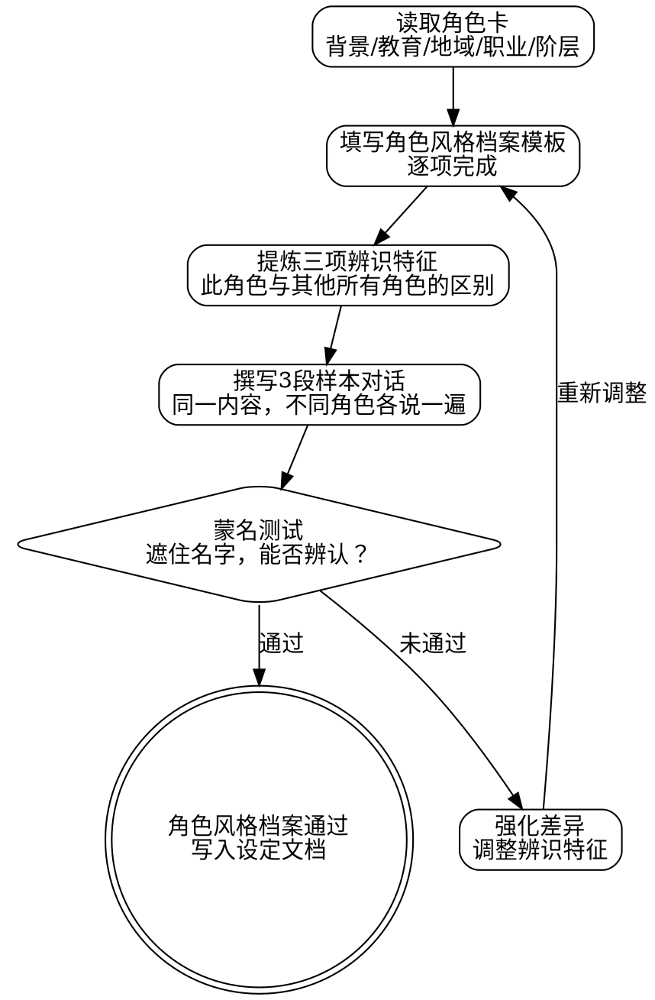
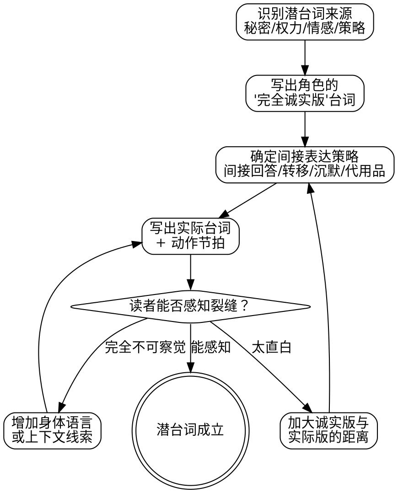

<SUBAGENT-STOP>
如果你是被派遣执行特定任务的子代理，跳过此技能。
</SUBAGENT-STOP>

# 角色风格与对话塑形（含潜台词）

本技能是**弹性技能（FLEXIBLE）**。核心原则不变，具体细节可因故事类型、角色数量、文体风格而调整。

章节结构：核心定位 → 前置条件 → 角色风格档案模板 → 角色风格创建流程(graphviz) → 对话写作规则（结构规则/对话标签规则/潜台词写作指引）→ 角色风格一致性检查 → 潜台词深潜（核心定位/适用时机/四种来源/构建技法/密度控制/审查方法/构建流程）→ 交互表 → 反模式 → Red Flags → 终止状态

交互：输入来自 `dp-set-concept`，被 `dp-chapter-draft`、`dp-chapter-direct` 调用，与 `dp-chapter-direct` 协同

## 核心定位

角色风格档案的终极检验标准：**蒙住角色名字，读者仅凭对话就能辨认出说话者。**

每个角色必须在两个维度上同时达标：
1. **差异性**：与其他角色的说话方式明显不同
2. **一致性**：自身的说话方式在全书范围内保持稳定（除非有明确的角色弧线支撑变化）

如果你的角色换个名字贴上去也毫无违和感，说明角色风格没有建立起来。

## 前置条件

必须已完成 `dp-set-concept`，且角色卡中包含基础信息（身份、背景、性格、动机）。角色风格档案是角色卡的延伸，不是替代品。

## 角色风格档案模板

每个主要角色一份角色风格档案，嵌入设定文档（`docs/dreampowers/set/character/`），紧跟对应角色卡之后。

```markdown
## 角色风格档案：[角色名]

### 语言层次
- **教育程度**: [文盲/私塾/学院/自学成才/...]
- **词汇范围**: [文言/白话/方言/行话/混合]
- **典型用语举例**: [3个该角色会用的词或短语]

### 句式偏好
- **句长倾向**: [短句为主 / 长句为主 / 混合]
- **句型偏好**: [陈述 / 反问 / 祈使 / 省略]
- **主被动**: [主动居多 / 被动居多]

### 口头禅与标志词
- **口头禅**: [1-2个，不超过3个]
- **标志词**: [角色偏爱的特定词汇]
- **使用频率**: [每N句出现一次，避免过密]

### 情绪表达方式
- **愤怒**: [爆发型/压抑型/冷嘲型/沉默型]
- **喜悦**: [外放型/内敛型/自嘲型]
- **悲伤**: [流露型/掩饰型/转化为愤怒型]
- **恐惧**: [逃避型/强撑型/理性分析型]

### 禁忌词汇
- [这个角色绝不会说的词/句式，至少列2个]
- [原因说明]

### 说话节奏
- **语速**: [急促/平稳/缓慢/视情绪波动]
- **停顿习惯**: [频繁停顿/一口气说完/关键处停顿]

### 潜台词倾向
- **直接度**: [直说 / 暗示 / 极度委婉]
- **常见潜台词策略**: [反话/转移话题/以问代答/沉默]

### 信息量控制
- **话多还是话少**: [寡言/适中/健谈/因对象而异]
- **主动提供信息还是被动回应**: [主动/被动/视关系而定]

### 三项辨识特征（核心）
1. [区别于所有其他角色的第一特征]
2. [第二特征]
3. [第三特征]
```

## 角色风格创建流程



### 步骤详解

**第一步：从角色背景出发**

角色风格不是凭空捏造的。一个农民不会说官话，一个将军不会说市井俚语（除非有特定经历支撑）。从角色卡中的以下字段推导角色风格：
- 教育经历 → 语言层次
- 出生地域 → 方言痕迹
- 职业背景 → 行话来源
- 社会阶层 → 说话时的自信程度与措辞习惯
- 核心性格 → 情绪表达方式与潜台词倾向

**第二步：定义三项辨识特征**

从角色风格档案的所有维度中，提炼出 3 个最能将此角色与其他角色区分开的特征。这 3 个特征必须满足：
- 至少 1 个是句式层面的（不能全靠口头禅）
- 至少 1 个是内容层面的（说什么，不只是怎么说）
- 不得与已有角色的辨识特征重复

**第三步：样本对话测试**

选一个简单的场景（比如"拒绝一个请求"），让每个主要角色分别用自己的角色风格说一遍。写出来后并排对比。如果两个角色的台词互换后依然通顺，说明差异不够。

**第四步：蒙名测试**

遮住角色名字，让自己（或子 agent）仅从对话内容判断说话者身份。通过标准：主要角色的辨认准确率 ≥ 80%。

## 对话写作规则

### 结构规则

| 规则 | 阈值 | 说明 |
|------|------|------|
| 连续对话上限 | ≤5 轮 | 超过 5 轮必须插入叙事/动作/心理描写（详见 `dp-chapter-direct`） |
| 潜台词密度 | ≥60% | 至少 60% 的对话应承载 ≥2 层含义（字面义 + 潜台词） |
| 对话功能 | 必选其一 | 每句对话至少完成一项：推进情节、揭示性格、制造张力 |

### 对话标签规则

**推荐**：
- 动作节拍代替对话标签。"他放下茶杯"比"他说"更有画面感
- "说""道"足矣。朴素的标签不会打断阅读节奏
- 当说话者明确时，省略标签。两人对话中交替回合不需要每句都标注

**禁止**：
- 替代词滥用（咆哮道、嘶吼道、低吟道、轻笑道）❌ 除非极端情绪场景偶尔使用
- 副词堆砌（"他愤怒地说""她温柔地道"）❌ 如果对话本身不能传达情绪，加副词也救不回来
- 解释性标签（"他讽刺地说"）❌ 讽刺应该从台词本身读出来

### 潜台词写作指引

好的对话永远有两层：角色说了什么，角色真正在表达什么。

这一节提供核心原则。关于潜台词的完整技法体系（四种来源、六种构建技法、密度控制、审查方法、构建流程），参见本技能后半部分的**"潜台词：对话中没说出口的那一半"**章节。

简要原则：

- 角色有不能说的秘密
- 角色有想要但不好意思要的东西
- 角色在试探对方
- 角色在保护自己或他人
- 权力关系导致不能直说

如果一段对话只有字面意思，问自己：这两个角色之间有什么是不能直接说出来的？如果什么都没有，要么场景设置有问题，要么角色关系太平淡。

## 角色风格一致性检查

每完成 3-5 章后执行一次角色风格一致性审查：

1. **提取**：把角色 X 在所有已完成章节中的对话全部提取出来
2. **比对**：逐项对照角色风格档案，检查是否偏离
3. **标记**：发现偏离时，判断类别：

| 偏离类型 | 处理方式 |
|---------|---------|
| 角色成长导致的角色风格变化 | 合理。在角色风格档案中补充"演变记录"，注明变化起始章节和驱动事件 |
| 情绪极端状态下的临时偏离 | 合理。不修改角色风格档案，但在该章节标注原因 |
| 无故偏离（作者笔误） | 不合理。修正对话，使其回归角色风格档案 |

4. **演变记录**：如果角色经历重大转折，角色风格档案应增加"演变"条目：

```markdown
### 角色风格演变记录
| 章节 | 变化内容 | 驱动事件 |
|------|---------|---------|
| 第12章 | 开始使用敬语 | 身份暴露，被迫融入上层社会 |
| 第20章 | 口头禅消失 | 导师去世，刻意抛弃旧习惯 |
```

## 潜台词：对话中没说出口的那一半

本章节是对前面"潜台词写作指引"的深潜展开，提供完整的潜台词技法体系。

### 核心定位

这是一个专注于**对话潜台词**的深潜模块。

前面的角色风格档案解决"角色怎么说话"。`dp-chapter-direct` 对白模式解决"对话场景怎么搭"。本章节只关心一件事：**角色说出口的话和真实意图之间的那条裂缝。**

潜台词是对话技艺的最高层。没有潜台词的对话是信息传递。有潜台词的对话是角色碰撞。

判定标准很简单：把角色说的话原文抄下来，再把他"真正想说的话"写在旁边。如果两句话完全相同，这段对话就没有潜台词。

### 适用时机

在以下场景中激活本章节的技法：

- 情绪高度紧绷的对话（告白、质问、摊牌）
- 谈判与博弈（交易、审讯、外交）
- 权力不对等的对话（上下级、师徒、主仆）
- 角色藏有秘密，或故意欺骗/误导的场景
- 任何"角色不能/不愿/不敢说真话"的对话

如果角色之间没有隐瞒、没有权力差、没有情感压力，潜台词就缺乏驱动力。先检查场景设定是否具备产生潜台词的条件。

### 潜台词的四种来源

每一句有潜台词的台词，背后都有一个驱动力。识别驱动力，才能写出精准的间接表达。

| 来源 | 驱动力 | 角色状态 | 典型场景 |
|------|--------|---------|---------|
| 秘密 | 角色知道某件事但不能暴露 | 闪躲、模糊、转移注意力 | 身份隐瞒、背叛前夕、双面间谍 |
| 权力 | 等级/关系阻止诚实表达 | 委婉、服从表面下的抵抗 | 下属暗讽上司、学生违心附和 |
| 情感 | 感受太脆弱/太强烈，直说等于暴露自己 | 压抑、伪装、用愤怒掩饰恐惧 | 告别、表白、创伤触发 |
| 策略 | 角色故意隐瞒以获取优势 | 设局、试探、钓鱼 | 谈判、审讯、情报刺探 |

一句台词可以同时被多种来源驱动。"策略"+"秘密"是最常见的复合型。

### 潜台词构建技法

#### 间接回答

用另一个问题回避原始问题。回避本身就是答案。

> "你昨晚去了哪里？"
> "你什么时候开始查我行踪了？"

角色没有回答。但读者已经知道：去了不该去的地方。

#### 话题转移

对话碰到敏感区域时，角色突然切换话题。越突然，越暴露。

> "你真的不恨他？"
> "这茶凉了。我去烧点水。"

转移的时机就是痛点的坐标。

#### 过度补偿

解释得太多、太细、太急切，反而暴露了心虚。

> "我只是路过，正好看到灯还亮着，想着你可能还没吃饭，也没什么特别的意思，就是顺路带了点东西……"

正常人不需要为一碗面条辩护。

#### 身体语言矛盾

嘴上说的和身体做的不一致。文字对话中，通过动作节拍实现。

> "我没事。"她把手藏到桌子底下，指甲掐进掌心。

台词和动作的缝隙就是潜台词的入口。

#### 选择性沉默

不回答，也是一种回答。在关键节点插入沉默，用叙述填充那个空白。

> "你还爱她吗？"
> 他把杯子转了半圈，又转回来。窗外有人在叫卖水果。
> "走吧，该出发了。"

沉默持续的长度正比于问题的杀伤力。

#### 代用品（位移表达）

不谈真正的问题，用一个安全话题承载真实情绪。两个人在争论一道菜的做法，其实在争论谁说了算。

> "你每次都放太多盐。"
> "你每次都嫌我放太多盐。"

他们不是在谈盐。

### 潜台词密度控制

不是每句台词都需要潜台词。**目标密度：60%。**

全程潜台词会让读者精疲力竭。密码一样的对话读起来像解谜游戏，不像故事。你需要在"加载句"和"呼吸句"之间交替：

| 类型 | 功能 | 占比 |
|------|------|------|
| 加载句 | 承载潜台词，字面意思和真实意图不同 | ~60% |
| 呼吸句 | 字面即全部，推动对话前进 | ~40% |

呼吸句的作用：给读者消化空间，让加载句更显锋利。连续三句加载句后放一句呼吸句，效果最佳。

### 潜台词审查方法

写完一段对话后，逐句做以下检查：

**对每个对话交换，问自己：如果这个角色在这个场景中完全诚实，他会怎么说？**

然后把"完全诚实版"和"实际台词"并排放。

- 两者完全相同 → 这句没有潜台词。检查：场景是否需要？角色是否有理由直说？
- 两者存在差距 → 差距就是潜台词。检查：差距是否可感知？读者能否在不解释的情况下隐约感受到？
- 读者完全无法察觉差距 → 潜台词太深，等于没有。需要增加身体语言线索或上下文暗示

这个方法也是诊断工具。如果你发现一场关键对话中每句台词的"诚实版"和"实际版"完全一致，说明角色之间缺乏足够的张力、秘密或不对等关系。问题不在对话技法，在场景设定。

### 潜台词构建流程



## 与其他技能的交互

| 关系 | 技能 | 说明 |
|------|------|------|
| 上游 | `dp-set-concept` | 角色背景、性格、动机、人际关系 |
| 被引用 | `dp-chapter-draft` | 写作阶段文笔审查中的"对话辨识度"检查和对话层次检查 |
| 被引用 | `dp-chapter-direct` | 场景对话子模式中的角色风格参考，以及"60% 潜台词密度"规则的具体执行指引 |
| 协作 | `dp-chapter-direct` | 潜台词密度影响对话节奏，加载句减速，呼吸句加速 |
| 协作 | `dp-review-consistency` | 角色风格是修订和去AI味的红线，不得抹杀角色说话方式 |
| 协作 | `dp-set-outline` | 角色风格应反映其对主题的立场 |

## 反模式

以下行为严格禁止：

- **所有角色说话像同一个人（作者本人）** ❌ 角色风格档案存在的全部意义就是防止这件事
- **方言/口音作为唯一区分手段** ❌ 方言是差异的一部分，不是全部。去掉方言标记后角色仍应有差异
- **导游角色：只为解释设定而存在的角色** ❌ 每个角色都要有自己的目标和立场，不是作者的传声筒
- **对话读起来像论文** ❌ 没有人在日常对话中使用完整的因果论证链条
- **角色风格无故变化** ❌ 角色说话方式改变必须有角色发展支撑，否则就是笔误
- **口头禅过度使用** ❌ 口头禅是点缀，不是每句话的开头。频率过高会变成读者的噪音
- **用外貌描写替代角色风格** ❌ "粗犷的声音说道"不是角色风格，是偷懒
- **所有台词都是字面意思，对话变成信息传递带** ❌ 角色之间如果没有任何需要隐瞒的东西，场景设定有问题
- **潜台词深到读者完全无法察觉** ❌ 读者感知不到的潜台词等于不存在
- **用旁白直接解释潜台词** ❌ "他这么说，其实是想表达……"直接杀死了潜台词的全部力量
- **每句话都有潜台词，100% 密度** ❌ 读者会疲劳、脱离、不再信任任何台词的字面意思
- **潜台词与角色性格矛盾** ❌ 一个一向直率的角色突然满口暗示，没有铺垫就是笔误
- **所有角色用同一种间接表达方式** ❌ 角色 A 和角色 B 都用沉默回避，那就不是角色差异，是作者的偷懒

## Red Flags（STOP 信号）

出现以下任一情况，立即停下：

| 信号 | 说明 |
|------|------|
| 两个角色的台词互换后毫无违和感 | 角色风格差异不足 |
| 角色突然使用从未用过的句式/词汇 | 可能是笔误，检查角色风格档案 |
| 连续超过 5 轮纯对话无叙事打断 | 违反结构规则 |
| 对话只有字面意思，没有潜台词 | 检查角色关系和场景张力 |
| 角色在"解释"而非"说话" | 导游角色陷阱 |
| 全篇对话标签都是"XX道" | 需要用动作节拍替换 |
| 关键对话中每句台词的"诚实版"和"实际版"完全一致 | 场景缺乏张力或角色缺乏隐瞒动机 |
| 连续多句潜台词后无呼吸句 | 密度过高，读者疲劳 |
| 角色的间接表达方式与角色风格档案中的"潜台词倾向"矛盾 | 角色风格一致性被破坏 |
| 需要旁白解释角色"真正的意思" | 潜台词太深或技法失败，需要重写 |
| 读者必须回翻前文才能理解一句对话 | 上下文暗示不足，线索需要前置 |
| 角色突然变得极度间接，无触发事件 | 缺乏动机铺垫 |

出现 Red Flag 后：
1. 暂停写作
2. 重新查阅相关角色的角色风格档案
3. 运行潜台词审查方法（诚实版 vs 实际版对比），确认潜台词来源是否成立
4. 改写问题对话
5. 如果是系统性问题（多处出现），执行完整的角色风格一致性检查

## 终止状态

当以下条件全部满足时，本技能的产出物视为完成：

- 所有主要角色（主角 + 主要配角）均已建立角色风格档案
- 每份角色风格档案的三项辨识特征已定义，且不与其他角色重复
- 样本对话测试已完成
- 蒙名测试通过（辨认准确率 ≥ 80%）
- 角色风格档案已写入 `docs/dreampowers/set/character/` 中的角色设定文档
- 对话中潜台词密度接近 60% 目标，加载句与呼吸句交替
- 每句潜台词都有可追溯的来源（秘密/权力/情感/策略）
- 读者无需旁白解释即可感知字面与真实意图之间的裂缝
- 角色间接表达方式与各自角色风格档案中的潜台词倾向一致
- 关键对话的"诚实版"与"实际版"存在可感知的差距

完成后，角色风格档案与潜台词技法将作为 `dp-chapter-draft` 和 `dp-chapter-direct` 的持续参考依据。
