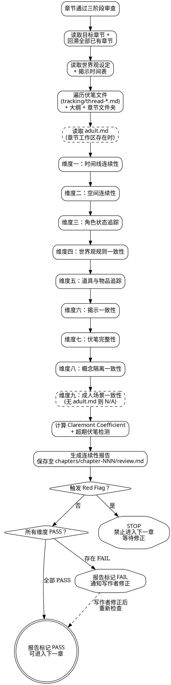
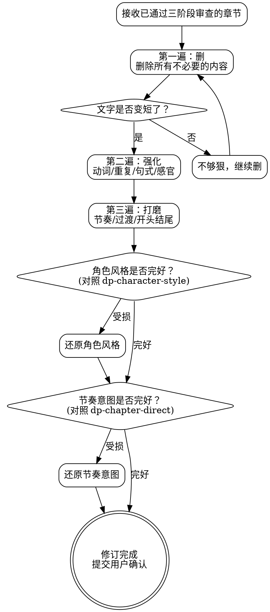
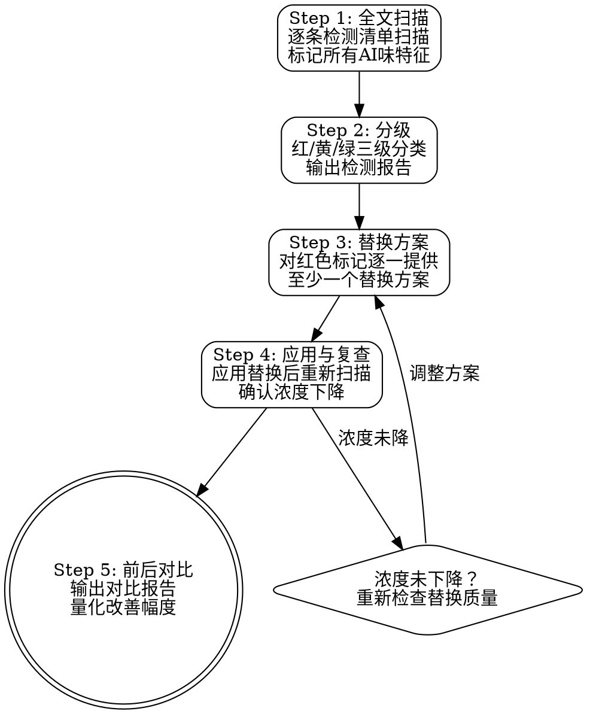
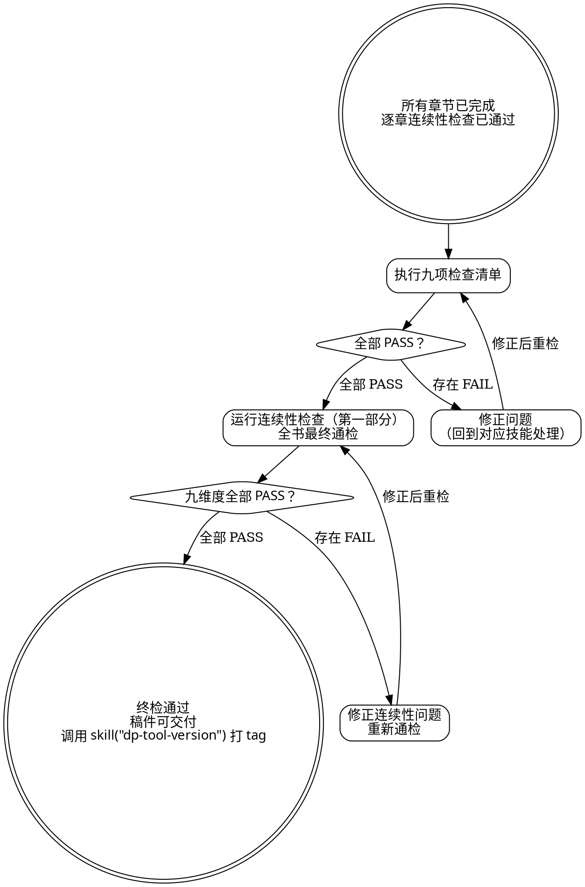

<SUBAGENT-STOP>
如果你是被派遣执行特定任务的子代理，跳过此技能。
</SUBAGENT-STOP>

# 连续性检查、散文修订与终检

本技能覆盖三个层面：

1. **连续性检查**（刚性）：逐维度验证叙事连续性，PASS/FAIL 二元判定
2. **散文修订与AI味检测**（检测刚性，替换弹性）：文笔打磨 + AI味消除
3. **终检**（刚性）：全书完成后的九项检查清单 + 最终连续性通检

三个层面可独立调用，也可按顺序串联执行。

---

# 第一部分：连续性检查

本部分是**刚性规则**，必须逐条执行，不得跳过任何检查维度，不得以"问题不大"为由放行。

**刚性执行声明（不可协商）：**
- 必须逐维度检查，不得合并或省略。
- 所有维度均为 PASS/FAIL 二元判定，不存在"基本通过"。
- 本部分只产出连续性报告，不修改稿件。发现问题后由写作者决定如何修正。

## 核心定位

本部分用于在章节完成后逐维度验证叙事连续性。它捕捉那些在写作时不易察觉、但会随章节推进而放大的不一致问题。

本部分**不是**编辑工具。它不修改任何稿件内容。它的唯一产出是一份结构化的连续性报告，标注每个维度的通过/失败状态及具体问题位置。

## 适用时机

- **外部审阅闭环（必选）**：章节通过 `dp-chapter-draft` 三阶段审查后，在外部审阅闭环中**紧随** `dp-review-reader` 执行。执行内容包括第一部分（连续性检查）和第二部分（散文修订与AI味检测，含对照 `style.md` 的写作风格检查）。闭环最多循环 3 次（详见 `dp-chapter-draft` 的外部审阅闭环章节）
- 长时间中断后重新回到稿件时（超过 3 天未写作）
- 大纲发生重大修改、需要回溯检查已写章节时
- 合并多人写作片段时

## 检查维度

共九个维度，全部必检（第九维度仅在章节工作区存在 `adult.md` 时执行，否则标记 N/A）。

### 一、时间线连续性

检查时间流逝的逻辑一致性：

- 日期与星期是否吻合
- 白天/夜晚的描写是否与时间线矛盾
- 季节变化是否与经过的时间匹配
- 旅行时间是否合理（距离 vs 交通方式 vs 消耗天数）
- 角色年龄是否与故事时间跨度一致
- 事件先后顺序是否与因果关系匹配

### 二、空间连续性

检查地理与空间描写的一致性：

- 角色当前位置是否与上章结尾一致
- 场景内部布局是否前后矛盾（门的方向、窗户位置、房间大小）
- 地点之间的距离描写是否稳定
- 同一地点在不同章节中的描写是否吻合

### 三、角色状态追踪

检查角色在章节间的状态延续：

- 伤势是否延续（上章受伤，本章无恙？）
- 情绪状态是否有合理过渡（上章崩溃，本章若无其事？）
- 人际关系变化是否被后续章节承认
- 信息不对称是否维持（角色 A 知道的事，角色 B 不该知道）
- 角色能力边界是否一致（忽强忽弱？）

### 四、世界观规则一致性

检查已确立的世界规则是否被违反：

- 魔法/科技/社会规则是否与 `dp-set-concept` 设定一致
- 规则的限制条件是否始终有效（不能因为情节需要就临时取消）
- 新引入的规则是否与已有规则矛盾
- 代价/副作用是否始终被执行

### 五、道具与物品追踪

检查关键物品的存在性和位置：

- 武器、工具、关键道具是否在需要时出现在正确角色手中
- 被消耗/损毁的物品是否不再出现
- 物品的描写（颜色、材质、大小）是否前后一致
- 情节关键物品是否有"凭空出现"或"突然消失"的问题

### 六、揭示一致性

对照 `dp-set-outline` 的揭示时间表检查：

- 本章揭示的世界观信息是否与时间表一致
- 是否有"意外揭示"（计划在后续章节才揭示的信息提前泄露）
- 已揭示的信息是否与后续计划矛盾
- 揭示方式是否符合铁律（无旁白讲解、概念预算达标）

### 七、伏笔完整性

遍历 `docs/dreampowers/tracking/` 目录下的所有伏笔文件（`thread-*.md`），检查：

- 已植入的伏笔是否在本章被意外否定或矛盾
- 本章新植入的伏笔是否已创建对应的伏笔文件（`tracking/thread-NNN-*.md`）
- 需要在本章推进的伏笔是否被遗漏
- 长期未触及的伏笔线索是否超出其层级的预期回收范围

### 八、概念隔离一致性

对照章节文件夹（`docs/dreampowers/chapters/chapter-NNN/`）检查：

- 本章是否引用了章节文件夹中没有符号链接的概念？（如出现了目录中不存在链接的力量体系、社会结构等设定）
- 本章是否出现了章节文件夹中没有符号链接的角色？（如提到了目录中没有对应链接的角色名字）
- 复杂角色是否仅展示了章节文件夹中链接的特定时间线阶段的信息？（如本章只链接了 `lin-feng-before-war.md`，但文中泄露了角色在"灾变后"的能力或身份）
- 本章 `spec.md` 标记为"新引入"的概念，是否确实在文中首次出现？（避免元数据与实际写作脱节）
- 本章 `spec.md` 标记为"深化"的概念，是否确实在文中得到了深化展开？

### 九、成人场景一致性

**仅在章节工作区存在 `adult.md` 时执行。** 有 `adult.md` = 本章含成人场景。

对照章节工作区的 `adult.md`（可能是符号链接到 `tracking/adult.md` 或章节级独立文件）逐项检查：

- **分级一致性**：场景描写是否符合 `adult.md` 中指定的默认分级（软性/硬核）？如果用户确认了分级切换，切换是否合理？
- **感官偏好**：重点描写的感官通道是否与 `adult.md` 中的偏好一致？弱化/省略的通道是否确实被弱化？
- **角色偏好**：视角展开是否与 `adult.md` 中的角色偏好一致？角色语言和行为是否符合偏好要求？
- **场景节奏**：铺垫、升温、高潮、余韵四阶段的节奏分配是否与 `adult.md` 中的偏好匹配？
- **个人禁区**：是否出现了 `adult.md` 中明确标注的禁区元素？（零容忍，出现即 FAIL）
- **写作风格**：成人场景的写作风格是否与 `adult.md` 中的风格描述一致？
- **章节频率**：回溯检查成人场景的出现频率，是否与 `adult.md` 中定义的频率预期大致吻合？

---

## 检查清单模板

每章检查后填写以下模板。每个维度必须标注 PASS 或 FAIL，FAIL 必须附带具体问题描述。

报告存储路径：`docs/dreampowers/chapters/chapter-NNN/review.md`

```markdown
# 连续性检查报告：第[N]章

检查日期：[YYYY-MM-DD]
检查范围：第[N]章 + 回溯至第[1]章

## 检查结果总览

| 维度 | 状态 | 问题数 |
|------|------|--------|
| 时间线连续性 | PASS/FAIL | N |
| 空间连续性 | PASS/FAIL | N |
| 角色状态追踪 | PASS/FAIL | N |
| 世界观规则一致性 | PASS/FAIL | N |
| 道具与物品追踪 | PASS/FAIL | N |
| 揭示一致性 | PASS/FAIL | N |
| 伏笔完整性 | PASS/FAIL | N |
| 概念隔离一致性 | PASS/FAIL | N |
| 成人场景一致性 | PASS/FAIL/N/A | N |

## 总体判定：PASS / FAIL

## 问题明细

### [维度名]
- **位置**：第N章，第X段 / 第Y行
- **问题**：[具体描述]
- **关联章节**：第M章（矛盾来源）
- **严重程度**：致命 / 重要 / 轻微

## Claremont Coefficient
- 已引入伏笔数：N
- 已回收伏笔数：M
- CC = N - M = [值]
- 状态：健康 / 可控 / 警告
```

---

## 伏笔追踪交互

### 读取与校验

1. 遍历 `docs/dreampowers/tracking/` 目录下的所有伏笔文件（`thread-*.md`），提取所有伏笔条目及其状态
2. 对照已写章节，验证每条伏笔的植入/推进/回收记录与实际文本是否匹配
3. 标记伏笔文件中有记录但文本中找不到对应内容的条目

### Claremont Coefficient 检查

```
CC = 已引入伏笔数 - 已回收伏笔数
```

| CC 值 | 状态 | 处置 |
|-------|------|------|
| = 0 | 健康 | 无需干预 |
| > 0 且 ≤ 2 | 可控 | 在报告中提示，建议优先回收旧伏笔 |
| > 2 | 警告 | 报告中强制标记，建议暂停引入新伏笔 |

注意：故事早期 CC 值可能偏高属正常现象。当已引入伏笔超过 5 条且无任何回收时额外发出警告。

### 超期伏笔检测

每条伏笔根据大纲规划有预期的回收章节范围。超出预期范围的伏笔需要标记：

- 超出大纲规划的预期回收章节范围 50% 以上的伏笔线索，在报告中标记为"超期"。

---

## 连续性检查输入来源

| 来源技能 | 读取内容 |
|---------|---------|
| `dp-chapter-draft` | 已完成的章节稿件（`release/chapter-NNN.md`） |
| `dp-set-concept` | 世界规则、角色设定（`docs/dreampowers/set/`） |
| `dp-set-outline` | 揭示时间表、铁律约束、计划的情节事件、章节目标 |
| 章节文件夹 | `docs/dreampowers/chapters/chapter-NNN/` 中的符号链接和 `spec.md` |
| `dp-chapter-adult` | 章节工作区的 `adult.md`（存在时读取，用于第九维度检查） |

### 产出

- 章节连续性报告，存储路径：`docs/dreampowers/chapters/chapter-NNN/review.md`
- 全书连续性报告，存储路径：`docs/dreampowers/outlines/review-consistency-*.md`
- 本部分**不修改**任何稿件，仅输出报告
- 如有维度 FAIL，在报告中标记，由写作者在下一轮 `dp-chapter-draft` 中修正

---

## 连续性检查 Red Flags（STOP 信号）

出现以下任一情况，立即停止后续章节的写作：

| 信号 | 含义 |
|------|------|
| 同一角色在同一时间出现在两个地点 | 空间连续性严重破坏 |
| 已死亡/离场的角色无交代地重新出现 | 角色状态追踪失败 |
| 世界规则被情节需要临时推翻 | 世界观一致性崩溃 |
| CC > 3 | 叙事债务失控，读者已无法追踪伏笔 |
| 三个以上维度同时 FAIL | 稿件整体连续性存在结构性问题 |
| 成人场景出现 `adult.md` 个人禁区元素 | 零容忍，立即 FAIL 并停止 |

出现 Red Flag 后：
1. 停止写作，不再进入下一章。
2. 完成完整的连续性报告。
3. 将报告提交给写作者，等待其修正后重新检查。

---

## 连续性检查执行流程

严格按以下顺序执行，不可跳步。

1. 读取目标章节稿件（`release/chapter-NNN.md`）
2. 读取全部已有章节（回溯至第 1 章）
3. 读取世界观设定（`docs/dreampowers/set/`）
4. 读取揭示时间表
5. 遍历 `docs/dreampowers/tracking/` 目录下的伏笔文件（`thread-*.md`）
6. 读取大纲（`docs/dreampowers/outlines/`）
7. 读取章节文件夹（`docs/dreampowers/chapters/chapter-NNN/` 中的符号链接和 `spec.md`）
8. 如果章节工作区存在 `adult.md`，读取其内容（用于第九维度检查）
9. 按九个维度逐一检查，每个维度独立判定 PASS/FAIL（第九维度无 `adult.md` 时标记 N/A）
10. 计算 Claremont Coefficient
11. 检测超期伏笔
12. 填写检查清单模板，生成连续性报告
13. 将报告保存到 `docs/dreampowers/chapters/chapter-NNN/review.md`
14. 如有任何维度 FAIL 或触发 Red Flag，明确告知写作者



---

## 连续性检查终止状态

- **全部 PASS**：在外部审阅闭环中，与 `dp-review-reader` 的结果合并判定。如果两份报告均无问题，章节可进入用户确认环节。
- **存在 FAIL（无 Red Flag）**：在外部审阅闭环中，问题与 `dp-review-reader` 的问题汇总后统一修改，修改后重新进入闭环（最多 3 次）。独立调用时，修正后重新运行本技能的连续性检查。
- **触发 Red Flag**：禁止进入下一章，必须先修正问题并重新通过全部九个维度检查。

---

# 第二部分：散文修订与AI味检测消除

本部分包含两个层面：**散文修订**（弹性，根据文体灵活调整）和**AI味检测**（刚性，检测规则不可妥协）。替换策略和修订操作可以灵活调整，但检测本身必须严格执行。

本部分同时覆盖两个维度：

- **散文修订** = 文笔打磨（改善表达质量）。让文字更好。
- **AI味检测与消除** = 改善表达真实性。让文字更真。

**推荐使用顺序**：先运行AI味检测与消除流程（本部分后半段），再运行散文修订流程（本部分前半段）。也可以合并使用，但检测阶段必须独立完成，不能在打磨的同时"顺便"去AI味。

与 `dp-chapter-draft` 三阶段审查的关系：Stage 3（文笔审查）是快速扫描，本部分提供深度检测和深度打磨。三阶段审查通过不代表没有AI味，AI味可以藏在"合格"的文字里。

## 散文修订核心定位

修订不是重写。修订是在内容、情节、结构全部定稿之后，对文字本身的精细打磨。不改变发生了什么，只让已经写好的东西读起来更好。

你的工作对象是词语和句子，不是场景和情节。如果一个场景需要重写，那是 `dp-chapter-draft` 的工作。如果节奏需要大幅调整，那是 `dp-chapter-direct` 的工作。你打磨的是已经成型的文字，像匠人给家具上最后一层漆。

## 散文修订适用时机

- **外部审阅闭环中**：作为闭环的一部分，在 `dp-review-reader` 之后执行。含对照 `style.md` 的写作风格检查
- 特定章节被标记为"文笔需要改善"时
- 终检前的最后一道工序
- 用户明确要求对某段文字做 prose-level 改善
- 每章写完、三阶段审查通过之后，需要检查AI味时
- 全书完成后的全稿扫描
- 用户明确要求"检查AI味"或"这段读起来像AI写的"

## 修订维度

七把打磨工具。不必每次全部使用，根据文本状态选择需要的维度。

### 冗余删除

如果删掉一个词、一个短语、一整句话，意思没有改变，删。检查：重复表达同一意思的相邻句子、"然后""于是"等空连接词、已用动作展示情绪又用独白解释的双重表达、形容词堆砌、"开始""试图""似乎"等弱化动作的词（"他开始跑"→"他跑"）。

### 动词强化

"是""有""做""进行""觉得"都是信号词，意味着可能有更精确的动词被错过。"他是一个勇敢的人"→"他冲进火场"。"她有一种不安的感觉"→"她的手指不停绞着衣角"。不是每个弱动词都需要替换，判断标准：它是否让你错过了一个展示角色、推进叙事的机会？

### 感官丰富

检查每个场景至少调动两种感官。只有视觉的场景加一笔听觉或触觉。动作场景感官应聚焦（痛觉、冲击感），情感场景可铺展 3-4 种感官。注意：节奏快的段落不要加感官细节拖慢速度（参考 `dp-chapter-direct`）。

### 重复检测

同一个词在 3 段内出现两次以上，读者会注意到。扫描内容：近距离重复词汇（排除代词和虚词）、连续相同句式结构、重复的比喻或意象、段首词重复（连续段落以同一个字开头）。

### 节奏微调

不改变场景的整体节奏模式（那是 `dp-chapter-direct` 的领域），只调整段落内部的句子长度变化。连续 4 句以上等长句子需拆分或合并。高潮句之前用稍长的句子做铺垫。段落结尾句的长度影响停顿感：短句干脆利落，长句余韵绵长。

### 过渡打磨

读者不应该在两段之间感到"跳了一下"。场景切换后第一句是否建立了新时空？段落之间是否有逻辑或情感上的承接？时间跳跃是否有清晰但不突兀的标记？

### 开头结尾锤炼

章节的第一段和最后一段是全书被翻阅最多的文字，值得额外打磨。

**开头**：第一句话是否抓人？是否从动作、感官、冲突切入？试着删掉前三句，如果故事从第四句也能读，前三句多余。

**结尾**：最后一句是否留有余味？是否避免了"总结陈词"式收尾（"那一天，他终于明白了..."）？章末钩子是否驱动读者翻页？

## 修订原则

1. **删 > 改 > 加**。能删就不改，能改就不加。好的修订让文字变少。如果修订后比原文更长，你在扩写
2. **每句话必须挣得它的位置**。推进情节、揭示角色、建立氛围，三项至少占一项，否则删
3. **杀死你的挚爱 (Kill Your Darlings)**。写得漂亮但不服务故事的句子就是装饰品，让读者欣赏文字而非沉浸故事。删掉它
4. **修订不是重写**。改动一个场景 50% 以上的文字，停下来。回到 `skill("dp-chapter-draft")` 走完整流程

## 修订流程

三遍通读法。每一遍只关注一个层面。

- **第一遍：删（Cut）**。只删除，不改写，不添加。这一遍结束后文字应明显变短。如果长度没变，你不够狠
- **第二遍：强化（Strengthen）**。替换弱动词，消除重复，调整句式变化，确认感官描写到位。对照 `style.md` 风格档案的七维参数：叙事距离、句法节奏、感官密度、词汇层级、比喻策略、情感表达、对话比重，确保强化方向与风格基准一致
- **第三遍：打磨（Polish）**。朗读感受音韵节奏，打磨过渡，锤炼开头结尾，确认阅读体验连贯自然。最终对照 `style.md` 的可执行风格指令和禁区做风格一致性终检



---

## AI味检测与消除

AI 生成的中文小说有一种独特的"机器味"。不是某一个词用错了，而是整体散发出一种套路化的气息：比喻词像撒胡椒面一样到处都是，情感永远靠"他感到"三个字交代，排比三连像条件反射，每段结尾都来一句升华感悟。单独看哪一条都不算大问题，叠在一起就让读者的潜意识发出警报："这不是人写的。"

本章节是专门的"去味"过滤器。它不管文笔好不好（那是上方散文修订部分的事），只管文字是否暴露了 AI 生成的痕迹。目标很明确：让文本读起来像人写的。

**刚性声明**：以下检测规则不可妥协，每条规则对应具体的模式匹配和量化阈值，不得因"风格需要"而绕过。替换策略可以灵活调整，但检测本身必须严格执行。

### AI味检测清单

六个层面，逐一扫描。这是本章节的核心，每条规则都有具体的模式和阈值。

#### A. 词汇层面

**比喻词泛滥**。"仿佛"、"宛如"、"犹如"、"好似"、"恰似"、"好像...一般"密集出现。人类作者也用比喻词，但不会每段都用，更不会一页出现三四次。

**万能连词开头**。"然而"、"不过"、"但是"、"可是"作为段落第一个词反复出现。AI特别喜欢用转折连词制造虚假的"层次感"，实际上什么也没转折。

**情感标签词**。"他感到悲伤"、"她心中涌起一阵温暖"、"一股莫名的恐惧攫住了他"。直接给情感贴标签，而不是通过动作、生理反应、环境变化来展示。这是 tell-not-show 的典型表现。

**程度副词堆砌**。"深深地"、"轻轻地"、"缓缓地"、"微微地"、"默默地"、"静静地"、"淡淡地"。AI用这些副词当万能调味料，给每个动词都撒一点。

**AI万能形容词**。"璀璨"、"氤氲"、"绚烂"、"旖旎"、"斑驳"、"葳蕤"、"澄澈"、"馥郁"。这些词不是不能用，而是AI用它们的频率远超人类作者。它们出现在不需要它们的地方。

**空洞的心理描写公式**。"他不知道为什么"、"她突然意识到"、"他从未想过"、"一种说不清道不明的感觉"。用模糊的元叙述替代具体的心理活动。

#### B. 句式层面

**排比三连**。"他看到了X，看到了Y，看到了Z"、"那是A的味道，是B的味道，是C的味道"。AI对排比有近乎强迫症的偏好，尤其是三项排比。

**"不是A，而是B"过度使用**。一章里出现三次以上这个句式，几乎可以确定是AI写的。

**段尾感慨式总结**。每段最后一句都是某种感悟、升华或哲理总结。"也许，这就是人生吧。""他终于明白了一个道理。""有些东西，失去了就再也回不来了。"

**主语重复**。"他...他...他..."连续三句以上以同一主语开头。AI很少意识到需要变换句子起始方式。

**句长过度均匀**。真实写作的句长参差不齐，短的可能只有两三个字，长的可能拖到四五十字。AI生成的文本句长标准差很小，读起来像节拍器。

**问句+自答**。"这是为什么呢？因为..."、"他能怎么办呢？他只能..."。AI喜欢用设问句制造虚假的思考感。

#### C. 结构层面

**固定三段式**。每个场景都是"环境描写→人物动作→内心独白"。顺序从不变化。人类作者会直接从对话切入，会把环境描写穿插在动作之间，会完全省略内心独白。

**章节开头必定是景物描写**。"阳光透过窗帘..."、"夜幕降临..."、"秋风萧瑟..."。AI把景物开头当作章节的"标准起手式"。

**对话后必跟动作标签**。"他说道"、"她轻声说"、"他淡淡地回应"。每句对话后面都挂着一个说话标签。人类作者会省略标签，用动作替代，或者让对话本身就能辨识说话人。

**转场公式化**。"时间飞逝"、"不知不觉"、"日子一天天过去"、"转眼间"。AI不会用具体事件来标记时间流逝。

**结尾必是升华式感悟**。每章最后一段一定要拔高一下，来一段关于人生、命运、成长的感悟。人类作者的章末可以是一个动作、一句对话、一个画面，甚至一个突然的中断。

#### D. 修辞层面

**通感滥用**。AI特别喜欢通感（"甜蜜的声音"、"冰冷的寂静"），几乎每页都有。人类作者使用通感是为了制造惊喜效果，AI用它只是因为这是它学到的"高级"修辞。

**比喻密度过高**。每段都有比喻。好的比喻是稀缺品，密集使用等于把钻石当碎石铺路。

**拟人化万物**。"月光温柔地洒下"、"风轻轻地叹息"、"树叶欢快地舞蹈"、"阳光顽皮地跳跃"。万物皆有情，读多了就腻。

**感叹号过多**。AI用感叹号来制造情绪强度，实际效果是让每个感叹都贬值。

**意象重复**。AI特别偏爱某些意象："琥珀色的光芒"、"碎裂的镜子"、"潮水般的情绪"。同一意象在不同章节反复出现却不是有意为之的母题。

**伪古旧感（回忆滤镜）**。描写过去时代发生的事时，AI 自动加上当代人回忆往事的"陈旧感"：发黄的纸张、泛黄的照片、生锈的栏杆、褪色的棉衣、蒙尘的器物、斑驳的墙壁。但故事发生在那个时代时，这些东西在当时就是新的、鲜活的——纸是白的，照片是刚洗出来的，栏杆是光亮的，棉衣是刚做的。AI 混淆了"叙事视角"和"当代读者视角"，用后者的怀旧滤镜覆盖了前者的即时体验。检测标志：大量使用"旧"、"老"、"褪色"、"泛黄"、"斑驳"、"锈迹"、"蒙尘"等词描写对角色而言应该是当下的事物。

**时代物品穿帮**。AI 用当代常见物品替代该时代实际存在的事物。这不是"古旧感"问题，而是事实错误。例如：90年代教室里是黑板和粉笔，不是白板和记号笔；方便面只有袋装的，没有桶面；日用品以搪瓷、铝制、木质为主，没有那么多塑料制品；通讯靠书信和公用电话，没有手机。每个时代都有自己的物质生活细节，AI 容易用训练数据中占比最大的当代物品填充场景。检测方法：逐场景核查出现的器物、食品、交通工具、通讯方式、日常用品是否符合故事设定的年代。

#### E. 格式层面

**连字符/长破折号**。"——"、"—"、"--"、" -- " 在中文小说中大量出现是典型的AI生成痕迹。中文标点有自己的体系：用逗号、句号、省略号、冒号来断句，用分段来切换节奏。AI却习惯性地插入英文标点风格的长破折号作为解释性插入语或戏剧性停顿，这在人类中文写作中极少出现。

**Emoji 表情符号**。小说正文中出现任何 Emoji 表情符号（😊、❤️、💔 等）都是纯粹的AI痕迹。正经的中文小说——无论网文还是传统文学——不使用 Emoji。情感通过文字表达，不是通过图标。如果看到 Emoji，说明 AI 把聊天风格混入了叙事文体。

**Markdown 星号标记**。正文中出现 `**加粗**` 或 `*斜体*` 等 Markdown 格式标记是AI生成的铁证。小说是纯文本叙事，不是技术文档。加粗和斜体是排版层面的事，不应出现在稿件正文中。AI经常用星号来"强调"关键词或情感高潮，这在人类写作中不存在。

**HTML 实体字符**。正文中出现 `&nbsp;`、`&mdash;`、`&hellip;`、`&ldquo;` 等 HTML 实体编码。小说是纯文本，不是网页。AI 有时会混入这些编码而非直接使用对应字符。

#### F. 语域层面

技术文档的语言混入小说正文。概念文件、角色卡、研究资料本身用结构化的百科式语言写成，AI 写作时如果直接复制这些资料的语言风格，正文就会读起来像技术报告而不是小说。这种污染比其他 AI 味更隐蔽，因为句子本身可能语法正确、逻辑清晰，只是不像人在讲故事。

**技术术语堆砌**。"基于"、"通过"、"实现"、"机制"、"体系"、"系统"、"构成"、"具备"、"呈现"等技术文档高频词在正文中密集出现。角色不会想"灵力基于经脉循环机制实现能量转化"，他会感受到灵力像暖流一样沿经脉流动。

**定义式句型**。"X是一种Y"、"X由A、B、C组成"、"X的特点是"、"X分为N类"。这是百科全书的写法，不是小说叙事。设定信息应通过角色的体验、观察、对话自然流露，不应以下定义的方式直接陈述。

**被动/无主句过多**。"被称为"、"被认为是"、"据说"、"一般认为"。技术文档和学术论文偏爱被动语态和无主语句式。小说需要具体的人在做具体的事。

**列举式说明**。正文中出现"首先...其次...最后..."、"第一...第二...第三..."、"一方面...另一方面..."等论文式的列举结构。小说不是在做报告。

**因果链条过度外显**。"因为A所以B，而B又导致了C"。技术文档追求因果逻辑的完整和外显，小说追求因果的隐含和自然。读者应该自己推导出因果关系，而不是被作者手把手领着走。

### 量化检测规则

硬性阈值。超过即标记，不接受"但这里是需要的"之类的辩解。如果确实需要，保留时必须给出具体理由。

| 检测项 | 统计单位 | 阈值 | 超标则标记为 |
|--------|---------|------|------------|
| 比喻词（仿佛/宛如/犹如/好似/恰似） | 每千字 | ≤2 次 | 🔴 比喻词泛滥 |
| 程度副词（深深/轻轻/缓缓/微微/默默/静静/淡淡） | 每千字 | ≤3 次 | 🔴 副词堆砌 |
| 情感标签（感到/觉得/心中涌起/一股...攫住） | 每千字 | ≤1 次，目标 0 | 🔴 情感标签化 |
| 排比结构（同一句式连续出现 3 次） | 每章 | ≤2 处 | 🟡 排比过度 |
| 句长标准差 | 全章 | ≥3 字 | 🔴 机械节奏 |
| "不是A，而是B"句式 | 每章 | ≤2 处 | 🟡 句式单调 |
| 通感修辞 | 每千字 | ≤1 次 | 🟡 通感滥用 |
| 感叹号 | 每千字 | ≤2 个 | 🟡 感叹号过多 |
| 段尾感慨式总结 | 每章 | ≤1 处 | 🔴 AI味升华 |
| AI万能形容词 | 每千字 | ≤1 个 | 🟡 词汇AI化 |
| 连字符/长破折号（——/—/--） | 每章 | 0 个 | 🔴 英文标点入侵 |
| Emoji 表情符号 | 每章 | 0 个 | 🔴 聊天体混入 |
| Markdown 星号标记（**/**） | 每章 | 0 个 | 🔴 格式标记残留 |
| HTML 实体字符（&nbsp;/&mdash;/&hellip; 等） | 每章 | 0 个 | 🔴 HTML 编码混入 |
| 技术术语（基于/通过/实现/机制/体系/系统/构成/具备） | 每千字 | ≤1 个 | 🔴 技术语域污染 |
| 定义式句型（X是一种Y/X由...组成/X的特点是） | 每章 | ≤1 处 | 🔴 百科语域污染 |
| 被动/无主句（被称为/被认为/据说/一般认为） | 每千字 | ≤1 次 | 🟡 技术文体残留 |
| 列举式说明（首先...其次.../第一...第二...） | 每章 | 0 处 | 🔴 报告体混入 |
| 因果链条外显（因为A所以B而B又导致C） | 每千字 | ≤1 处 | 🟡 论文式因果 |
| 伪古旧感（旧/老/褪色/泛黄/斑驳/锈迹/蒙尘修饰当时应新鲜的事物） | 每章 | 0 处 | 🔴 回忆滤镜 |
| 时代物品穿帮（不属于故事年代的器物、食品、通讯方式等） | 每章 | 0 处 | 🔴 年代穿帮 |

分级标准：

- **🔴 红色**：必须修改。这些特征是AI味的核心标志。
- **🟡 黄色**：建议修改。单独出现不致命，但累积会暴露AI痕迹。
- **🟢 绿色**：可接受。在阈值范围内，或虽然超标但有充分理由。

### AI味替换策略

检测是刚性的，替换是弹性的。以下是每个检测类别的推荐替换方向，具体操作可根据上下文灵活处理。

#### 比喻词泛滥 → 精简保留

删除 80% 的比喻，只保留最精准、最有信息量的那一个。其余用直接描写替代。"天空仿佛一块巨大的幕布"→"天空压得很低"。判断标准：这个比喻是否传达了直接描写无法传达的信息？

#### 情感标签 → 动作/生理/环境

用外部可观察的信号替代内心标签。"他感到愤怒"→"他攥紧了拳头，指甲掐进肉里"。"她心中涌起温暖"→"她嘴角不自觉地弯了一下"。"他感到恐惧"→"他的后背贴上了冷汗"。给每个被标记的情感标签至少提供两个替换方案。

#### 排比三连 → 保留一个或改为递进

三项排比保留信息量最大的一项，删除其余。或者把并列改为递进（一个比一个加强），让排比有方向感而非简单堆砌。

#### 程度副词 → 具体动作

删除副词，用动词本身的精确性替代修饰。"他缓缓地走过去"→"他一步一步挪过去"或直接"他走过去"（如果"缓慢"不重要的话）。"她轻轻地叹了口气"→"她叹了口气"或"一声几乎听不见的叹息"。

#### 固定三段式 → 打乱顺序

从动作或对话直接切入。把环境描写拆碎，穿插在动作之间。省略内心独白，让读者从行为推断。或者反过来，从内心独白开始，再切到环境。关键是打破"环境→动作→独白"的条件反射。

#### 公式化转场 → 具体事件

用一个小事件标记时间流逝。"门口的积雪已经化成了泥浆"比"不知不觉，冬天过去了"有效一百倍。用物件的状态变化、人物外观的变化、习惯的改变来暗示时间。

#### 均匀句长 → 长短交替

刻意制造句长变化。紧张时用短句加速，两三个字一断。铺陈时用长句拉慢节奏，让读者的眼睛在文字上滑行。段落内部至少有一次明显的长短切换。

#### 段尾升华 → 具体收尾

用一个画面、一个动作、一句对话收尾。"他关上了灯。"比"也许，真正的勇气不是无所畏惧，而是即使害怕也依然前行"好一万倍。

#### 对话标签 → 省略或动作替代

连续对话中省略标签，让对话内容和语气自行辨识说话人。需要标签时用动作替代："他把杯子放下"比"他说道"信息量更大。

#### 连字符/长破折号 → 中文标点替代

零容忍，全部删除或替换。"他走了——带着那把刀"→"他走了，带着那把刀"或分成两句。用于解释性插入的破折号改用逗号或括号。用于戏剧性停顿的破折号改用省略号或直接分段。中文有足够丰富的标点体系，不需要借用英文标点。

#### Emoji → 删除

零容忍，无条件删除。没有任何替换方案，因为 Emoji 在小说叙事中没有对应的文字功能。如果 Emoji 出现在对话中试图表达语气，用文字描写替代："她发了一个笑脸"→ 删除，用对话内容和动作描写传达情绪。

#### Markdown 星号 → 删除

零容忍，无条件删除星号标记。`**重要**` → `重要`，`*强调*` → `强调`。如果作者确实需要强调某个词，通过句式结构、位置安排或上下文来实现强调效果，不使用格式标记。小说是纯文本，强调靠写法，不靠排版。

#### HTML 实体字符 → 替换为对应字符或删除

零容忍。`&nbsp;` → 删除或替换为普通空格。`&mdash;` → 按连字符规则处理。`&hellip;` → `……`。`&ldquo;`/`&rdquo;` → `""`。所有 HTML 实体编码都不应出现在小说正文中。

#### 技术语域污染 → 感知化改写

把技术描述改写为角色的感官体验或行为。"灵力基于经脉循环系统实现能量转化"→"灵力顺着经脉流过去，像一条缓慢的暖流"。"该阵法具备三重防御机制"→"他试着往前走了一步，脚底传来一阵刺痛，又退了回来——这阵法不止一层"。判断标准：这句话听起来像是角色的体验，还是像词条解释？

#### 伪古旧感 → 当时视角还原

把"回忆滤镜"下的陈旧描写还原为角色当时的即时体验。过去时代发生的事，对角色而言就是当下，事物是新的、鲜活的。"泛黄的信纸"→"刚铺开的信纸"。"生锈的铁栏杆"→"铁栏杆"。"旧棉衣"→"棉衣"。"蒙尘的算盘"→"算盘"。判断标准：这个形容词是角色在那个时刻会感知到的，还是几十年后的人回忆时才会加上的？如果是后者，删掉。

#### 时代物品穿帮 → 查证替换

把不属于该年代的物品替换为当时实际存在的对应物。"白板上写满了要点"→"黑板上写满了粉笔字"。"她撕开桶面的盖子"→"她撕开方便面的包装"。"塑料收纳盒"→"铁皮箱子"。替换时需要查证：该年代这个场景里实际会用什么？不确定的物品用 web search 核实。

### AI味检测执行流程

五步流程，严格按顺序执行。



**Step 1: 全文扫描**。按检测清单（A/B/C/D/E/F 六个层面）逐条扫描全文，标记每一处匹配的 AI 味特征，记录行号和原文。

**Step 2: 分级**。按量化检测规则对标记进行红/黄/绿分级。输出检测报告（格式见下方）。

**Step 3: 替换方案**。对每个红色标记，参照替换策略提供至少一个具体的替换方案。黄色标记如果累积超过 5 处，也需要提供替换方案。

**Step 4: 应用与复查**。应用替换后重新跑一遍扫描，确认 AI 味浓度评分下降。如果浓度未降或反而上升，说明替换引入了新的 AI 味，需要调整方案。

**Step 5: 前后对比报告**。输出修改前后的量化对比，展示各项指标的变化。

### AI味检测报告格式

```
## AI味检测报告：[章节标题]

### AI味浓度：X/10
（0 = 纯人味，10 = 纯AI味。6分以上建议全面修订。）

### 🔴 红色标记（必须修改）
- L[行号]：「[原文摘录]」→ [问题类型]
- L[行号]：「[原文摘录]」→ [问题类型]

### 🟡 黄色标记（建议修改）
- L[行号]：「[原文摘录]」→ [问题类型]

### 🟢 绿色（已检测，在阈值内）
[无需列出具体条目，仅确认通过的检测项]

### 统计面板
| 指标 | 实测值 | 阈值 | 状态 |
|------|--------|------|------|
| 比喻词密度 | X/千字 | ≤2 | 🔴/🟢 |
| 程度副词密度 | X/千字 | ≤3 | 🔴/🟢 |
| 情感标签密度 | X/千字 | ≤1 | 🔴/🟢 |
| 排比结构 | X处/章 | ≤2 | 🟡/🟢 |
| 句长标准差 | X字 | ≥3 | 🔴/🟢 |
| 通感密度 | X/千字 | ≤1 | 🟡/🟢 |
| 感叹号密度 | X/千字 | ≤2 | 🟡/🟢 |
| 段尾升华 | X处/章 | ≤1 | 🔴/🟢 |
| 连字符/长破折号 | X处/章 | 0 | 🔴/🟢 |
| Emoji 表情符号 | X处/章 | 0 | 🔴/🟢 |
| Markdown 星号 | X处/章 | 0 | 🔴/🟢 |
| HTML 实体字符 | X处/章 | 0 | 🔴/🟢 |
```

---

# 第三部分：终检

本部分在**全书完成**后执行。所有计划章节已完成，每章均通过 `dp-chapter-draft` 三阶段审查，逐章连续性检查已通过。

## 终检适用时机

- 所有计划章节已完成，每章均通过 `dp-chapter-draft` 三阶段审查
- 全部连续性检查通过，无未修正的 FAIL
- `docs/dreampowers/tracking/` 目录下所有伏笔文件中的伏笔线索已回收或已明确标记为续作伏笔
- 你准备进入打包/发布/归档阶段

## 九项检查清单

以下九项逐一核实。每项标记 PASS 或 FAIL，FAIL 附具体位置和问题描述。

### 一、伏笔收束

遍历 `docs/dreampowers/tracking/` 目录下的所有伏笔文件（`thread-*.md`），确认：
- Claremont Coefficient 趋近 0（允许范围：-1 ~ 1）
- 所有非续作伏笔均已回收，伏笔文件中 status 为 `resolved`
- 续作伏笔已显式标记为 `deferred`，并记录计划回收位置
- 不存在遗忘的伏笔（伏笔文件有记录但正文中找不到对应内容）

### 二、角色弧线完整性

对照 `docs/dreampowers/set/character/` 中每个主要角色的弧线设定：
- 核心冲突是否在故事中得到回应（解决或刻意留开放结局）
- 角色结尾状态是否与弧线方向一致
- 配角弧线至少有收尾，不是突然消失

### 三、悬念线索清点

- 已计划解答的问题是否全部解答
- 保留的悬念是否为续作服务（记录在 `deferred-threads.md` 中）
- 不存在作者忘记回收的悬念线索

### 四、标题定稿

- 总标题已确定，不再是占位符，与内容/主题/基调匹配
- 各章标题风格统一（名词短语、动词短语、或纯编号……选一种，贯穿始终）

### 五、开篇回检

以"已读完全书"的视角重读第一章：
- 开篇钩子在全书语境下是否依然有效
- 暗示、意象、措辞是否与结局形成呼应
- 读者带着结局回看时，能否发现隐藏层次

### 六、结尾兑现

对照开篇的叙事承诺：
- 核心问题是否得到回答（哪怕答案是"问题本身就是错的"）
- 情感承诺是否兑现
- 结尾基调是否与故事整体一致

### 七、节奏全局检查

- 高潮点在合理位置（通常后 1/4），张弛交替贯穿全书
- 不存在连续 2 章以上的高/低张力区
- 结尾后有足够消化空间（除非风格要求戛然而止）

### 八、格式与元数据

- 章节命名遵循 `release/chapter-NNN.md`，头部元数据完整
- 不存在 `release/chapter-NNN-TBD.md` 文件（所有 TBD 章节均已由用户审阅并重命名为正常格式）
- 所有章节 `review_status` 为 `approved`

### 九、世界观最终校验

- 设定规则在正文中均未被违反，如有演变已同步更新至 `docs/dreampowers/set/`

---

## 最终连续性通检

九项清单全部 PASS 后，运行本技能第一部分（连续性检查）对**全部章节**做一次完整通检。不是逐章，而是将所有章节作为整体跑完九个维度。

目的：捕捉逐章检查时不易发现、全书尺度才暴露的不一致。

全书连续性报告存储路径：`docs/dreampowers/outlines/review-consistency-final.md`

通检如有 FAIL，修正后重新通检，直到全部维度 PASS。

---

## 终检流程



---

# 与其他技能的交互

| 关系 | 技能 | 说明 |
|------|------|------|
| 被调用 | `dp-chapter-draft` | 三阶段审查通过后，在外部审阅闭环中被调用，紧随 dp-review-reader 执行 |
| 上游 | `dp-set-concept` | 世界规则、角色设定是连续性检查的参照基准 |
| 上游 | `dp-set-outline` | 揭示时间表、大纲是检查揭示一致性和情节一致性的依据 |
| 被引用 | `dp-set-style` | 风格档案是文笔修订的基线。修订和去AI味以 style.md 的七维参数和可执行指令为标尺 |
| 协作 | `dp-review-reader` | 同在外部审阅闭环中，dp-review-reader 先执行，本技能后执行。两份报告的问题汇总后统一修改 |
| 协作 | `dp-character-style` | 角色风格是红线。修订和去AI味不得抹杀角色的说话方式和个性。某些角色可能就是会用"文雅"的词汇，这不是AI味 |
| 协作 | `dp-chapter-direct` | 节奏意图是红线。不得为了"顺滑"而磨平故意设计的节奏起伏。去AI味后需检查节奏意图是否受损 |
| 协作 | `dp-chapter-adult` | 章节工作区有 `adult.md` 时，读取其内容作为第九维度（成人场景一致性）的检查基准 |
| 下游 | `dp-tool-version` | 终检通过后，使用 `dp-tool-version` 创建 git tag 标记最终版本 |

---

# 反模式

以下行为严格禁止：

## 连续性检查反模式

| 行为 | 为什么是错的 |
|------|------------|
| 跳过连续性检查"节省时间" ❌ | 不一致问题会在后续章节中指数级放大，越晚发现修正成本越高 |
| 发现问题后直接修改稿件 ❌ | 本技能的连续性检查只报告，不修改。修改是 `dp-chapter-draft` 的职责 |
| 只检查最新章节，不回溯 ❌ | 连续性问题往往跨越多个章节，必须对照全部已写内容 |
| 忽略"轻微"不一致 ❌ | 轻微不一致会累积，三章后变成情节漏洞 |
| 把检查报告写成修改建议 ❌ | 报告只标注问题和位置，不替写作者做决策 |
| 合并多个维度一起检查 ❌ | 每个维度独立检查、独立判定，合并会遗漏问题 |

## 散文修订反模式

- **过度打磨直到声音消失** ❌ 修订是让文字更好，不是变成标准化的"漂亮散文"。每个故事有自己的粗糙质感
- **情节未稳就开始打磨** ❌ 情节还可能改动时做 prose-level 修订，等于给即将拆掉的墙刷漆
- **追求句句精致** ❌ 有的句子就是功能性的，让它安静完成自己的任务
- **修订变成扩写** ❌ 修订后字数增加超过 5%，你在加东西而不是打磨
- **忽视角色风格** ❌ 把角色粗糙口语修订成流畅书面语，等于谋杀角色个性
- **一遍过** ❌ 三遍通读法分层设计有原因，一遍搞定所有问题结果是什么都没搞好

## AI味检测反模式

- **把风格当AI味** ❌ 作者/角色有意选择的文学化表达不是AI味。判断标准是"是否套路化"，不是"是否使用了某个修辞手法"
- **去味去到没有文采** ❌ 好的比喻、有力的排比、精准的通感应当保留。去AI味不等于去修辞
- **一刀切删除所有比喻词** ❌ "仿佛"不是禁用词。每千字用两次以内完全正常。人类作者也用比喻词，只是不会每页用三次
- **替换时引入新的AI味** ❌ 把"他感到悲伤"改成"他的心仿佛被什么东西揪住了"，恭喜，你用一个AI味替换了另一个
- **跳过复查直接交稿** ❌ 替换后必须重新扫描。替换本身可能引入新的问题

## 终检反模式

- **最后一章写完就宣布完稿** ❌ 写完 ≠ 完稿，未检查的稿件里一定藏着遗忘的伏笔
- **跳过最终通检"逐章都检查过了"** ❌ 全书尺度的不一致只有全书通检才能发现
- **某项 FAIL 但"问题不大"就放行** ❌ 每一项 FAIL 都是读者会注意到的裂缝
- **终检时修改正文内容** ❌ 改内容必须回到 `skill("dp-chapter-draft")` 重新审查
- **续作伏笔不记录就留着** ❌ 未记录的 `deferred` 伏笔等于遗忘的伏笔
- **设定和正文有出入但"以正文为准"** ❌ 正文为准可以，但设定文档必须同步更新至 `docs/dreampowers/set/`

---

# Red Flags（STOP 信号）

## 散文修订 STOP 信号

| 信号 | 说明 |
|------|------|
| 修订后文字比原文长 | 你在扩写。回到"删 > 改 > 加"原则 |
| 修订后句子长度趋于一致 | 你在磨平节奏。检查 `dp-chapter-direct` 意图 |
| 修订后角色对话变"文雅" | 你在抹杀角色风格。对照 `dp-character-style` 还原 |
| 单个段落改动超过 50% | 你在重写。回到 `skill("dp-chapter-draft")` |
| 同一段修订超过 3 次仍不满意 | 问题可能不在文字层面，检查结构或内容 |

## AI味检测 STOP 信号

| 信号 | 说明 |
|------|------|
| AI味浓度评分 ≥8 | 文本需要大面积重写，不是修补能解决的。回到 `skill("dp-chapter-draft")` |
| 替换后浓度反而上升 | 替换方案本身带有AI味。停下来，换思路 |
| 单章红色标记 >15 处 | 问题是系统性的，逐条修补效率太低。考虑重写关键段落 |
| 去味后角色风格消失 | 过度矫正。对照 `dp-character-style` 还原角色个性 |
| 去味后节奏被磨平 | 检查 `dp-chapter-direct` 的节奏意图，还原有意设计的起伏 |

## 终检 STOP 信号

| 信号 | 含义 |
|------|------|
| CC > 2 | 仍有大量未回收伏笔，线索没有收束 |
| 主要角色弧线未收尾 | 读者会感到被抛弃 |
| 开篇核心问题未回答 | 故事没有兑现自己的契约 |
| 最终通检存在 FAIL 维度 | 连续性问题未解决 |
| 有章节 `review_status` ≠ `approved` | 稿件混入未审查内容 |
| 存在 `release/chapter-NNN-TBD.md` 文件 | TBD 章节未经用户人工审阅 |
| `deferred-threads.md` 条目无法与伏笔文件对应 | 续作伏笔管理混乱 |

出现 Red Flag 后：暂停当前流程，判断问题层级。structure-level 交回 `skill("dp-chapter-draft")`，prose-level 回到修订第一遍重新开始。AI味浓度 ≥8 或红色标记 >15 的章节，直接交回 `skill("dp-chapter-draft")` 重新起草。终检 Red Flag 不得标记稿件为完成，修正问题后重新检查。

---

# 终止状态

根据调用的部分，终止状态不同：

**连续性检查终止**：连续性报告生成并保存至 `docs/dreampowers/chapters/chapter-NNN/review.md` 后，本部分执行结束。全部 PASS 可进入下一章；存在 FAIL 需修正后重检；触发 Red Flag 禁止进入下一章。

**散文修订终止**：章节经过三遍通读法修订，冗余已删除，动词已强化，重复已消除，节奏自然流畅，开头结尾经过锤炼，角色风格和节奏意图均未受损。文字变少了，但读起来更好了。同时，AI味检测五步流程已完成，AI味浓度评分降至 3 分以下，所有红色标记已处理，黄色标记累积不超过 3 处，量化指标全部达标，技术语域污染已清除，角色风格和节奏意图未受损。文字读起来不再有机器味，但保留了该有的文采。

**终检终止**：九项检查清单全部 PASS，全书最终连续性通检九维度全部 PASS。稿件可交付。调用 `skill("dp-tool-version")` 创建 git tag 标记最终版本。
