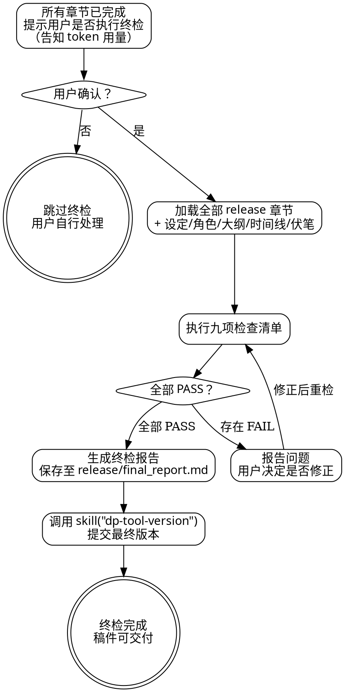

<SUBAGENT-STOP>
如果你是被派遣执行特定任务的子代理，跳过此技能。
</SUBAGENT-STOP>

# 全书终检报告

本技能是**刚性技能**。九项检查清单必须逐项执行，不得跳过或以"问题不大"为由放行。

## 核心定位

全书完成后的一次性全局检查。对照世界观设定、概念、角色卡、大纲、时间线，检查 `docs/dreampowers/release/` 下所有终稿章节的全局一致性。

本技能是**人工可选触发**——所有章节完成后，提示用户是否执行终检。用户确认后才执行。

**token 用量警告**：终检需要加载 `docs/dreampowers/release/` 下的全部章节终稿，加上世界观设定、角色卡、大纲、时间线等支撑文档。长篇小说的 token 用量可能很大，执行前必须告知用户。

## 适用时机

全部满足时才可执行：

- 所有计划章节已完成，每章均通过 `dp-chapter-draft` 三阶段审查和外部审阅闭环
- `docs/dreampowers/release/` 下所有章节文件为 `chapter-NNN.md` 格式，不存在 `chapter-NNN-TBD.md`
- 所有伏笔已回收或已明确标记为续作伏笔（`deferred`）
- 用户确认执行（告知 token 用量后）

## 输入来源

| 来源 | 路径 |
|------|------|
| 终稿章节 | `docs/dreampowers/release/chapter-*.md`（全部章节） |
| 世界观设定 | `docs/dreampowers/set/world/` |
| 概念源文件 | `docs/dreampowers/set/concept/` |
| 角色卡 | `docs/dreampowers/set/character/` |
| 大纲 | `docs/dreampowers/outlines/` |
| 时间线 | `docs/dreampowers/timeline/timeline.md` |
| 伏笔场记 | `docs/dreampowers/tracking/thread-*.md` |
| 风格档案 | `docs/dreampowers/tracking/style.md` |

## 九项检查清单

以下九项逐一核实。每项标记 PASS 或 FAIL，FAIL 附具体位置和问题描述。

### 一、伏笔收束

遍历 `docs/dreampowers/tracking/` 目录下的所有伏笔文件（`thread-*.md`），确认：
- Claremont 系数趋近 0（允许范围：-1 ~ 1）
- 所有非续作伏笔均已回收，伏笔文件中 status 为 `resolved`
- 续作伏笔已显式标记为 `deferred`，并记录计划回收位置
- 不存在遗忘的伏笔（伏笔文件有记录但正文中找不到对应内容）

### 二、角色弧线完整性

对照 `docs/dreampowers/set/character/` 中每个主要角色的弧线设定：
- 核心冲突是否在故事中得到回应（解决或刻意留开放结局）
- 角色结尾状态是否与弧线方向一致
- 配角弧线至少有收尾，不是突然消失

### 三、悬念线索清点

- 已计划解答的问题是否全部解答
- 保留的悬念是否为续作服务（记录在 `docs/dreampowers/tracking/deferred-threads.md` 中）
- 不存在作者忘记回收的悬念线索

### 四、标题定稿

- 总标题已确定，不再是占位符，与内容/主题/基调匹配
- 各章标题风格统一（名词短语、动词短语、或纯编号……选一种，贯穿始终）

### 五、开篇回检

以"已读完全书"的视角重读第一章：
- 开篇钩子在全书语境下是否依然有效
- 暗示、意象、措辞是否与结局形成呼应
- 读者带着结局回看时，能否发现隐藏层次

### 六、结尾兑现

对照开篇的叙事承诺：
- 核心问题是否得到回答（哪怕答案是"问题本身就是错的"）
- 情感承诺是否兑现
- 结尾基调是否与故事整体一致

### 七、节奏全局检查

- 高潮点在合理位置（通常后 1/4），张弛交替贯穿全书
- 张弛法则详见 `dp-chapter-direct`
- 结尾后有足够消化空间（除非风格要求戛然而止）

### 八、格式与元数据

- 章节命名遵循 `docs/dreampowers/release/chapter-NNN.md`，头部元数据完整
- 不存在 `chapter-NNN-TBD.md` 文件
- 所有章节 `review_status` 为 `approved`

### 九、世界观最终校验

- 设定规则在正文中均未被违反，如有演变已同步更新至 `docs/dreampowers/set/`

## 报告输出

终检报告保存至 `docs/dreampowers/release/final_report.md`。

报告模板：

```markdown
# 全书终检报告

生成时间：[YYYY-MM-DD]
章节总数：[N]

## 九项检查结果

| # | 检查项 | 结果 | 问题数 |
|---|--------|------|--------|
| 1 | 伏笔收束 | PASS/FAIL | N |
| 2 | 角色弧线完整性 | PASS/FAIL | N |
| 3 | 悬念线索清点 | PASS/FAIL | N |
| 4 | 标题定稿 | PASS/FAIL | N |
| 5 | 开篇回检 | PASS/FAIL | N |
| 6 | 结尾兑现 | PASS/FAIL | N |
| 7 | 节奏全局检查 | PASS/FAIL | N |
| 8 | 格式与元数据 | PASS/FAIL | N |
| 9 | 世界观最终校验 | PASS/FAIL | N |

## 问题明细

### [检查项名]
- **位置**：第N章，第X段
- **问题**：[具体描述]
- **严重程度**：致命 / 重要 / 轻微

## 结论

[全部通过：稿件可交付 / 存在问题：需修正后重检]
```

## 执行流程



## 与其他技能的交互

| 关系 | 技能 | 说明 |
|------|------|------|
| 上游 | `dp-chapter-draft` | 所有章节完成后触发 |
| 上游 | `dp-set-concept` | 世界观设定、角色卡是终检的对照基准 |
| 上游 | `dp-set-outline` | 大纲、揭示时间表是终检的对照基准 |
| 下游 | `dp-tool-version` | 终检通过后，调用 `skill("dp-tool-version")` 提交最终版本 |

## 反模式

- **最后一章写完就宣布完稿** ❌ 写完 ≠ 完稿，未检查的稿件里一定藏着遗忘的伏笔
- **某项 FAIL 但"问题不大"就放行** ❌ 每一项 FAIL 都是读者会注意到的裂缝
- **终检时修改正文内容** ❌ 改内容必须回到 `skill("dp-chapter-draft")` 重新审查
- **续作伏笔不记录就留着** ❌ 未记录的 `deferred` 伏笔等于遗忘的伏笔
- **设定和正文有出入但"以正文为准"** ❌ 正文为准可以，但设定文档必须同步更新至 `docs/dreampowers/set/`
- **不告知 token 用量就开始加载** ❌ 长篇小说的终检 token 消耗巨大，用户有权决定是否执行

## 终止状态

九项检查清单全部 PASS，终检报告已保存至 `docs/dreampowers/release/final_report.md`，已调用 `skill("dp-tool-version")` 提交最终版本。稿件可交付。
