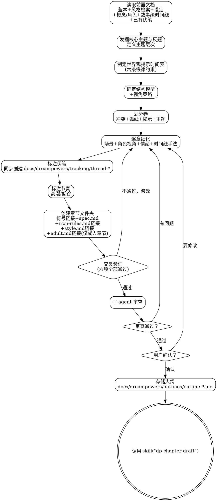

<SUBAGENT-STOP>
如果你是被派遣执行特定任务的子代理，跳过此技能。
</SUBAGENT-STOP>

# 大纲规划：从框架到章节文件夹

本技能是**刚性技能**。严格遵循流程，不可跳步。

大纲不是灵感的记录，是工程图纸。每一章存在的理由必须经得起追问：这一章推动了什么冲突？揭示了什么世界观？角色弧线走到了哪里？如果答不上来，这一章不该存在。

本技能整合了四项核心职责：
1. **世界观揭示节奏控制** — 六条铁律、五问闸门、概念预算
2. **大纲结构构建** — 结构模型、卷划分、章节细化、视角策略
3. **主题编织** — 核心主题与反题、主题追踪
4. **章节文件夹创建** — 章节文件夹、符号链接、spec.md

## 前置条件

必须已完成以下五项，缺一不可：

1. **故事蓝本** (`docs/dreampowers/tracking/overview.md`) 已通过用户确认
2. **风格档案** (`docs/dreampowers/tracking/style.md`) 已通过用户确认（由 `dp-set-style` 产出）
3. **世界观设定** (`docs/dreampowers/set/world/`) 已通过用户确认
4. **设定拆分** (`docs/dreampowers/set/concept/` 和 `docs/dreampowers/set/character/`) 已完成概念和角色拆分为独立文件
5. **故事级时间线** (`docs/dreampowers/timeline/timeline.md`) 已通过用户确认（由 `dp-set-concept` 产出）

如果 `docs/dreampowers/tracking/` 中已存在伏笔文件（`thread-*`，前序技能可能已创建），一并读取。

**硬性约束：** 在确认上述五项前置条件全部满足且已读取之前，禁止开始大纲构建。不论用户多急，前置条件不可绕过。

## 清单

调用本技能后，将以下清单写入 todowrite，逐项执行：

- [ ] 读取所有前置文档（蓝本 + 风格档案 + 世界观设定 + 概念/角色源文件 + 故事级时间线 + 已有伏笔线索）
- [ ] 发掘核心主题与反题，定义主题层次
- [ ] 制定世界观揭示时间表
- [ ] 确定故事结构模型（三幕式/英雄之旅/起承转合/自定义）
- [ ] 确定视角策略
- [ ] 划分卷，每卷确定：核心冲突升级、角色弧线进展、世界观揭示节点、主题测试点
- [ ] 细化到章节级：每章的场景列表、角色视角、情绪走向、时间线手法
- [ ] 标注伏笔植入点，同步创建伏笔文件至 `docs/dreampowers/tracking/`
- [ ] 标注高潮/低谷节奏（张弛有度）
- [ ] 创建章节文件夹（`docs/dreampowers/chapters/chapter-NNN/`），添加符号链接（含 `style.md`），编写 `spec.md`
- [ ] 检测 `~/.config/opencode/skills/dp-chapter-adult` 目录是否存在。若存在：通过提问式模板收集用户偏好，生成 `docs/dreampowers/tracking/adult.md`，仅在大纲中标注了成人场景的章节文件夹添加 `adult.md` 符号链接（有链接 = 本章含成人场景）
- [ ] 交叉验证（揭示时间表 vs 大纲 vs 伏笔 vs 概念分配 vs 主题分布）
- [ ] 大纲审查：派遣子 agent 检查结构完整性
- [ ] 用户确认大纲
- [ ] 过渡到 dp-chapter-draft

---

## 第一部分：六条铁律与揭示节奏

本部分是 Dreampowers 的核心创新能力。

**刚性执行声明（不可协商）：**
- 必须逐条执行，不得"灵活处理"。
- 不得以"设定很重要"为理由豁免任意铁律。
- 任一铁律违反即判定失败，必须回退重排方案。

### 铁律一：先好奇，后解释
- 每个世界观元素必须先以谜团/悬念形式出现。
- 至少经过 1-2 个场景后才解释其原理。
- 读者应该先问"这是什么？"再得到答案。

### 铁律二：先感知，后体系
- 角色先通过感官体验世界元素（看到、听到、感受到）。
- 再逐步理解背后的体系/规则。
- 禁止用旁白直接解释体系。

### 铁律三：扩展已有，少添新增
- 优先深化已引入的概念，而非引入新概念。
- 旧概念的新层面 > 全新概念。
- 每次"深化"都应使已知概念变得更复杂、更有趣、更有代价。

### 铁律四：概念预算
- 第一章：最多引入 3 个新概念（可以为 0）。
- 后续每章：最多引入 2 个新概念（可以为 0）。
- 每个场景：最多解释 1 个已引入的概念。
- 每 3000 字：至少保留 1 个未解答的问题。

### 铁律五：禁止旁白讲解
世界观信息只能通过以下方式传递：
- a. 角色对话（自然提及，非教学式）
- b. 角色行动（通过做事展示规则）
- c. 角色观察（通过感知发现）
- d. 冲突揭示（通过矛盾暴露真相）

禁止的形式：
- a. 旁白大段解释 ❌
- b. "正如大家所知..." ❌
- c. 导游式角色（专门负责解释的角色）❌
- d. 内心独白回忆设定 ❌

### 铁律六：按需揭示
- 世界观细节只在对情节有影响时才揭示。
- Deborah Swift 测试："这段信息此刻正在发生什么？如果没有，删掉。"
- 信息揭示必须为当前冲突服务。

### 揭示时间表

大纲构建前，先制定世界观揭示时间表。读取设定中的"冰山水下"元素，按主线冲突重新排序。先定"悬念出现点"，后定"解释发生点"，确保两者至少间隔 1-2 个场景。

```markdown
# 世界观揭示时间表：[故事名]

## 第一卷（建立）：第1-X章
| 章节 | 引入的概念 | 揭示方式 | 保留的悬念 |
|------|-----------|---------|-----------|
| 第1章 | 概念A, 概念B | 感知式 | A的来源, B的规则 |
| 第2章 | 概念C | 对话式 | C的代价 |

## 第二卷（发展）：第X-Y章
| 章节 | 深化/新增 | 揭示方式 | 保留的悬念 |
|------|----------|---------|-----------|

## 第三卷（高潮）：第Y-Z章
| 章节 | 揭示的真相 | 与早期悬念的关联 |
|------|-----------|-----------------|
```

揭示时间表存储至大纲文件的开头部分（同一文件），不单独存储。

### 反合理化对照表（防止绕过铁律）

| 借口 | 现实 |
|------|------|
| "读者需要理解背景才能看懂" | 不需要。先制造好奇，读者会继续读 |
| "这段设定很重要所以要详细解释" | 越重要越需要分散揭示，增加悬念价值 |
| "只是一小段解释" | 小段累积就是 info-dump |
| "不解释读者会困惑" | 适度困惑=好奇心=翻页动力 |
| "这只是提供背景色" | Deborah Swift测试：此刻正在发生什么？没有就删 |

### 量化指标（硬阈值）
- 黄金三章法则：前 3 章决定读者去留，必须优先保证悬念驱动而非设定讲解。
- 概念预算以铁律四为准（本节不重复定义）。
- 金手指渐进揭示：主角能力分 3-5 个阶段展开，不得一次性公开上限。
- Sanderson 第三法则：在添加新设定前，先扩展已有设定。
- Chekhov 世界观：引入的设定元素必须在后续为情节服务，否则删除。

---

## 第二部分：主题编织

主题不是作者塞给读者的信息，不是贴在故事表面的标签。主题从角色选择与后果的碰撞中自然浮现。好的主题让读者合上书后久久回味，却说不出"作者想告诉我什么"。

### 主题层次

**核心主题**（1-2 个）：故事存在的根本理由。核心主题是**问题**，不是**答案**。"权力是否必然导致腐败？"比"权力导致腐败"更好。问题让故事保持开放性，答案让故事沦为宣传。

**次级主题**（2-4 个）：回应、呼应或复杂化核心主题。通常通过配角弧线或支线情节来表达。

**反题**：核心主题的对立面。**没有反题的故事是布道。** 反题必须由一个有说服力的角色来体现，这个角色的论点不能是稻草人。读者应该在某些时刻觉得反题的持有者可能是对的。

### 主题表达原则

1. **主题从角色选择中生长** — 主题不是旁白告诉读者的道理，是角色在压力下做出选择、承受后果时自然浮现的意义。
2. **每个主要角色以不同方式回应主题**：

| 角色类型 | 与核心主题的关系 |
|---------|----------------|
| 主角 | 在主题与反题之间挣扎，最终做出选择 |
| 对手/反派 | 体现反题，且其论点必须有说服力 |
| 导师 | 代表主题的一种理解，但可能是不完整的 |
| 盟友 | 从不同角度呼应主题 |
| 牺牲者 | 展示主题/反题的极端后果 |

3. **主题必须被测试** — 测试时机：第二卷中期（主角遭遇反题论证）、至暗时刻（主角几乎被反题说服）、高潮（主角在理解反题后重新选择或放弃核心主题）。
4. **平行情境，不同结局** — 用不同角色在相似情境下做出不同选择，来"展示"主题。

### 主题追踪表

在大纲文件中建立主题追踪表：

```markdown
## 主题追踪
### 核心主题：[问题形式]  |  反题：[对立观点]

| 章节 | 涉及主题 | 表达角色 | 表达方式 | 强度(1-5) |
|------|---------|---------|---------|----------|
| 第1章 | 核心主题 | 主角 | 选择/行动 | 2 |
| 第3章 | 反题 | 对手 | 对话/冲突 | 3 |
```

追踪要点：
- 核心主题应在前 3 章内以某种形式出现（哪怕只是暗示）
- 反题不晚于全篇 30% 处出场
- 每 5 章至少有 1 个章节显著推进主题
- 高潮章节的主题强度应为全篇最高

### 主题 vs 说教

| 主题 | 说教 |
|------|------|
| 通过行动展示 | 通过旁白陈述 |
| 角色自己得出结论 | 作者替角色（和读者）下结论 |
| 反题有力，结局开放 | 反题是稻草人，结局是道德审判 |
| 读者自行体会 | 读者被告知"应该怎么想" |
| 主角有困惑和动摇 | 主角是道德标杆，从不犯错 |

**自测方法：** 如果读者在全篇三分之一处就能用一句话概括"作者想表达什么"，你在写寓言而非小说。

---

## 第三部分：大纲结构构建

### 结构模型选择

第一步是和用户确定故事的结构框架。不要替用户选。给出选项，让用户挑。

| 模型 | 适用场景 | 结构 |
|------|---------|------|
| 三幕式 | 电影感强的中短篇 | 建立(25%) → 对抗(50%) → 解决(25%) |
| 英雄之旅 | 成长型主角 | 12 阶段循环 |
| 起承转合 | 中式传统叙事 | 4 段式 |
| 自定义 | 实验性/非线性 | 用户自定义 |

**说明：** 篇幅与结构模型不设默认推荐，用户自行选择字数篇幅与结构模型的组合。

**模型嵌套说明：** 多卷结构时，每一卷可以采用不同结构模型（例如第一卷用起承转合、第二卷用三幕式），模型可以嵌套。

### 叙事时间线手法（章节级）

时间线手法决定了故事"怎么讲"，而不是"讲什么"。大纲阶段必须确定每章的时间线手法，不可等到写正文时临时决定。

> **注意**：故事级时间线（年代、时间跨度、关键日期）已在 `dp-set-concept` 阶段构建并存储于 `docs/dreampowers/timeline/timeline.md`。本节只处理**章节级叙事手法**——每章采用顺叙、倒叙、插叙还是补叙。两者的区分：故事级时间线是"什么时候发生了什么"，章节级时间线手法是"怎么讲这些事"。

| 手法 | 定义 | 适用场景 | 风险 |
|------|------|---------|------|
| 顺叙 | 按时间顺序叙事 | 情节驱动型故事，因果链清晰的主线 | 风险最低，但开头可能缺乏冲击力 |
| 倒叙 | 从结果切入，再回溯原因 | 结果比过程更有悬念时 | 回溯段落容易让节奏拖沓 |
| 插叙 | 在当前时间线中插入过去片段 | 当前场景需要过去事件支撑时 | 打断叙事流，过长会喧宾夺主 |
| 补叙 | 对已叙述事件的补充说明 | 揭示被隐瞒的真相 | 时机不对会让读者困惑或无感 |

#### 倒叙判定规则

- 结果本身就是一个巨大的悬念，读者看到结果后会迫切想知道"怎么走到这一步的"
- 过程本身缺乏悬念但结果令人震惊
- 需要在第一章就抓住读者，而故事的自然起点过于平淡

**硬性规则：** 倒叙开头必须制造足够的认知缺口。如果读者看完倒叙开头没有产生任何疑问，这个倒叙就是失败的。

#### 插叙使用规则

1. 插叙必须服务当前场景的情感或信息需求，不可无故回忆
2. 插叙长度不超过当前场景的 1/3
3. 插叙的进入和退出必须有明确的过渡标记：感官触发、物件联想、对话中的关键词。不可硬切
4. 一章内最多一段插叙

#### 补叙使用规则

1. 补叙时机必须在读者产生疑问之后
2. 补叙的内容必须改变读者对已知事件的理解
3. 补叙不可用于偷懒式填坑

#### 时间线手法决策树

```
这一章的核心信息是什么？
├─ 事件的过程本身就有张力 → 顺叙
├─ 结果比过程更令人震惊 → 倒叙
│   └─ 倒叙开头能制造认知缺口吗？
│       ├─ 能 → 确认使用倒叙
│       └─ 不能 → 回退到顺叙，考虑用章末钩子代替
├─ 当前场景的情感/信息需要过去事件支撑 → 插叙
│   └─ 插叙内容是否不超过当前场景 1/3？
│       ├─ 是 → 确认使用插叙，设计过渡标记
│       └─ 否 → 拆成独立章节，用顺叙或倒叙单独处理
└─ 需要揭示已叙述事件中被隐瞒的真相 → 补叙
    └─ 读者此时是否已经产生了疑问？
        ├─ 是 → 确认使用补叙
        └─ 否 → 延后补叙时机，先制造疑问
```

**硬性规则：** 每章大纲中必须标注该章的时间线手法。默认顺叙不需要额外说明理由，但非顺叙手法必须注明选择理由。

### 视角选择与切换规则

视角策略必须在大纲阶段确定，不在写作阶段临时决定。

| 视角类型 | 优势 | 劣势 | 适用场景 |
|---------|------|------|---------|
| 第一人称 | 代入感最强，情感传递直接 | 信息受限于主角认知 | 悬疑/推理、成长叙事 |
| 第三人称限制视角 | 兼顾代入感和叙述灵活性 | 仍受限于跟随角色的认知 | 大多数类型小说的默认选择 |
| 第三人称全知 | 可自由切入任何角色内心 | 代入感弱，容易违反铁律五 | 史诗/群像剧 |
| 多视角轮转 | 信息量大，世界立体 | 管理难度高 | 群像剧、权谋/宫斗 |

#### 视角切换硬性规则

1. **同一章内不切换视角。** 除非章内有明确的分隔标记。
2. **连续两章不给同一配角视角。** 主角可连续，配角不行。
3. **视角切换必须在章首第一段明确新视角角色。** 不可让读者猜了三段才发现换人了。
4. **全篇角色视角总数不超过 5 个。** 短篇/中篇 1-2 个，长篇 3-5 个。
5. **每个角色视角的首次出场，必须在前 30% 篇幅内完成。**

在大纲的开头部分确定全篇视角策略：使用哪种视角类型、角色视角列表及首次出场章节、每个角色视角承担的叙事功能。

### 卷划分

确定模型后，划分大的结构单元。每卷需要明确：

1. **核心目标**：这一卷要完成什么叙事任务
2. **冲突升级**：相对上一卷，紧张程度如何递进
3. **主角弧线进展**：角色从什么状态走到什么状态
4. **揭示重点**：本卷需要揭示哪些世界观元素（必须对照揭示时间表）
5. **主题测试点**：本卷如何推进、挑战或呼应核心主题
6. **卷末转折**：以什么事件结束，制造下一卷的悬念

### 章节细化

卷级结构确定后，逐章填充。**不允许只做到卷级就停下。** 卷级大纲是半成品，章节级大纲才是可执行的蓝图。

#### 章节大纲模板

```markdown
# 大纲：[故事名]

## 结构模型：[选择的模型]
## 预计总章数：[N]
## 预计总字数：[M 万字]

## 视角策略
- **类型**: [第一人称/第三人称限制/全知/多视角]
- **角色视角**: [角色列表及首次出场章节]

## 世界观揭示时间表
[揭示时间表内容]

## 主题追踪
### 核心主题：[问题形式] | 反题：[对立观点]
[主题追踪表]

---

## 第一卷：[标题]
**核心目标**: [这一卷要达成什么]
**主角弧线**: [从 A 到 B]
**揭示重点**: [本卷揭示的世界观元素]
**主题**: [本卷的主题测试/推进]

### 第 1 章：[章节标题]
- **角色视角**: [视角角色] — [第一人称/第三人称限制/第三人称全知]
- **时间线手法**: [顺叙/倒叙/插叙/补叙]
- **场景**:
  1. [场景 1] — [地点] — [冲突/事件]
  2. [场景 2] — [地点] — [冲突/事件]
- **情绪曲线**: [开头情绪] → [结尾情绪]
- **世界观揭示**: [本章引入/深化的概念]
- **主题贡献**: [本章如何推进/呼应主题]
- **伏笔**: [植入的伏笔] → [预计回收章节]
- **章末钩子**: [让读者翻到下一章的理由]
- **概念白名单**: [本章工作区中有符号链接的概念列表]
- **角色白名单**: [本章工作区中有符号链接的角色及对应时间线阶段]
- **新引入概念**: [本章新引入的概念]
- **深化概念**: [本章深化的已有概念]

### 第 2 章：[章节标题]
...

---

## 第二卷：[标题]
...
```

每章必须有**章末钩子**。没有钩子的章节结尾等于允许读者退出。

### 节奏控制原则

#### 硬性规则

1. **连续 2 章高强度冲突后，必须有 1 章缓冲**。读者需要喘息，角色需要消化。
2. **"谷底"章节不是无事发生**。缓冲章用来做：角色发展、关系深化、世界观细节铺展、伏笔植入。
3. **每个卷的结尾必须有明确的转折点**。不是渐变，是断裂。
4. **每 5-8 章有一个小高潮**。
5. **全篇高潮点不超过 3 个**。一路高潮等于没有高潮。

#### 节奏检查方法

大纲完成后，把每章的情绪强度标注为 1-5 分（1=宁静，5=极端），画出情绪曲线。曲线应该呈波浪形，而不是直线或锯齿。

---

## 第四部分：伏笔场记

大纲中每标注一个伏笔，必须同步在 `docs/dreampowers/tracking/` 目录下创建对应的伏笔文件。不存在"等大纲写完再统一补录"这种操作。

### 伏笔类型

中国叙事传统里的伏笔分三层：

- **明线**：读者能察觉到"这里有东西"，但不知道具体是什么
- **暗线**：读者读到时完全没感觉，回收时才恍然大悟
- **草蛇灰线**：极其细微的暗示，可能跨越几十上百章才回收

### 伏笔回收规划

所有伏笔的收敛速度由大纲规划决定。大纲应为每条伏笔指定预期回收的章节范围。章节执行完成后，由一致性检查（dp-review-consistency）确认伏笔是否按计划回收，不合格则打回重写。

### 伏笔文件格式

每条伏笔独立存储为 `docs/dreampowers/tracking/` 目录下的一个 `.md` 文件，文件名使用 `thread-` 前缀（如 `thread-001-rusty-key.md`），通过符号链接分配到相关章节文件夹。

```markdown
<!-- foreshadow
id: thread-001
name: 描述性名称
type: 暗线
tier: 第10-15章
status: active
-->

# 伏笔：描述性名称

## 计划
- 植入：第3章，植入描述
- 推进：第8章，推进描述
- 扭转：第12章，扭转描述
- 高潮：第14章，高潮描述
- 回收：第15章，回收描述

## 事件记录
（随写作推进更新）

| 事件类型 | 章节 | 描述 |
|---------|------|------|
| 植入 | 3 | 植入描述 |
| 推进 | 8 | 推进描述 |
```

**元数据字段说明：**
- `type`：明线 / 暗线 / 草蛇灰线
- `tier`：大纲规划的预期回收章节范围（如"第10-15章"、"第二卷末"）
- `status`：active（进行中）/ resolved（已回收）/ abandoned（已放弃）/ deferred（延至续作）

### 事件类型

| 类型 | 含义 | 示例 |
|------|------|------|
| foreshadow | 植入伏笔 | 角色无意间提到一个地名 |
| progress | 推进/加深 | 地名再次出现，关联到新信息 |
| twist | 扭转认知 | 读者以为的含义被颠覆 |
| climax | 伏笔线的高潮 | 真相浮出水面 |
| resolution | 彻底回收 | 伏笔线完整闭合 |

每条伏笔线至少有 `foreshadow` 和 `resolution` 两个事件。跨度长的伏笔建议有中间推进事件（progress/twist/climax）。

### Claremont 系数

大纲完成后计算 Claremont 系数：

```
Claremont 系数 = status=active 的伏笔数 - status=resolved 的伏笔数
```

- **= 0**：伏笔收支平衡
- **> 0 且 ≤ 2**：叙事债务可控
- **> 2**：警告，叙事债务过重

---

## 第五部分：章节文件夹

`docs/dreampowers/chapters/chapter-NNN/` 是章节的自包含工作区。草稿预审阶段读取文件夹全部材料。包含：

1. **符号链接** — 指向 `docs/dreampowers/set/concept/`、`docs/dreampowers/set/character/`、`docs/dreampowers/tracking/thread-*` 中的源文件
2. **`spec.md`** — 章节 spec（施工说明书 + 写作蓝图，七节结构）
3. **`draft.md`** — 章节草稿（写作阶段产生）
4. **`review.md`** — 章节审查报告（审查阶段产生）
5. **`iron-rules.md`** — 指向 `docs/dreampowers/tracking/iron-rules.md` 的符号链接
6. **`style.md`** — 指向 `docs/dreampowers/tracking/style.md` 的符号链接
7. **`summary-*.md`** — 前序章节摘要的符号链接（由 `dp-chapter-summary` 在生成摘要后为下一章创建，`dp-chapter-draft` 草稿预审时检查并补建缺失链接）

### 符号链接命名规则

- 概念链接：使用概念的简短名称（如 `spirit-energy.md → ../../set/concept/spirit-energy-system.md`）
- 简单角色链接：使用角色 id（如 `su-wan.md → ../../set/character/su-wan.md`）
- 复杂角色链接：使用 `角色id-时间线.md` 格式（如 `lin-feng-before-war.md → ../../set/character/lin-feng/before-war.md`）
- 伏笔链接：使用 `thread-NNN.md` 格式（如 `thread-001.md → ../../tracking/thread-001-rusty-key.md`）
- 铁律链接：`iron-rules.md → ../../tracking/iron-rules.md`
- 风格档案链接：`style.md → ../../tracking/style.md`
- 前序摘要链接：**不在大纲阶段创建**。由 `dp-chapter-summary` 在每章摘要生成后将 `docs/dreampowers/timeline/` 下所有已有摘要符号链接到下一章文件夹（`summary-NNN.md → ../../timeline/summary-NNN.md`）。`dp-chapter-draft` 草稿预审时检查并补建缺失链接

### iron-rules.md

六条铁律的精简版，存储在 `docs/dreampowers/tracking/iron-rules.md`，通过符号链接出现在每个章节文件夹中。AI 在写作时读取此文件，确保铁律贯穿整个写作链条。

```markdown
# 六条铁律（写作时必须遵守）

1. **先好奇，后解释** — 每个世界观元素先以谜团出现，至少 1-2 场景后才解释
2. **先感知，后体系** — 角色先感官体验，再理解背后体系。禁止旁白解释体系
3. **扩展已有，少添新增** — 优先深化已引入概念，旧概念新层面 > 全新概念
4. **概念预算** — 第一章 ≤3 新概念，后续 ≤2/章，每场景 ≤1 解释，每 3000 字 ≥1 未解问题
5. **禁止旁白讲解** — 仅通过角色对话/行动/观察/冲突传递信息
6. **按需揭示** — 只揭示服务当前冲突的信息。Deborah Swift 测试：此刻没在发生？删掉
```

### spec.md 格式

`spec.md` 是章节的施工说明书 + 材料清单 + 验收记录 + 写作蓝图，四合一。

**两阶段写入**：
- **大纲阶段**（本技能）：写入第一～五节（spec 框架）
- **写作前**（`dp-chapter-draft` 草稿预审）：读取章节文件夹全部材料，评估后写入第六节（门控评估结果）和第七节（本章写作蓝图）

**核心原则**：第六、七节写入完成并经用户确认后，写作阶段只读 spec.md 即可完成当前章节。

使用纯 Markdown 编写：

```markdown
# 第1章 spec

## 一、概念预算
- 新概念上限：3
- 深化概念上限：不限
- 本章新引入：灵力体系, 宗门等级
- 本章深化：（首章无）

## 二、门控标准
- [ ] 所有概念均在本目录内有对应符号链接
- [ ] 新概念数量未超出预算
- [ ] 无旁白讲解式揭示
- [ ] 伏笔线索文件已链接
- [ ] 角色只展示本目录内链接的时间线阶段信息
- [ ] iron-rules.md 已链接
- [ ] 前序章节摘要已链接（非首章，由 `dp-chapter-summary` 创建，`dp-chapter-draft` 草稿预审时补建缺失）

## 三、概念依赖
- 灵力体系：无前置依赖
- 宗门等级：依赖"灵力体系"（读者需先理解灵力的存在才能理解宗门以灵力定等级）

## 四、读者评估要求
- 翻页欲望：>= 3/5
- 认知负载：<= 3个陌生元素/500字
- 共情验证：读者应对主角产生好奇或同情

## 五、改进要求
（首章无前序审查，留空）

## 六、门控评估结果
<!-- 由 dp-chapter-draft 草稿预审写入，大纲阶段留空 -->

## 七、本章写作蓝图
<!-- 由 dp-chapter-draft 草稿预审写入，大纲阶段留空 -->
```

#### spec.md 字段说明与模板（合并）

| 节 | 写入者 | 写入时机 | 内容 |
|----|--------|---------|------|
| 一、概念预算 | dp-set-outline | 大纲阶段 | 新概念上限、深化上限、本章新引入/深化列表 |
| 二、门控标准 | dp-set-outline | 大纲阶段 | 检查清单，可含本章特有项 |
| 三、概念依赖 | dp-set-outline | 大纲阶段 | 概念间前置关系 |
| 四、读者评估要求 | dp-set-outline | 大纲阶段 | 翻页欲望、认知负载、共情验证的目标值 |
| 五、改进要求 | dp-set-outline | 首章留空，后续章节由审查写入 | 前序审查的改进反馈 |
| 六、门控评估结果 | dp-chapter-draft | 草稿预审 | 门控标准逐项检查结果 + 五问闸门结果 + 评估结论 |
| 七、本章写作蓝图 | dp-chapter-draft | 草稿预审 | 大纲要点、揭示计划、概念/角色要点（定向提取）、前情衔接（含前序摘要全文）、伏笔指令、风格指令、调优指令、成人场景指令、优先级、铁律提醒 |

第一～五节统称 **spec 框架**。第六、七节统称 **草稿预审产物**。

各节字段要求以本模板和上表为准，不再另设分散字段说明。

#### 写作蓝图的材料来源

第七节的内容从以下来源定向提取。所有来源均位于章节文件夹内部或通过符号链接可达：

| 蓝图子项 | 来源文件 | 来源位置（物理路径） | 章节文件夹中的形态 |
|---------|---------|-------------------|------------------|
| 大纲要点 | `outline-*.md` | `docs/dreampowers/outlines/` | 符号链接（`outline-*.md → ../../outlines/outline-*.md`） |
| 揭示计划 | 同上（嵌在大纲文件内） | 同上 | 同上 |
| 概念要点 | `*.md`（概念文件） | `docs/dreampowers/set/concept/` | 符号链接 |
| 角色要点 | `*.md`（角色文件） | `docs/dreampowers/set/character/` | 符号链接 |
| 前情衔接 | `summary-*.md`（前序摘要） | `docs/dreampowers/timeline/` | 符号链接（由 `dp-chapter-summary` 创建，草稿预审补建缺失） |
| 伏笔指令 | `thread-*.md` | `docs/dreampowers/tracking/` | 符号链接 |
| 风格指令 | `style.md` | `docs/dreampowers/tracking/style.md` | 符号链接 |
| 铁律提醒 | `iron-rules.md` | `docs/dreampowers/tracking/iron-rules.md` | 符号链接 |
| 调优指令 | `tuning.md`（可选） | 章节文件夹内（原始文件） | 原始文件 |
| 成人场景指令 | `adult.md`（可选） | `docs/dreampowers/tracking/adult.md` | 符号链接（仅成人章节） |

所有来源均通过符号链接在章节文件夹内可达，不存在跨越章节文件夹边界的读取。草稿预审将大纲中本章相关的要点提取进蓝图。

### 章节文件夹创建时机

章节文件夹在本技能的大纲构建过程中创建。流程：

1. **`dp-set-concept`**：拆分源文件到 `docs/dreampowers/set/concept/`、`docs/dreampowers/set/character/`
2. **本技能**（dp-set-outline）：构建大纲时，为每章创建 `docs/dreampowers/chapters/chapter-NNN/` 文件夹，添加符号链接（包括大纲文件的符号链接 `outline-*.md → ../../outlines/outline-*.md`），编写 `spec.md`，创建 `docs/dreampowers/tracking/iron-rules.md`。若检测到 `~/.config/opencode/skills/dp-chapter-adult` 目录存在，通过提问式模板生成 `docs/dreampowers/tracking/adult.md`，仅在标注了成人场景的章节文件夹添加符号链接（有链接 = 本章含成人场景）
3. **`dp-chapter-draft`**：草稿预审读取章节文件夹全部材料并写入 spec.md 第六、七节，用户确认后进入写作

### 章节文件夹目录结构

```
docs/dreampowers/chapters/chapter-NNN/
├── spec.md                         # 章节 spec（施工说明书 + 写作蓝图，七节结构）
├── draft.md                         # 章节草稿（写作阶段产生）
├── review.md                        # 章节审查报告（审查阶段产生）
├── iron-rules.md                  → ../../tracking/iron-rules.md
├── style.md                       → ../../tracking/style.md
├── outline-*.md                   → ../../outlines/outline-*.md  (大纲符号链接，由 dp-set-outline 创建)
├── adult.md                       → ../../tracking/adult.md  (仅当大纲标注本章含成人场景；有此链接 = 本章含成人场景)
├── summary-*.md                   → ../../timeline/summary-*.md  (由 dp-chapter-summary 创建，dp-chapter-draft 补建缺失)
├── spirit-energy.md               → ../../set/concept/spirit-energy-system.md
├── sect-hierarchy.md              → ../../set/concept/sect-hierarchy.md
├── lin-feng-before-war.md         → ../../set/character/lin-feng/before-war.md
├── su-wan.md                      → ../../set/character/su-wan.md
├── thread-001.md                  → ../../tracking/thread-001-rusty-key.md
└── thread-002.md                  → ../../tracking/thread-002-scar.md
```

---

## 第六部分：五问闸门协议

在大纲完成后，以及每章进入 `dp-chapter-draft` 前，必须执行五问闸门。闸门在本技能中定义，在 `dp-chapter-draft` 中逐章执行。

### 每章写作前五问

1. 本章引入了几个新概念？（≤ 概念预算上限）
2. 本章解释了几个已有概念？（每场景 ≤1）
3. 本章保留了几个未解答的问题？（每 3000 字 ≥1）
4. 所有世界观信息都通过角色行动/对话/观察传递了吗？（无旁白讲解）
5. 有没有信息"此刻没有发生"（未服务于当前冲突）？

**闸门规则：**
- 任一问题不满足阈值：禁止写作，先回退修改章节方案。
- 五问全部通过：方可进入章节起草。

---

## 第七部分：交叉验证

大纲完成后，以下验证**全部通过**才能进入用户确认阶段。任何一项不通过都要回去修改。

### 1. 揭示时间表一致性

逐章检查：本章计划揭示的世界观元素，是否出现在揭示时间表中对应的位置？

- 揭示时间表是权威文档。大纲服从揭示时间表，不是反过来。
- 允许微调揭示时间表（前后 1-2 章的偏移），但大幅调整需要用户确认。

### 2. 伏笔闭合检查

- 每个伏笔是否有对应的回收点？
- Claremont 系数是否 ≤ 2？
- 跨度长的伏笔是否有中间事件（progress/twist/climax）？

### 3. 角色弧线连续性

- 主角在每一卷是否都有可感知的状态变化？
- 角色弧线的方向是否与核心冲突吻合？
- 有没有角色在某一卷完全消失？

### 4. 节奏波形检查

- 依据“节奏控制原则”逐项检查（连续冲突缓冲、谷底有效性、卷末转折、小高潮密度、高潮总量上限）。

### 5. 概念分配验证

对照各章节文件夹检查：

- `docs/dreampowers/set/concept/` 和 `docs/dreampowers/set/character/` 中的每个源文件，是否都至少在某个章节文件夹中有符号链接？（未被引用的概念/角色要么是遗漏，要么应移除）
- 每章工作区中的符号链接数量是否合理？
- 每章 `spec.md` 中的"新概念上限"是否被遵守？（第一章 ≤3，后续 ≤2）
- 概念链接是否累积的？（引入后的概念在后续章节中应保持符号链接）
- 角色的首次出场顺序是否合理？（主角优先，配角渐次登场）
- 复杂角色的时间线文件链接是否与大纲标注的时间线手法一致？
- 所有符号链接是否指向实际存在的源文件？（无断链）
- `spec.md` 中的概念依赖图是否一致？（概念 B 依赖 A，则 A 必须在 B 之前的某个章节出现）
- 冰山比例：标记为 `underwater` 的概念是否在前 30% 章节中保持不被链接？

### 6. 主题分布验证

- 核心主题是否在前 3 章内以某种形式出现？
- 反题是否不晚于全篇 30% 处出场？
- 是否每 5 章至少有 1 个章节显著推进主题？
- 高潮章节的主题强度是否为全篇最高？
- 是否存在角色直接陈述主题的段落？（如有，标记为问题）

---

## 大纲审查

交叉验证通过后，派遣一个子 agent 执行结构完整性检查：

```
检查这份大纲的结构完整性：
1. 每章是否都有明确的角色视角、场景列表、情绪曲线？
2. 章末钩子是否每章都有？有没有章节遗漏？
3. 冲突升级是否贯穿全篇？有没有中段塌陷？
4. 伏笔植入点和回收点是否在大纲中清晰标注？
5. 揭示时间表中的每个条目是否都能在大纲中找到对应章节？
6. 全篇的情绪节奏是否张弛有度？
7. 主题是否通过行动表达，而非旁白或角色台词直接陈述？
8. 反题持有者是否有说服力，而非稻草人？
列出所有发现的问题，不需要修正。
```

子 agent 返回问题清单后，与用户讨论需要修改的地方。审查最多循环 3 次。

---

## 大纲修订（中途改纲）

写作过程中用户可能想要修改故事走向。这是创作的正常部分，不是错误。

### 触发条件

- 用户主动说"我想改一下后面的走向"或类似表述
- `dp-chapter-draft` 检测到大偏离（导致后续 2 章以上大纲失效）
- 用户在批量审阅时否决了已写章节的方向

### 修订流程

#### 第一步：冻结当前进度

- 停止所有正在进行的章节写作
- 调用 `skill("dp-tool-version")` 提交当前所有已完成章节，提交信息：`outline: 大纲修订前快照`
- 记录当前写作位置

#### 第二步：明确修订范围

与用户确认修订意图：

| 规模 | 影响范围 | 示例 |
|------|---------|------|
| **局部修订** | 仅影响未写章节的大纲 | "后面的反派动机改一下" |
| **中度修订** | 影响未写章节 + 需要微调已写的 1-2 章 | "把第10章的转折提前到第8章" |
| **重大修订** | 影响已写多章 + 大幅改变后续走向 | "主角的阵营要反转" |

#### 第三步：冲突分析

读取所有已完成章节，对照修订后的新走向，逐章检查冲突：

1. **硬冲突**：已写内容与新走向直接矛盾
2. **软冲突**：已写内容暗示了旧走向但不构成矛盾
3. **无冲突**：已写内容与新走向兼容

#### 第四步：用户决策

将冲突清单交给用户，提供处理选项。用户拍板后执行。

#### 第五步：更新大纲

修改大纲文档。重新运行交叉验证。同步更新 `docs/dreampowers/tracking/` 目录下的伏笔文件：被修订掉的伏笔标记为 `abandoned`（记录原因），新增的按正常流程录入，重新计算 Claremont 系数。

#### 第六步：回写已完成章节（如需要）

需要回写的章节调用 `skill("dp-chapter-draft")` 走完整流程。回写完成后调用 `skill("dp-review-consistency")` 检查连续性。

#### 第七步：恢复写作

从中断位置调用 `skill("dp-chapter-draft")` 继续流程。

---

## 存储路径

```
docs/dreampowers/
├── tracking/
│   ├── overview.md                   # 故事蓝本（dp-tool-research 产出）
│   ├── style.md                     # 风格档案（dp-set-style 产出，符号链接到每个章节文件夹）
│   ├── adult.md                     # 成人场景偏好（本技能在检测到已安装后产出，仅成人章节文件夹有符号链接）
│   ├── iron-rules.md                # 六条铁律精简版（符号链接到每个章节文件夹）
│   └── thread-NNN-*.md              # 伏笔线索文件
├── timeline/
│   ├── timeline.md                  # 故事级时间线（dp-set-concept 产出，本技能读取）
│   └── summary-NNN.md              # 章节摘要（dp-chapter-summary 产出）
├── outlines/
│   ├── outline-*.md                 # 大纲文件（含揭示时间表 + 主题追踪）
│   └── review-*.md                  # 阶段性全书审查
└── chapters/
    └── chapter-NNN/                 # 章节文件夹（详细目录见“章节文件夹目录结构”）
```

大纲文件存储至：`docs/dreampowers/outlines/outline-YYYY-MM-DD.md`

---

## 全局串行写作规则

**硬性约束：** 章节写作必须严格串行推进，适用于所有 dp-* 技能。写完第 N 章、确认无误后，才能开始第 N+1 章。禁止并行写多章。

### 为什么串行

- **概念控制**：每章的可见范围由其工作区中的符号链接决定。并行写作时无法确定正确的可见范围
- **逻辑连贯**：前一章的结尾状态直接影响下一章的开头
- **伏笔追踪**：伏笔的植入和推进是严格的顺序操作
- **及时发现问题**：每章完成后立即检查，问题不会累积

---

## 写作注意事项

出现以下任一情况，立即暂停，审查并修正：

| 信号 | 说明 |
|------|------|
| 连续超过 200 字无对话/动作的纯描述 | 可能是 info-dump |
| 一个场景内出现 3 个以上新术语 | 概念过载 |
| 角色突然变成"解说员" | 导游角色陷阱 |
| "正如我们所知/据说/传说中" | 旁白讲解信号 |
| 整段可以移到其他章节且不影响当前剧情 | 违反按需揭示 |
| 角色台词直接陈述主题 | 说教陷阱 |
| 反题持有者被写成小丑或恶人 | 稻草人谬误 |
| 连续 5 章以上无主题相关事件 | 主题线断裂 |
| 主角从未被反题动摇 | 主题未被测试 |
| 读者能一句话概括"故事的道理" | 主题过于直白 |

---

## 反模式

- ❌ **不要只做卷级大纲就交付。** 没有章节细化的大纲无法指导 dp-chapter-draft。
- ❌ **不要跳过交叉验证。** "感觉差不多"不是验证。
- ❌ **不要把伏笔留到正文阶段再想。** 大纲阶段就要把伏笔的植入和回收全部规划好。
- ❌ **不要一路高潮。** 没有低谷的故事没有对比度。
- ❌ **不要替用户选结构模型。** 给出推荐和理由，让用户决定。
- ❌ **不要把所有概念放在一个文件里。** 物理隔离失效。
- ❌ **不要在大纲之前做章节分配。** 没有大纲就不知道每章的情节需求。
- ❌ **不要并行写多章。** 无法保证概念可见范围正确。
- ❌ **不要创建索引/清单文件。** 违反"目录即逻辑"原则。
- ❌ **角色直接说出主题。** 那是论文结语，不是小说台词。
- ❌ **反派是纯粹的道德反面。** 反派必须有令人信服的理由。
- ❌ **主题只在开头和结尾出现。** 主题应贯穿全篇。

---

## 与其他技能的交互

| 关系 | 技能 | 说明 |
|------|------|------|
| 上游 | `dp-set-concept` | 接收拆分后的概念/角色源文件 + 故事级时间线（`docs/dreampowers/timeline/timeline.md`） |
| 上游 | `dp-set-style` | 接收风格档案（`docs/dreampowers/tracking/style.md`），创建章节文件夹时添加 `style.md` 符号链接 |
| 上游 | `dp-tool-research` | 接收故事蓝本，可回调做考据 |
| 下游 | `dp-chapter-draft` | 大纲确认后进入章节写作，执行五问闸门 |
| 下游 | `dp-chapter-summary` | 章节完成后生成摘要，并为下一章文件夹创建摘要符号链接 |
| 协作 | `dp-review-consistency` | 检查已写章节是否违反揭示计划与铁律 |
| 协作 | `dp-review-reader` | 按 spec.md 中的读者评估要求执行审查 |
| 协作 | `dp-character-style` | 角色风格应反映其对主题的立场 |
| 协作 | `dp-chapter-direct` | 大纲阶段通过 `skill("dp-chapter-direct")` 调用，规划全篇张力走势；大纲中的张力弧线标注作为场景导演和节奏控制的输入 |
| 协作 | `dp-tool-version` | 大纲修订时冻结进度 |
| 协作 | `dp-chapter-adult` | 若检测到 `~/.config/opencode/skills/dp-chapter-adult` 目录存在，大纲阶段通过提问式模板生成 `docs/dreampowers/tracking/adult.md`，仅在标注成人场景的章节文件夹添加符号链接（有链接 = 本章含成人场景） |

---

## 流程图



## 终态

大纲通过用户确认并存储后，**必须**立即调用 `skill("dp-chapter-draft")`。

大纲是蓝图，不是终点。蓝图的意义在于被执行。dp-chapter-draft 会读取大纲、伏笔场记、揭示时间表，三者协同指导正文写作。如果大纲写完就停下，下次重新启动时大量上下文会丢失。

框架搭好了。现在开始长肉。
