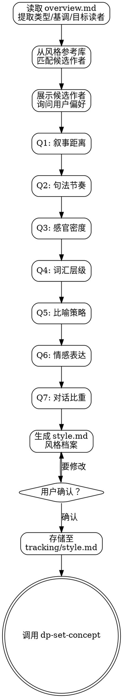

<SUBAGENT-STOP>
如果你是被派遣执行特定任务的子代理，跳过此技能。
</SUBAGENT-STOP>

# 写作风格定义

本技能是**刚性技能**。问卷和风格档案生成不可跳过。

故事蓝本告诉你写什么，风格档案告诉你怎么写。没有风格档案就开始构建世界观，等于让乐队即兴演奏却不商量好调性。模型不需要额外的修正轮次，它只需要精确知道目标是什么。

## 前置条件

必须已完成 `dp-tool-research`，且 `docs/dreampowers/tracking/overview.md` 存在并已通过用户确认。

<HARD-GATE>
在确认故事蓝本存在之前，禁止开始风格问卷。没有蓝本中的类型、基调和目标读者信息，风格建议就是无源之水。
</HARD-GATE>

## 清单

调用本技能后，将以下清单写入 todowrite，逐项执行：

- [ ] 读取故事蓝本（`docs/dreampowers/tracking/overview.md`），提取类型/基调/目标读者
- [ ] 从风格参考库中自动匹配候选作者（基于类型和基调）
- [ ] 展示候选作者列表，询问用户是否有参考偏好
- [ ] 执行七维风格问卷（逐题提问，每题一条消息）
- [ ] 生成风格档案（`style.md`）
- [ ] 用户确认风格档案
- [ ] 存储至 `docs/dreampowers/tracking/style.md`
- [ ] 过渡到 `dp-set-concept`

## 三步流程

### 第一步：类型匹配

读取 `overview.md` 中的类型、基调和目标读者，从下方**风格参考库**中自动匹配该类型下的候选作者。

展示匹配结果时：
- 列出该类型下所有参考作者及其一句话风格描述
- 询问用户："这些作者中有没有你想靠近的风格？或者你心中有其他参考对象？"
- 用户可以选择一位或多位锚定作者，也可以说"没有特别的参考"
- 用户可以提出不在列表中的作者（如"余华《活着》那种风格"），此时根据你对该作者的了解进行风格分析

### 第二步：七维风格问卷

**每次只问一个问题。** 用户不是在填表格。

每题提供三个预设选项（A/B/C）加上自定义选项。用户可以：
- 选择 A/B/C 中的一个
- 用自己的话描述（如"余华《活着》那种克制的写法"）
- 说"不确定"，由 AI 根据已有信息推荐

七个维度：

#### Q1：叙事距离

读者和角色之间的距离感？

- **A** 上帝视角，冷静旁观，保持情感距离
- **B** 跟随主角，偶尔进入内心，但不长驻
- **C** 深度沉浸，读者＝角色，感受即读者的感受
- 或者用你自己的话描述

#### Q2：句法节奏

你喜欢什么样的句子节奏？

- **A** 短句利落，节奏快，不拖泥带水
- **B** 长短交错，张弛有度
- **C** 长句绵延，层层递进，有包裹感
- 或者用你自己的话描述

#### Q3：感官密度

场景描写偏向什么程度？

- **A** 白描勾勒，点到即止，留白给读者想象
- **B** 关键场景细致描写，过渡场景简笔带过
- **C** 五感沉浸，让读者仿佛身临其境
- 或者用你自己的话描述

#### Q4：词汇层级

用词偏好？

- **A** 口语化，接地气，读起来像朋友聊天
- **B** 书面但平易，不拽文不掉书袋
- **C** 典雅，可引经据典，有文学腔调
- 或者用你自己的话描述

#### Q5：比喻策略

对比喻和意象的使用？

- **A** 几乎不用，叙事直白，靠事件本身说话
- **B** 偶尔点缀，在关键情绪节点使用
- **C** 频繁使用，追求诗意和意象层次
- 或者用你自己的话描述

#### Q6：情感表达

角色的情感如何传达给读者？

- **A** 通过动作和细节暗示，读者自己体会
- **B** 行为描写与内心独白各占一半
- **C** 大量心理剖析，直接展示内心活动
- 或者用你自己的话描述

#### Q7：对话比重

对话在故事中占多大比重？

- **A** 少量对话，叙述为主，对话只在必要时出现
- **B** 叙述与对话均衡，互相推动
- **C** 大量对话推动剧情，场景以对白为主
- 或者用你自己的话描述

### 第三步：生成风格档案

根据问卷结果和锚定作者，生成 `style.md` 风格档案。

档案包含以下部分：

```markdown
# 写作风格档案

## 风格标签
[一个简洁的风格概括，例：冷峻白描风 / 诗意沉浸风 / 口语对话流]

## 七维参数
| 维度 | 设定 | 刻度 |
|------|------|------|
| 叙事距离 | [选项文字或自定义描述] | [1-3] |
| 句法节奏 | [选项文字或自定义描述] | [1-3] |
| 感官密度 | [选项文字或自定义描述] | [1-3] |
| 词汇层级 | [选项文字或自定义描述] | [1-3] |
| 比喻策略 | [选项文字或自定义描述] | [1-3] |
| 情感表达 | [选项文字或自定义描述] | [1-3] |
| 对话比重 | [选项文字或自定义描述] | [1-3] |

刻度说明：1=A选项，2=B选项，3=C选项。自定义答案由 AI 映射到最接近的刻度。

## 可执行风格指令
[机械化的写作规则，可直接用于约束 AI 输出。例：]
- 每段不超过 5 句，以短句收尾制造节奏停顿
- 每 3-4 段至少一个视觉或触觉意象
- 比喻源域限定自然界（水、植物、天气）
- 不使用"他感到""他觉得"等心理滤镜词
- 句子平均长度 15-25 字
- 对话段落占比 40%-60%

## 锚定作者
[最接近的 1-2 位参考作者及其风格特征摘要]

## 范例段落
[按当前风格档案生成的一段示范文字，约 200 字，场景自选]

## 禁区
[与当前风格相冲突的写法。例：]
- 禁止大段心理独白（叙事距离=远）
- 禁止成语堆砌（词汇层级=口语）
- 禁止连续三段以上无对话（对话比重=高）
```

**可执行风格指令的要求：**
- 必须是机械化的、可检查的规则，不是模糊的"感觉"描述
- 每条指令都应该能回答"是否违规"这个问题
- 指令数量 5-10 条，太少不够约束，太多记不住
- 指令之间不能矛盾

**范例段落的要求：**
- 按照七维参数和可执行指令写一段 200 字左右的示范
- 场景自选，但应与故事蓝本中的类型相关
- 这段文字本身就是风格标准，后续写作以此为参照

**禁区的要求：**
- 列出与当前风格档案直接冲突的写法
- 每条禁区都应对应某个维度的设定
- 禁区不是反模式列表，是当前风格的边界

## 优先级

风格档案在写作指令优先级链中的位置：

```
铁律 > tuning.md > style.md > 大纲默认设定 > spec.md
```

- **铁律**不可违反，即使与风格档案冲突（但实际上几乎不会冲突）
- **tuning.md**（作者调优）可以覆盖风格档案中的个别指令（如"本章例外，加大心理描写"）
- **style.md** 覆盖大纲中的一般性风格描述
- 风格档案是**作品级**的，对所有章节生效（除非被 tuning.md 局部覆盖）

### 章节级风格微调

不要为单章风格调整创建额外的风格文件。`tuning.md` 已经承担了这个职责。

如果用户对某章的风格不满意（例如"这章太文艺了"、"对话太少"），处理方式：

1. **诊断**：确认是本章个例问题还是作品级风格需要修改
2. **章节级调整**：在该章的 `tuning.md` 中写入风格微调指令（如"本章语言收着点，比喻减半，对话比重提升到 60%"）。tuning.md 优先级高于 style.md，写入即生效
3. **作品级修改**：如果多章都出现同样的风格问题，说明 style.md 本身需要修订。此时重新运行本技能的问卷流程，更新 `tracking/style.md`。更新后提示用户已完成章节中哪些可能受影响，由用户决定是否重写
4. **重写**：调整完成后，重新进入 `dp-chapter-draft` 即可。Pre-Draft Gate 会读取更新后的风格栈（style.md + tuning.md）

## 存储路径

```
docs/dreampowers/
├── tracking/
│   ├── style.md              ← 风格档案（本技能产出）
│   ├── overview.md            ← 故事蓝本（dp-tool-research 产出）
│   ├── iron-rules.md          ← 铁律文件
│   └── thread-NNN-*.md        ← 伏笔线索文件
└── chapters/
    └── chapter-NNN/
        ├── style.md → ../../tracking/style.md   ← 符号链接（dp-set-outline 创建）
        └── ...
```

风格档案存储在 `tracking/` 目录，与 `iron-rules.md` 和 `overview.md` 同级。通过符号链接出现在每个章节工作区中，由 `dp-set-outline` 在创建章节文件夹时添加。

## 风格参考库

以下按类型分组列出参考作者。每位作者附简短风格描述，用于候选匹配和锚定。

### 科幻（13位）

- **Asimov**：代表作《基地》。风格：逻辑驱动，对话推动剧情，感官描写极少
- **Heinlein**：代表作《星船伞兵》。风格：军事简洁，第一人称，政治观点嵌入叙事
- **Clarke**：代表作《2001太空漫游》。风格：科学诗意，宏大尺度，冷静旁观
- **Dick**：代表作《高堡奇人》。风格：偏执叙事，现实解体，日常恐惧感
- **Herbert**：代表作《沙丘》。风格：生态政治史诗，内心独白密集，仪式感重
- **Gibson**：代表作《神经漫游者》。风格：赛博朋克，感官过载，信息密度高
- **Bradbury**：代表作《华氏451》。风格：诗意散文，隐喻丰富，怀旧与警示
- **刘慈欣**：代表作《三体》。风格：硬核概念驱动，工程师叙事，宏大场景白描
- **王晋康**：代表作《生命之歌》。风格：哲学思辨，人文关怀，技术与伦理碰撞
- **韩松**：代表作《地铁》。风格：荒诞现实主义，压抑氛围，社会隐喻
- **何夕**：代表作《天年》。风格：硬科幻加温情，科学与人性并重
- **陈楸帆**：代表作《荒潮》。风格：科技现实主义，多语言混合叙事，感官细腻
- **郝景芳**：代表作《北京折叠》。风格：社会寓言，克制抒情，留白与暗示

### 言情（9位）

- **Austen**：代表作《傲慢与偏见》。风格：反讽对话，社会观察，含蓄情感
- **Roberts**：代表作《黑暗系列》。风格：浪漫悬疑，节奏紧凑，感官描写丰富
- **Sparks**：代表作《恋恋笔记本》。风格：煽情叙事，时间跳跃，宿命感
- **Kleypas**：代表作《Wallflowers系列》。风格：历史言情，感官细腻，幽默对话
- **琼瑶**：代表作《还珠格格》。风格：情感浓烈，对白抒情化，戏剧冲突强
- **顾漫**：代表作《何以笙箫默》。风格：都市轻快，对话机智，情感克制
- **匪我思存**：代表作《东宫》。风格：虐恋美学，古典意境，悲剧宿命
- **桐华**：代表作《步步惊心》。风格：历史穿越，情感细腻，权谋与爱情交织
- **丁墨**：代表作《你和我的倾城时光》。风格：悬爱结合，节奏明快，男强女强

### 情色（12位）

- **Palahniuk**：暴力美学，第一人称独白，节奏碎片化
- **McCarthy**：极简标点，原始暴力，圣经式节奏
- **Avery**：BDSM主题，心理深度，权力动态细腻
- **Jordan**：都市幻想，多人视角，感官密集
- **Tan**：亚裔身份，代际冲突，双语叙事
- **Updike**：郊区中产，心理描写细腻，日常情欲
- **Amis**：讽刺尖锐，语言游戏，道德模糊
- **Miller**：意识流，粗粝直白，反文学规范
- **Nin**：诗意情色，日记体，心理分析深
- **Leduc**：自传体，女性欲望，社会禁忌
- **Réage**：匿名叙事，仪式化，臣服美学
- **Roth**：自传虚构，性与身份焦虑，独白密集

### 奇幻（4位）

- **Tolkien**：代表作《指环王》。风格：史诗语言，神话叙事，世界构建浩大
- **Rowling**：代表作《哈利波特》。风格：成长叙事，幽默温暖，校园冒险
- **Martin**：代表作《冰与火之歌》。风格：多视角，灰色道德，残酷现实主义
- **Sanderson**：代表作《飓光志》。风格：硬魔法体系，结构精密，力量升级

### 武侠（4位）

- **金庸**：代表作《天龙八部》。风格：正统叙事，文白交融，儒释道融合
- **古龙**：代表作《多情剑客无情剑》。风格：短句，意境先行，留白极多，诗意暴力
- **梁羽生**：代表作《白发魔女传》。风格：诗词入文，端正古典，叙事工整
- **温瑞安**：代表作《四大名捕》。风格：实验句式，意识流武斗，分行密集

### 现实主义（3位）

- **托尔斯泰**：代表作《战争与和平》。风格：全景叙事，心理深度，道德探索
- **陀思妥耶夫斯基**：代表作《罪与罚》。风格：极端心理，哲学对话，灵魂拷问
- **村上春树**：代表作《挪威的森林》。风格：都市孤独，爵士节奏，日常超现实

### 历史（2位）

- **Mantel**：代表作《狼厅》。风格：现在时叙事，内心戏密集，历史沉浸
- **Follett**：代表作《巨人的陨落》。风格：多线并进，史诗跨度，可读性优先

### 悬疑推理（4位）

- **克里斯蒂**：代表作《无人生还》。风格：公平推理，群像叙事，反转精巧
- **柯南道尔**：代表作《福尔摩斯探案集》。风格：华生视角，逻辑推理，维多利亚氛围
- **东野圭吾**：代表作《白夜行》。风格：社会派推理，人性阴暗面，情感与逻辑并重
- **丹布朗**：代表作《达芬奇密码》。风格：短章节，知识密集，节奏极快

### 恐怖（3位）

- **King**：代表作《闪灵》。风格：日常恐惧，角色驱动，小镇美国
- **Lovecraft**：代表作《克苏鲁的呼唤》。风格：宇宙恐惧，不可名状，学术体叙事
- **Poe**：代表作《乌鸦》。风格：哥特美学，心理恐怖，第一人称偏执

## 与其他技能的交互

| 关系 | 技能 | 说明 |
|------|------|------|
| 上游 | `dp-tool-research` | 接收故事蓝本（类型、基调、目标读者），作为风格匹配输入 |
| 下游 | `dp-set-concept` | 风格档案确认后进入世界观设定 |
| 被引用 | `dp-chapter-draft` | Pre-Draft Gate 读取 `style.md`，作为写作基准 |
| 被引用 | `dp-review-consistency` | 散文修订以 `style.md` 为风格基线 |
| 被引用 | `dp-set-outline` | 创建章节工作区时添加 `style.md` 符号链接 |

## 反模式

- ❌ **跳过问卷直接生成风格档案** — 没有用户输入的风格档案是 AI 的自说自话
- ❌ **把风格档案写成文学评论** — 档案是写作指令，不是鉴赏文章。每条指令必须可执行、可检查
- ❌ **七维全部选中间值** — 全 B 意味着没有风格特色。至少 3 个维度应有明确偏向（A 或 C）
- ❌ **可执行指令模糊化** — "写出有画面感的文字"不是可执行指令。"每3-4段至少一个视觉或触觉意象"才是
- ❌ **忽略用户的自定义回答** — 用户说"余华那种"比选 A/B/C 包含更丰富的信息
- ❌ **风格档案过长** — 超过一页纸就失去了快速参照的价值。精简、精确、可操作
- ❌ **范例段落敷衍** — 范例段落是风格的具象化，必须认真写，它就是标准

## 流程图



## 终态

风格档案确认并存储后，**必须**调用 `skill("dp-set-concept")`。

风格已定，现在去构建世界观和角色设定。写作的调性已经锁定，后续所有章节都会以这份档案为基准。
