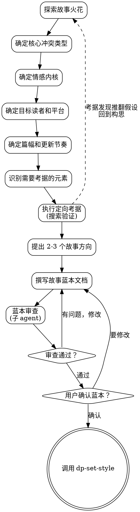

<SUBAGENT-STOP>
如果你是被派遣执行特定任务的子代理，跳过此技能。
</SUBAGENT-STOP>

# 从灵感到蓝本：构思与考据

本技能是**刚性技能（RIGID）**。前提文档必须经过用户确认才能推进到下一阶段。

通过自然对话和定向考据，把用户脑中一个模糊的灵感变成自洽、完整的故事蓝本。整个过程分为两个交替的阶段：**构思**（定方向、选冲突、塑角色）和**考据**（验证真实性、充实细节、确保设定可信）。两者不是线性流程，而是根据需要随时交替。

<HARD-GATE>
在用户明确确认故事蓝本之前，禁止调用任何实现类技能。不得调用 dp-set-concept、dp-set-outline 或任何后续技能。不论故事看起来多简单，蓝本必须经过确认才能推进。
</HARD-GATE>

## 反模式："这个故事很简单，不需要蓝本"

每个故事都走这个流程。一万字的短篇也走，百万字的长篇也走。"简单"的故事恰恰最容易栽在未经审视的假设上。蓝本文档可以很短（短篇可能只有半页），但你必须写出来，必须让用户确认。

## 检查清单

你必须为以下每一项创建 TodoWrite 任务，按顺序完成：

1. **探索用户的故事火花** — 一个句子、一个画面、一种情绪，什么都行
2. **确定核心冲突类型** — 人vs人 / 人vs自然 / 人vs社会 / 人vs自我 / 人vs命运
3. **确定故事的情感内核** — 这个故事想让读者感受什么？
4. **确定目标读者和平台**（起点 / 晋江 / 知乎 / 独立出版 / 其他）
5. **确定篇幅和更新节奏**（短篇 / 中篇 / 长篇 / 超长篇）
6. **识别需要考据的元素** — 标记故事中涉及的真实世界元素
7. **执行定向考据** — 针对标记元素进行搜索验证
8. **提出 2-3 个故事方向** — 含考据成果、取舍分析和推荐
9. **撰写故事蓝本文档**（logline + 主角 + 核心冲突 + 主题 + 基调 + 考据要点）
10. **蓝本审查** — 派遣审查子 agent 检查蓝本的可行性和自洽性
11. **用户确认蓝本** — 等待明确批准
12. **过渡到下一技能** — 调用 dp-set-style

## 信息收集方式

**每个提问都提供三种回答方式：**

1. **导入文件** — 用户已有相关文档或素材，直接导入
2. **输入** — 用户口头描述或手动输入
3. **不确定** — 用户没有想法，由 AI 基于已有信息提出建议

示例提问格式：
> 故事的核心冲突是什么？
> - 📄 **导入**：如果你有相关的构思笔记或灵感文档，可以直接提供
> - ✏️ **输入**：用你自己的话描述
> - 🤷 **不确定**：我根据你之前提供的信息来提建议

## 流程图



**终态是调用 dp-set-style。** 蓝本确认后，先定义写作风格，再进入世界观和角色设定。

## 提问策略

**每次只问一个问题。**

- 优先用选择题。给出 A/B/C/D 选项，让用户挑。
- 开放题也可以，但别连着问两个开放题。
- 从最大的决策开始，逐步收窄：类型 → 冲突 → 角色 → 世界。
- 感知用户的节奏。如果用户回答很短，你的问题也要精简。如果用户喜欢展开聊，你可以多给一些背景。

**提问顺序参考：**

1. 你脑子里有什么？（火花）
2. 这是什么类型的故事？（类型选择题）
3. 故事的核心矛盾是什么？（冲突）
4. 你想让读者读完后有什么感觉？（情感内核）
5. 写给谁看？发在哪里？（读者和平台）
6. 打算写多长？（篇幅）
7. 故事里有哪些元素需要查证？（考据触发）

## Logline 公式

```
在[世界/背景]中，[主角特征]的[主角]必须[核心行动]，否则[代价/后果]。
```

**示例：**
- 在末法时代的修仙世界中，失去灵根的前天才必须找到重塑灵根的方法，否则他将沦为凡人，眼睁睁看着仇敌毁灭他的宗门。
- 在 2077 年的赛博都市中，记忆被篡改的女黑客必须找到自己的真实身份，否则她将成为一场阴谋的替罪羊。

## 考据流程

### 识别知识缺口

审视已有的构思信息，标记所有需要外部验证或充实的条目。不要泛泛地"研究一切"，列出具体的问题清单。

**好的问题：**
- "唐代长安的坊市制度具体如何运作？夜禁时间是几点到几点？"
- "咏春拳的核心理念和训练方式是什么？与太极的根本区别在哪？"

**差的问题：**
- "研究一下唐朝" ❌
- "了解中国武术" ❌

### 执行搜索

使用 web search 工具进行定向搜索。每个研究问题独立搜索，不要把多个问题混在一条查询里。

### 提取与分类

从搜索结果中提取与故事相关的细节：

| 类别 | 内容示例 |
|------|---------|
| 可直接使用 | 符合设定且不需改动的真实细节 |
| 需要改编 | 真实但需要调整以适配虚构世界的元素 |
| 纯粹灵感 | 启发了新设定但不直接引用的素材 |
| 存疑待查 | 来源不够可靠、需要交叉验证的信息 |

### 来源标注

每条研究结果附注来源可信度：

- **高可信度**：学术文献、官方文档、权威百科
- **中可信度**：专业博客、纪录片、知名媒体
- **低可信度**：论坛帖子、个人博客、未标注来源的文章

低可信度来源的信息可以用作灵感，但不应作为"考据依据"。

### 考据 vs 创作的平衡

真实世界的细节是调味料，不是主菜。

1. 用真实细节作为灵感跳板，不是枷锁
2. 故意偏离历史或科学时，在蓝本中记录偏离点和理由
3. "基于"不等于"忠于"。一个"基于宋代"的世界可以有宋代没有的东西
4. 读者在意的是"感觉真实"，不是"事实准确"
5. 当考据结论和故事需要冲突时，故事赢

### 研究范围控制

考据最大的陷阱是兔子洞。你钻进去研究唐代酿酒工艺，三小时后发现自己在看安史之乱的政治博弈，而故事只需要一句"他喝了口浊酒"。

**硬性约束：**

- 每次研究会话有一个明确的核心问题
- 每个核心问题最多 3 个追问（follow-up）
- 每条搜索结果都要过"这对故事有用吗？"的筛选
- 如果发现自己连续搜索超过 5 次仍未找到直接相关的信息，停下来重新评估问题的提法

## 处理"随机"请求

当用户说"随机""你来决定""帮我想一个"：

1. **不要真的随机。** 生成 3 个有意设计差异的方案。
2. 三个方案应该在类型、基调、冲突类型上尽量不同。
3. 每个方案给出 logline + 一句话卖点。
4. 让用户选一个，或者说"都不喜欢，再来"。
5. 如果连续两轮用户都不满意，切换策略：问用户最近喜欢什么作品，从那里找灵感方向。

## 蓝本文档模板

确认故事方向后，用以下模板撰写蓝本文档：

```markdown
# 故事蓝本：[标题]

## Logline
[一句话概括]

## 核心信息
- **类型**: [玄幻/都市/悬疑/科幻/历史/...]
- **基调**: [热血/黑暗/轻松/沉重/...]
- **目标读者**: [平台+受众]
- **预计篇幅**: [万字数]

## 主角
- **姓名**:
- **核心特征**: [一个词]
- **内在需求 vs 外在欲望**:

## 核心冲突
[2-3句描述主要矛盾]

## 主题
[这个故事在说什么？一句话]

## 开篇钩子
[第一章用什么吸引读者？]

## 考据要点
[列出已考据的关键元素、来源、有意偏离及理由]

## 有意偏离
- **偏离点**: [与现实不符的设定]
- **现实情况**: [实际是怎样的]
- **偏离理由**: [为什么故事需要这样改]
```

**存储路径：** `docs/dreampowers/tracking/overview.md`

## 蓝本审查

写完蓝本后，派遣审查子 agent 检查以下问题：

- **冲突是否足够驱动全篇？** 对于短篇（1-3万字）冲突可以小而精，长篇（50万字以上）需要能展开多层矛盾。
- **主角是否有足够的行动力？** 主角必须是推动故事的人，不是被事件推着走的旁观者。
- **logline 是否清晰？** 不懂这个故事的人读完 logline 能不能知道这是写什么的？
- **目标平台和故事是否匹配？** 起点读者和晋江读者的期待完全不同。
- **篇幅和冲突是否匹配？** 一个支撑不了十万字的冲突不要硬拉成长篇。
- **自洽性检查：** 设定之间是否存在逻辑矛盾？考据结果是否支撑设定？
- **完整性检查：** 是否有关键信息缺失（没有冲突、没有主角、没有基调）？

审查最多循环 3 次。如果 3 次后仍有争议，把问题交给用户决定。

## 平台差异速查

不同平台的读者期待不同，蓝本阶段就要考虑：

| 平台 | 典型期待 | 注意事项 |
|------|---------|---------|
| 起点 | 升级体系、爽感节奏、金手指 | 开篇 3 章定生死，需要明确的成长线 |
| 晋江 | 人物关系、情感深度、CP 化学反应 | 主角关系是核心卖点，基调要稳定 |
| 知乎 | 脑洞、反转、信息差 | 短平快，每段都要有钩子 |
| 独立出版 | 文学性、主题深度、叙事技巧 | 节奏可以慢，但每个场景要有密度 |

## 与其他技能的交互

| 关系 | 技能 | 说明 |
|------|------|------|
| 下游 | `dp-set-style` | 蓝本确认后进入写作风格定义 |
| 被引用 | `dp-chapter-draft` | 写作中遇到不确定的细节时回调本技能做考据 |
| 被引用 | `dp-set-concept` | 设定构建中需要考据时回调本技能 |

本技能可在创作流程的任何阶段被调用做考据，不局限于初始构思阶段。

## 作者调优

当人工作者阅读了已完成的若干章节后，可能希望对后续章节的方向进行微调。本技能提供**作者调优**模式，将调优意见写入目标章节工作区的 `tuning.md` 文件。

### 触发条件

- 用户说"我想调整后面的方向" / "作者调优" / "这几章写完后我有些想法"
- 用户阅读已完成章节后，希望对尚未起草的章节进行方向调整

### 调优流程

1. **定位当前进度** — 读取 `docs/dreampowers/timeline/` 目录，找到所有 `summary-NNN.md` 文件。最大编号的章节即为最后完成的章节，其后的章节为未起草章节。向用户确认当前进度
2. **确认调优范围** — 告知用户当前已完成和未起草的章节，询问哪些未起草章节需要调优（单章 / 一个范围 / 所有后续章节）。已完成章节不走调优，走修订流程
3. **收集调优意见** — 通过对话了解用户想调整什么：
   - 节奏偏快/偏慢？
   - 某条伏笔要提前/延后/放弃？
   - 某个角色的戏份要增加/减少？
   - 基调需要转变？
   - 其他任何方向性调整
4. **撰写 tuning.md** — 将调优意见写入目标章节工作区。对每个目标章节，在 `docs/dreampowers/chapters/chapter-NNN/` 目录下创建 `tuning.md` 文件。如果章节工作区尚未建立（大纲阶段未执行），先提示用户需要先完成大纲
5. **用户确认** — 展示每份 tuning.md 的内容和写入路径，确认无误

### tuning.md 格式

```markdown
# 作者调优指令

## 来源
基于第 X-Y 章阅读反馈，由作者于 [日期] 提出。

## 调优要点
- [具体调整指令，每条一行]
- [例：加快主角与反派的对峙节奏，第12章必须正面冲突]
- [例：减少心理描写篇幅，增加对话推动剧情]
- [例：伏笔 thread-003 提前到本章回收]

## 优先级说明
本文件中的指令优先级高于大纲默认设定，仅次于铁律。
```

**存储路径：** `docs/dreampowers/chapters/chapter-NNN/tuning.md`

### 规则

- `tuning.md` 是**可选文件**。存在时有效，不存在时无影响。
- 调优指令的优先级：铁律 > tuning.md > style.md > 大纲默认设定 > spec.md 中的一般指导。
- 一个 `tuning.md` 只影响它所在的章节文件夹。如需影响多个章节，每个章节文件夹各写一份。
- 不得修改已完成章节的 `tuning.md`（已完成章节走修订流程，不走调优）。

## 考据 Red Flags

出现以下信号时，立即暂停研究，回到故事本身：

- 连续搜索超过 5 次未产出可用于设定的内容
- 研究笔记的篇幅已经超过对应章节的预计字数
- 你开始觉得"这个真实细节太有趣了必须全部写进去"
- 考据结论开始动摇已经确认的核心设定
- 用户说"差不多了"或"够了"但你还想继续查

任一 Red Flag 触发：停止搜索，整理已有素材，交给用户决定取舍。

## 反模式

- ❌ **不要一次问太多问题。** 一条消息一个问题。用户不是在填表格。
- ❌ **不要替用户做所有决定。** 你的工作是引导和提议，不是独裁。
- ❌ **不要在蓝本阶段就开始详细世界观设定。** "修炼体系分几个境界"这些问题不属于蓝本阶段。世界观设定是 dp-set-concept 的工作。
- ❌ **不要忽略目标平台的差异。** 起点的爽文和晋江的言情在叙事节奏、角色设计、冲突类型上都有巨大差异。
- ❌ **不要把蓝本写得太长。** 蓝本文档是一页纸。如果你写了三页，说明你已经越界进入了世界观设定或大纲的领域。
- ❌ **研究瘫痪**：无限考据，永远觉得"还没查够"，迟迟不动笔。
- ❌ **准确性高于一切**：为了历史准确性牺牲故事节奏或角色动机。
- ❌ **模糊提问**："帮我研究一下日本文化"。这不是问题，是主题。拆成具体的、可搜索的子问题。
- ❌ **兔子洞潜水**：一个追问接一个追问，偏离原始问题越来越远。遵守 3 次追问上限。

## 核心原则

- **一次一个问题** — 别让用户喘不过气
- **选择题优先** — 降低回答门槛
- **从大到小** — 先定类型和冲突，再谈细节
- **考据服务故事** — 真实细节是调味料，不是主菜
- **蓝本是契约** — 用户确认了才能往下走
- **自洽与完整** — 蓝本内部不能有矛盾，关键信息不能缺失
- **克制再克制** — 蓝本阶段只做蓝本的事
