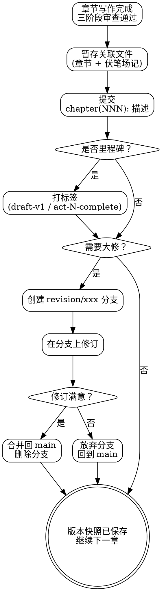

<SUBAGENT-STOP>
如果你是被派遣执行特定任务的子代理，跳过此技能。
</SUBAGENT-STOP>

# 稿件版本管理

本技能是**弹性技能**。提交规范和标签策略是固定的，分支策略和回滚方式可根据项目规模灵活调整。

## 核心定位

用 Git 管理稿件的版本历史。通过 commit、branch、tag 追踪草稿演进、修订记录和里程碑节点。

本技能**只负责版本管理操作**，不负责质量检查或终检。

职责边界：
- **管**：提交规范、标签策略、分支策略、版本回滚
- **不管**：稿件内容质量（那是 `dp-chapter-draft` 的事）、连续性检查和终检（那是 `dp-review-consistency` 的事）

本技能**不负责** git worktree 操作。需要隔离工作区时，使用其他工具或手动处理。

## 适用时机

- 每章通过 `dp-chapter-draft` 三阶段审查后，提交版本快照
- 重大修订里程碑：完成一幕、完成全书初稿、全书审查通过
- 大规模修改前，先提交当前状态作为安全点
- 大规模修改后，提交修改结果并与修改前对比
- 世界观设定、大纲、伏笔场记等支撑文档发生变更时

## 提交规范

每次 commit 必须使用结构化消息。格式：`类型(范围): 描述`。

### 类型与范围

| 类型 | 范围 | 示例 |
|------|------|------|
| `chapter` | 章节号 (NNN) | `chapter(003): 第3章初稿完成` / `chapter(003): 第3章审查通过` |
| `set` | 无 | `set: 更新角色X角色风格` |
| `outline` | 无 | `outline: 第二幕大纲修订` |
| `tracking` | 无 | `tracking: 更新伏笔场记` |
| `meta` | 无 | `meta: 更新写作进度说明` |

### 提交原则

1. **关联产物一起提交**。章节稿件和对应的伏笔场记更新放在同一个 commit 里
2. **每个 commit 有且只有一个目的**。不要把第3章初稿和第5章修订混在一起
3. **描述写中文**，类型和范围写英文。描述要具体，不要写"更新内容"
4. **审查通过的章节单独提交**。初稿完成是一个 commit，审查通过后是另一个

### 提交检查清单

每次提交前确认：消息格式正确、关联文件全部暂存、没有遗留未暂存的相关改动、描述具体。

## 标签策略

用 Git tag 标记关键里程碑，方便随时回溯。

| 标签 | 含义 | 打标签时机 |
|------|------|-----------|
| `draft-v1` | 第一版完整初稿 | 所有章节初稿完成 |
| `draft-v2` | 第二版修订稿 | 全书修订完成 |
| `review-v1` | 第一轮全书审查通过 | 连续性检查 + 三阶段审查全部通过 |
| `final-v1` | 最终定稿 | 由 `dp-review-consistency` 的终检流程确认 |
| `act-1-complete` | 第一幕完成 | 第一幕所有章节审查通过 |
| `act-2-complete` | 第二幕完成 | 第二幕所有章节审查通过 |
| `act-3-complete` | 第三幕完成 | 第三幕所有章节审查通过 |

标签命名规则：全小写，连字符分隔。版本号用 `vN` 后缀。不要用日期做标签名（commit 本身有时间戳）。

## 分支策略

保持简单。长篇小说不需要 GitFlow。

| 分支 | 用途 | 生命周期 |
|------|------|---------|
| `main` | 当前稿件状态，所有已确认的内容 | 永久 |
| `revision/xxx` | 重大修订（可能需要回滚） | 临时，合并或放弃后删除 |

使用规则：
- 日常写作直接在 `main` 上提交，不需要为每章开分支
- 当你要做**可能推翻大量已有内容**的修订时，开 `revision/xxx` 分支。例如：`revision/restructure-act-2`、`revision/change-pov`
- 修订分支完成且确认后，合并回 `main`。修订放弃则直接删除分支
- **不使用 git worktree**。一个工作目录，一个分支，简单明确

## 回滚指引

修订失败、需要恢复到之前版本时：

```bash
# 回滚单个章节：查看历史 → 恢复 → 提交
git log --oneline -- release/chapter-003.md
git checkout <commit-hash> -- release/chapter-003.md
git commit -m "chapter(003): 回滚至审查通过版本"

# 回滚到里程碑：从标签创建修订分支（不影响 main）
git checkout -b revision/rollback-to-draft-v1 draft-v1

# 对比版本差异
git diff draft-v1 -- release/
git diff draft-v1 review-v1 -- release/chapter-003.md
```

回滚原则：**永远不要用 `git reset --hard`**，用 `git checkout` 或 `git revert` 保留操作历史。回滚前先提交当前状态。回滚操作本身也要有规范的 commit 消息。

## 版本管理流程



## 与其他技能的交互

| 关系 | 技能 | 说明 |
|------|------|------|
| 上游 | `dp-review-consistency` | 连续性检查和终检通过后，可能触发一次提交或打标签 |
| 上游 | `dp-set-outline` | 大纲变更时，用 `outline:` 类型提交 |
| 上游 | `dp-set-concept` | 设定变更时，用 `set:` 类型提交 |

## 反模式

以下行为严格禁止：

- **提交不写消息或写"update"** ❌ 三个月后你不会记得"update"改了什么
- **累积大量改动后一次性提交** ❌ 失去逐步回滚的能力，版本历史变成摆设
- **章节和伏笔场记更新分开提交** ❌ 关联产物必须在同一个 commit，否则中间状态不一致
- **在 `main` 上做可能推翻的大修** ❌ 开 `revision/xxx` 分支，保护已有成果
- **用 `git reset --hard` 回滚** ❌ 这会删除历史，用 `checkout` 或 `revert`
- **给每章都开分支再合并** ❌ 过度工程化，日常写作直接在 `main` 提交

## Red Flags（STOP 信号）

| 信号 | 含义 |
|------|------|
| 超过 3 章未提交 | 版本管理形同虚设，立即补提交 |
| `git status` 显示大量未跟踪文件 | 新文件未纳入版本控制 |
| commit 消息全是英文或无类型前缀 | 提交规范未执行 |
| `main` 上有半完成的大修改 | 应该在 `revision/xxx` 分支上进行 |
| 标签与实际状态不符 | 标签打早了或漏打了 |

出现 Red Flag 后：不得继续写作。先补齐版本管理操作，使 `git status` 和版本历史恢复到规范状态。

## 终止状态

版本提交完成，commit 消息符合规范，关联产物一起入库，git tag 已创建（如需）。`git status` 显示工作区干净，没有遗留的未提交改动。后续如需修订，创建新版本分支，走 `skill("dp-chapter-draft")` + `skill("dp-review-consistency")` 流程后重新提交。
