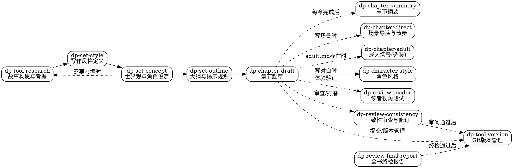

<SUBAGENT-STOP>
如果你是被派遣执行特定任务的子代理，跳过此技能。
</SUBAGENT-STOP>

<EXTREMELY-IMPORTANT>
哪怕你觉得只有 1% 的可能性某个 dp-* 技能跟当前创作任务相关，你也**必须**调用那个技能。

如果技能适用于你的任务，你没有选择。你必须使用它。

这不是协商。不是可选项。你不能给自己找借口绕过去。
</EXTREMELY-IMPORTANT>

## 模式切换

你现在处于**创作模式**。所有任务使用 `dp-*` 前缀的技能。

- 切换到编程模式：调用 `skill("using-superpowers")`
- 切换回创作模式：调用 `skill("dp-using-dreampowers")`

两套技能**绝不混用**。创作模式下只调用 dp-* 技能，编程模式下不调用 dp-* 技能。

## 全局串行规则（不可协商）

**所有 Dreampowers 技能的执行必须串行。** 不得并行调用多个 dp-* 技能，不得并行写作多个章节，不得并行执行多个创作流程步骤。

- 一次只执行一个 dp-* 技能
- 一次只写一个章节
- 上一步完成后再进入下一步
- 这条规则适用于所有 dp-* 技能，没有例外

## 指令优先级

Dreampowers 技能覆盖系统默认行为，但**用户指令永远优先**：

1. **用户的明确指令**（CLAUDE.md、GEMINI.md、AGENTS.md、直接要求）——最高优先级
2. **Dreampowers 技能**——在冲突处覆盖系统默认行为
3. **系统默认提示词**——最低优先级

如果用户说"不用管节奏控制"，而技能说"必须控制节奏"，听用户的。用户拥有最终决定权。

## 如何使用技能

通过 `skill` 工具调用技能。调用后技能内容会作为工具响应返回，直接遵循其指引。不要用 Read 工具读取技能文件。

# 技能路由

## 规则

**在任何创作行动之前，先调用对应的技能。** 哪怕只有 1% 的可能性适用，也要先调用确认。调用后发现不适用，可以不用。

## 14 技能总览

| 类别 | 技能 | 用途 |
|------|------|------|
| 入口 | `dp-using-dreampowers` | 模式切换、技能路由、工作流概览 |
| 工具 | `dp-tool-research` | 故事构思 + 考据调研 + 故事命名 + 作者调优 |
| 设定 | `dp-set-style` | 作品级写作风格定义（七维问卷 → style.md 风格档案） |
| 设定 | `dp-set-concept` | 世界观/角色设定、概念隔离、故事级时间线、外部素材导入 |
| 设定 | `dp-set-outline` | 大纲构建、揭示节奏、主题编织、伏笔规划 |
| 章节 | `dp-chapter-draft` | 章节起草（含草稿预审、三阶段审查、连续写作模式） |
| 章节 | `dp-chapter-summary` | 章节摘要生成（AI稿或人工导入稿） |
| 章节 | `dp-chapter-direct` | 场景导演 + 节奏控制（动作/情感/对话子模式） |
| 章节 | `dp-chapter-adult` | 成人场景写作：感官完整性与叙事真实（选装，需 --all 安装） |
| 工具 | `dp-character-style` | 角色风格档案、遮名测试、对话规则、潜台词 |
| 工具 | `dp-tool-version` | Git 版本管理（提交、回滚、差异对比） |
| 审查 | `dp-review-reader` | 读者视角体验测试（翻页欲、认知负荷、共情、节奏） |
| 审查 | `dp-review-consistency` | 连续性校验 + 修订建议 + AI味检测 |
| 审查 | `dp-review-final-report` | 全书终检报告（人工可选，全书完成后） |

## 意图路由表

| 用户意图 | 调用技能 |
|----------|---------|
| "我想写一个故事" / 新故事构思 | `dp-tool-research` |
| 考据 / 世界观调研 / 查资料 | `dp-tool-research` |
| 写作风格 / 定义风格 / 风格问卷 / 文笔基调 | `dp-set-style` |
| 世界观设定 / 角色设定 | `dp-set-concept` |
| 故事时间线 / 时间跨度 / 关键日期 | `dp-set-concept` |
| 概念拆分 / 概念隔离 | `dp-set-concept` |
| 导入外部内容（世界观/角色卡/章节/大纲） | `dp-set-concept` |
| 写大纲 / 故事结构 | `dp-set-outline` |
| 世界观揭示节奏 / 概念预算 | `dp-set-outline` |
| 主题编织 / 主题线索 | `dp-set-outline` |
| 伏笔规划 / 伏笔场记 | `dp-set-outline` |
| 写章节 / 正文 | `dp-chapter-draft` |
| 章节摘要 / 前情提要 | `dp-chapter-summary` |
| 场景导演（动作戏/情感戏/对白） | `dp-chapter-direct` |
| 节奏控制 / 张力弧线 | `dp-chapter-direct` |
| 角色风格 / 语言风格 / 潜台词 | `dp-character-style` |
| 连续性检查 | `dp-review-consistency` |
| 修订建议 / AI味检测 | `dp-review-consistency` |
| 终检 / 全书一致性扫描 | `dp-review-final-report` |
| 用读者视角测试章节体验 | `dp-review-reader` |
| "这段打戏/情感戏/对白写得怎么样？" / 评价已写场景 | `dp-review-reader` |
| "帮我分析这个角色的说话方式" / 分析角色对话 | `dp-character-style` |
| "查看伏笔状态" / "伏笔回收情况" | `dp-review-consistency` |
| "作者调优" / "调整后续章节方向" / "我看完了前几章，想调整" | `dp-tool-research` |
| 提交 / 版本管理 / 回滚 | `dp-tool-version` |
| 成人场景写作（需 opt-in 安装） | `dp-chapter-adult` |

## 创作工作流概览



主线流程从左到右：构思 → 设定 → 大纲 → 起草。虚线箭头表示在起草过程中按需调用的辅助技能。

## 危险信号

这些想法意味着你在给自己找借口——停下来：

| 想法 | 现实 |
|------|------|
| "这只是简单写几段" | 所有创作都是任务，检查是否有对应技能 |
| "我先写再说" | 先检查技能，再动笔 |
| "不需要走流程" | 技能存在就必须使用 |
| "世界观设定可以一次性交代" | 绝对禁止。dp-set-outline 中有铁律和概念预算 |
| "这段对话不需要节奏控制" | 对白节奏影响阅读体验，调用 `skill("dp-chapter-direct")` |
| "角色说话差不多就行" | 角色风格是区分度的核心，调用 `skill("dp-character-style")` |
| "我记得这个技能怎么用" | 技能会更新。读当前版本 |
| "这个任务太小了" | 小任务会膨胀。用技能 |
| "先产出再优化" | 没有流程的产出是返工的温床 |

## 技能优先级

当多个技能可能适用时，按此顺序：

1. **设定技能优先**（dp-set-outline, dp-set-concept）——决定**怎么**处理任务
2. **执行技能其次**（dp-chapter-draft, dp-chapter-direct, dp-character-style）——指导具体产出
3. **审查技能最后**（dp-review-consistency, dp-review-reader）——验证产出质量

"我要写个新故事" → 先 `skill("dp-tool-research")`，再 `skill("dp-set-concept")`。
"帮我写这场打戏" → 先 `skill("dp-chapter-direct")`，在其指引下起草。
"检查全书一致性" → `skill("dp-review-consistency")`。

## 技能类型

**刚性技能**（严格遵循，不可跳步）：
- `dp-set-outline`：大纲流程和六条铁律
- `dp-set-concept`：概念隔离和物理分离流程
- `dp-chapter-summary`：摘要格式和字数限制
- `dp-chapter-adult`：叙事必要性框架和分级边界
- `dp-review-consistency`：连续性检查维度和AI味检测规则为刚性，修订建议流程为弹性

**弹性技能**（原则不变，细节可因上下文调整）：
- `dp-chapter-draft`：章节写作流程（但三阶段审查流水线是刚性的）
- `dp-chapter-direct`：场景导演和节奏控制（但张弛法则是刚性的）
- `dp-review-reader`：四维度评估标准固定，权重可调
- `dp-tool-version`：提交规范固定，分支策略灵活
- `dp-set-style`：问卷维度固定，细节可调
- `dp-tool-research`：流程步骤固定，提问策略灵活
- `dp-character-style`：对话规则固定，风格刻画灵活

技能本身会告诉你它属于哪种。

## 产出物路径约定

Dreampowers 的所有产出物存放在 `docs/dreampowers/` 目录下，该目录作为**独立的 Git 仓库**管理稿件版本（由 `dp-tool-version` 技能操作）。

**首次使用时必须初始化**：

```bash
mkdir -p docs/dreampowers/{input,set/{world,concept,character},tracking,timeline,outlines,chapters,release}
cd docs/dreampowers
git init
```

目录结构：

```
docs/dreampowers/                      ← 独立 Git 仓库（git init）
├── input/                             ← 用户导入的原始数据（临时区，不自动清除）
├── set/
│   ├── world/                         ← 世界逻辑关系与背景（dp-set-concept 产出）
│   ├── concept/                       ← 具体概念名词，一概念一文件
│   └── character/                     ← 角色文件（单文件或目录）
├── tracking/
│   ├── overview.md                    ← 一句话故事概要
│   ├── iron-rules.md                  ← 铁律文件（软链接到各章节文件夹）
│   ├── style.md                       ← 写作风格档案（dp-set-style 产出，软链接到各章节文件夹）
│   ├── adult.md                       ← 成人场景偏好（选装，dp-set-outline 产出）
│   ├── thread-NNN-*.md                ← 伏笔线索文件（thread- 前缀）
│   └── deferred-threads.md            ← 续作保留悬念清单（dp-review-consistency 产出）
├── timeline/
│   ├── timeline.md                    ← 故事级时间线（dp-set-concept 产出）
│   └── summary-NNN.md                 ← 每章摘要（dp-chapter-summary 产出）
├── outlines/
│   ├── outline-*.md                   ← 大纲文件（dp-set-outline 产出）
│   └── review-*.md                    ← 全书审查报告（dp-review-consistency 产出）
├── chapters/
│   └── chapter-NNN/
│       ├── spec.md                    ← 章节 spec（七节结构：框架 + 门控评估 + 写作蓝图）
│       ├── draft.md                   ← 草稿（进行中，可修订）
│       ├── review.md                  ← 章节审查报告
│       ├── tuning.md                  ← 作者调优指令（可选，存在时优先级高）
│       ├── *.md → set/concept/*       ← 概念符号链接
│       ├── *.md → set/character/*     ← 角色符号链接
│       ├── thread-*.md → tracking/*   ← 伏笔符号链接
│       ├── iron-rules.md → tracking/iron-rules.md
│       ├── style.md → tracking/style.md
│       ├── outline-*.md → outlines/outline-*.md  （大纲符号链接）
│       └── summary-*.md → timeline/summary-*.md  （前1-3章摘要）
└── release/
    └── chapter-NNN.md                 ← 最终版本（dp-tool-version 管理）
```

章节文件夹（`docs/dreampowers/chapters/chapter-NNN/`）是**完全自包含**的写作单元。草稿预审阶段读取文件夹全部材料并写入 spec.md 第六、七节（门控评估结果 + 写作蓝图），用户确认后，写作阶段**只读 spec.md**，不再访问文件夹中的其他文件。一致性检查（`dp-review-consistency`）读 `draft.md` + `spec.md` + 前序已发布章节；读者审阅（`dp-review-reader`）只读 `draft.md`，不读 spec.md。

## 路径约定

所有 dp-* 技能中的文件路径一律写完整路径，从 `docs/dreampowers/` 开始。不得省略前缀，不得只写文件名。

### 全局文件清单

下表列出所有技能可能产出或消费的文件。**文件名和路径以此表为准，不得自行发明。**

| 完整路径 | 文件名格式 | 产出技能 | 说明 |
|----------|-----------|---------|------|
| `docs/dreampowers/tracking/overview.md` | 固定 | dp-tool-research | 一句话故事概要 |
| `docs/dreampowers/tracking/style.md` | 固定 | dp-set-style | 写作风格档案 |
| `docs/dreampowers/tracking/iron-rules.md` | 固定 | dp-set-outline | 六条铁律精简版 |
| `docs/dreampowers/tracking/adult.md` | 固定 | dp-set-outline | 成人场景偏好（选装） |
| `docs/dreampowers/tracking/thread-NNN-<name>.md` | NNN 三位数 + 描述性名称 | dp-set-outline / dp-chapter-draft | 伏笔线索文件 |
| `docs/dreampowers/tracking/deferred-threads.md` | 固定 | dp-review-consistency | 续作保留悬念清单 |
| `docs/dreampowers/timeline/timeline.md` | 固定 | dp-set-concept | 故事级时间线 |
| `docs/dreampowers/timeline/summary-NNN.md` | NNN 三位数章节号 | dp-chapter-summary | 章节摘要（纯文本 ≤150 字） |
| `docs/dreampowers/set/world/*.md` | 自由命名 | dp-set-concept | 世界逻辑与背景 |
| `docs/dreampowers/set/concept/<name>.md` | 一概念一文件 | dp-set-concept | 概念源文件 |
| `docs/dreampowers/set/character/<name>.md` 或 `docs/dreampowers/set/character/<name>/` | 一角色一文件或一目录 | dp-set-concept | 角色源文件 |
| `docs/dreampowers/outlines/outline-*.md` | outline-YYYY-MM-DD.md | dp-set-outline | 大纲文件 |
| `docs/dreampowers/outlines/review-*.md` | review-consistency-*.md | dp-review-consistency | 全书审查报告 |
| `docs/dreampowers/chapters/chapter-NNN/spec.md` | 固定 | dp-set-outline（框架）+ dp-chapter-draft（蓝图） | 章节 spec（七节：概念预算/门控标准/概念依赖/读者评估/改进要求/门控评估结果/写作蓝图） |
| `docs/dreampowers/chapters/chapter-NNN/draft.md` | 固定 | dp-chapter-draft | 章节草稿 |
| `docs/dreampowers/chapters/chapter-NNN/review.md` | 固定 | dp-review-consistency | 章节审查报告 |
| `docs/dreampowers/chapters/chapter-NNN/tuning.md` | 固定 | dp-tool-research | 作者调优指令（可选） |
| `docs/dreampowers/chapters/chapter-NNN/adult.md` | 固定（链接或独立） | dp-set-outline | 成人场景偏好（可选） |
| `docs/dreampowers/release/chapter-NNN.md` | NNN 三位数章节号 | dp-chapter-draft | 终稿 |
| `docs/dreampowers/release/chapter-NNN-TBD.md` | 同上 + TBD 后缀 | dp-chapter-draft | 待人工审阅终稿 |
| `docs/dreampowers/input/*` | 任意 | 用户 | 导入原始数据（临时区） |

## 用户指令

用户指令说的是**做什么**，不是**怎么做**。"帮我写第三章"不意味着跳过 dp-chapter-draft 的工作流。
