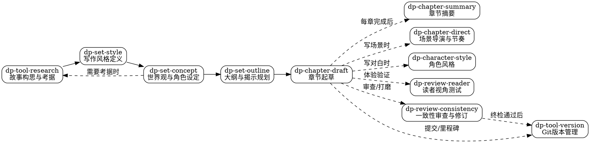

<SUBAGENT-STOP>
如果你是被派遣执行特定任务的子代理，跳过此技能。
</SUBAGENT-STOP>

<EXTREMELY-IMPORTANT>
哪怕你觉得只有 1% 的可能性某个 dp-* 技能跟当前创作任务相关，你也**必须**调用那个技能。

如果技能适用于你的任务，你没有选择。你必须使用它。

这不是协商。不是可选项。你不能给自己找借口绕过去。
</EXTREMELY-IMPORTANT>

## 模式切换

你现在处于**创作模式**。所有任务使用 `dp-*` 前缀的技能。

- 切换到编程模式：调用 `skill("using-superpowers")`
- 切换回创作模式：调用 `skill("dp-using-dreampowers")`

两套技能**绝不混用**。创作模式下不调用 sp-* 技能，编程模式下不调用 dp-* 技能。

## 全局串行规则（不可协商）

**所有 Dreampowers 技能的执行必须串行。** 不得并行调用多个 dp-* 技能，不得并行写作多个章节，不得并行执行多个创作流程步骤。

- 一次只执行一个 dp-* 技能
- 一次只写一个章节
- 上一步完成后再进入下一步
- 这条规则适用于所有 dp-* 技能，没有例外

## 指令优先级

Dreampowers 技能覆盖系统默认行为，但**用户指令永远优先**：

1. **用户的明确指令**（CLAUDE.md、GEMINI.md、AGENTS.md、直接要求）——最高优先级
2. **Dreampowers 技能**——在冲突处覆盖系统默认行为
3. **系统默认提示词**——最低优先级

如果用户说"不用管节奏控制"，而技能说"必须控制节奏"，听用户的。用户拥有最终决定权。

## 如何使用技能

通过 `skill` 工具调用技能。调用后技能内容会作为工具响应返回，直接遵循其指引。不要用 Read 工具读取技能文件。

# 技能路由

## 规则

**在任何创作行动之前，先调用对应的技能。** 哪怕只有 1% 的可能性适用，也要先调用确认。调用后发现不适用，可以不用。

## 13 技能总览

| 类别 | 技能 | 用途 |
|------|------|------|
| 入口 | `dp-using-dreampowers` | 模式切换、技能路由、工作流概览 |
| 工具 | `dp-tool-research` | 故事构思 + 考据调研 + 作者调优 |
| 设定 | `dp-set-style` | 作品级写作风格定义（七维问卷 → style.md 风格档案） |
| 设定 | `dp-set-concept` | 世界观/角色设定、概念隔离、故事级时间线、外部素材导入 |
| 设定 | `dp-set-outline` | 大纲构建、揭示节奏、主题编织、伏笔规划 |
| 章节 | `dp-chapter-draft` | 章节起草（含预写关卡、三阶段审查、连续写作模式） |
| 章节 | `dp-chapter-summary` | 章节摘要生成（AI稿或人工导入稿） |
| 章节 | `dp-chapter-direct` | 场景导演 + 节奏控制（动作/情感/对话子模式） |
| 章节 | `dp-chapter-adult` | 亲密场景写作（选装，需 --all 安装） |
| 工具 | `dp-character-style` | 角色风格档案、遮名测试、对话规则、潜台词 |
| 工具 | `dp-tool-version` | Git 版本管理（提交、标签、回滚、差异对比） |
| 审查 | `dp-review-reader` | 读者视角体验测试（翻页欲、认知负荷、共情、节奏） |
| 审查 | `dp-review-consistency` | 连续性校验 + 文笔修订/去AI味 + 终检 |

## 意图路由表

| 用户意图 | 调用技能 |
|----------|---------|
| "我想写一个故事" / 新故事构思 | `dp-tool-research` |
| 考据 / 世界观调研 / 查资料 | `dp-tool-research` |
| 写作风格 / 定义风格 / 风格问卷 / 文笔基调 | `dp-set-style` |
| 世界观设定 / 角色设定 | `dp-set-concept` |
| 故事时间线 / 时间跨度 / 关键日期 | `dp-set-concept` |
| 概念拆分 / 概念隔离 | `dp-set-concept` |
| 导入外部内容（世界观/角色卡/章节/大纲） | `dp-set-concept` |
| 写大纲 / 故事结构 | `dp-set-outline` |
| 世界观揭示节奏 / 概念预算 | `dp-set-outline` |
| 主题编织 / 主题线索 | `dp-set-outline` |
| 伏笔规划 / 伏笔场记 | `dp-set-outline` |
| 写章节 / 正文 | `dp-chapter-draft` |
| 章节摘要 / 前情提要 | `dp-chapter-summary` |
| 场景导演（动作戏/情感戏/对白） | `dp-chapter-direct` |
| 节奏控制 / 张力弧线 | `dp-chapter-direct` |
| 角色风格 / 语言风格 / 潜台词 | `dp-character-style` |
| 连续性检查 | `dp-review-consistency` |
| 修订打磨 / AI味检测消除 | `dp-review-consistency` |
| 终检 / 全书一致性扫描 | `dp-review-consistency` |
| 用读者视角测试章节体验 | `dp-review-reader` |
| "这段打戏/情感戏/对白写得怎么样？" / 评价已写场景 | `dp-review-reader` |
| "帮我分析这个角色的说话方式" / 分析角色对话 | `dp-character-style` |
| "查看伏笔状态" / "伏笔回收情况" | `dp-review-consistency` |
| "作者调优" / "调整后续章节方向" / "我看完了前几章，想调整" | `dp-tool-research` |
| 提交 / 版本管理 / 打标签 / 回滚 | `dp-tool-version` |
| 亲密场景写作（需 opt-in 安装） | `dp-chapter-adult` |

## 创作工作流概览



主线流程从左到右：构思 → 设定 → 大纲 → 起草。虚线箭头表示在起草过程中按需调用的辅助技能。

## 危险信号

这些想法意味着你在给自己找借口——停下来：

| 想法 | 现实 |
|------|------|
| "这只是简单写几段" | 所有创作都是任务，检查是否有对应技能 |
| "我先写再说" | 先检查技能，再动笔 |
| "不需要走流程" | 技能存在就必须使用 |
| "世界观设定可以一次性交代" | 绝对禁止。dp-set-outline 中有铁律和概念预算 |
| "这段对话不需要节奏控制" | 对白节奏影响阅读体验，使用 dp-chapter-direct |
| "角色说话差不多就行" | 角色风格是区分度的核心，使用 dp-character-style |
| "我记得这个技能怎么用" | 技能会更新。读当前版本 |
| "这个任务太小了" | 小任务会膨胀。用技能 |
| "先产出再优化" | 没有流程的产出是返工的温床 |

## 技能优先级

当多个技能可能适用时，按此顺序：

1. **设定技能优先**（dp-set-outline, dp-set-concept）——决定**怎么**处理任务
2. **执行技能其次**（dp-chapter-draft, dp-chapter-direct, dp-character-style）——指导具体产出
3. **审查技能最后**（dp-review-consistency, dp-review-reader）——验证产出质量

"我要写个新故事" → 先 dp-tool-research，再 dp-set-concept。
"帮我写这场打戏" → 先 dp-chapter-direct，在其指引下起草。
"检查全书一致性" → dp-review-consistency。

## 技能类型

**刚性技能**（dp-set-outline 中的铁律、dp-review-consistency）：严格遵循。不能因为"感觉可以"就跳过步骤。

**弹性技能**（dp-chapter-draft, dp-chapter-direct）：原则不变，细节可因上下文调整。

技能本身会告诉你它属于哪种。

## 产出物路径约定

```
docs/dreampowers/
├── input/                           ← 用户导入的原始数据（临时区，不自动清除）
├── set/
│   ├── world/                       ← 世界逻辑关系与背景（dp-set-concept 产出）
│   ├── concept/                     ← 具体概念名词，一概念一文件
│   └── character/                   ← 角色文件（单文件或目录）
├── tracking/                        ← 跨章持久追踪
│   ├── overview.md                   ← 一句话故事概要
│   ├── iron-rules.md                ← 铁律文件（软链接到各章节文件夹）
│   ├── style.md                     ← 写作风格档案（dp-set-style 产出，软链接到各章节文件夹）
│   └── thread-NNN-*.md              ← 伏笔线索文件（thread- 前缀）
├── timeline/                        ← 时间线 + 章节摘要
│   ├── timeline.md                  ← 故事级时间线（dp-set-concept 产出）
│   └── summary-NNN.md               ← 每章摘要（dp-chapter-summary 产出）
├── outlines/                        ← 大纲 + 全书审查报告
│   ├── outline-*.md                 ← 大纲文件（dp-set-outline 产出）
│   └── review-*.md                  ← 全书审查报告（dp-review-consistency 产出）
└── chapters/                        ← 章节工作区
    └── chapter-NNN/
        ├── spec.md                 ← 元数据（预算、门控、依赖、评估）
        ├── draft.md                 ← 草稿（进行中，可修订）
        ├── review.md                ← 章节审查报告
        ├── tuning.md                ← 作者调优指令（可选，存在时优先级高）
        ├── *.md → set/concept/*     ← 概念符号链接
        ├── *.md → set/character/*   ← 角色符号链接
        ├── thread-*.md → tracking/* ← 伏笔符号链接
        ├── iron-rules.md → tracking/iron-rules.md
        ├── style.md → tracking/style.md
        └── summary-*.md → timeline/summary-*.md  （前1-3章摘要）

output/                              ← 最终版本（dp-tool-version 管理）
└── chapter-NNN.md
```

章节文件夹（`docs/dreampowers/chapters/chapter-NNN/`）是**完全自包含**的写作单元。AI 写作时**只读章节文件夹内的文件**，不直接访问 `set/concept/` 或 `set/character/` 源目录。只有看不见的信息才能保证不会被使用。

## 用户指令

用户指令说的是**做什么**，不是**怎么做**。"帮我写第三章"不意味着跳过 dp-chapter-draft 的工作流。
